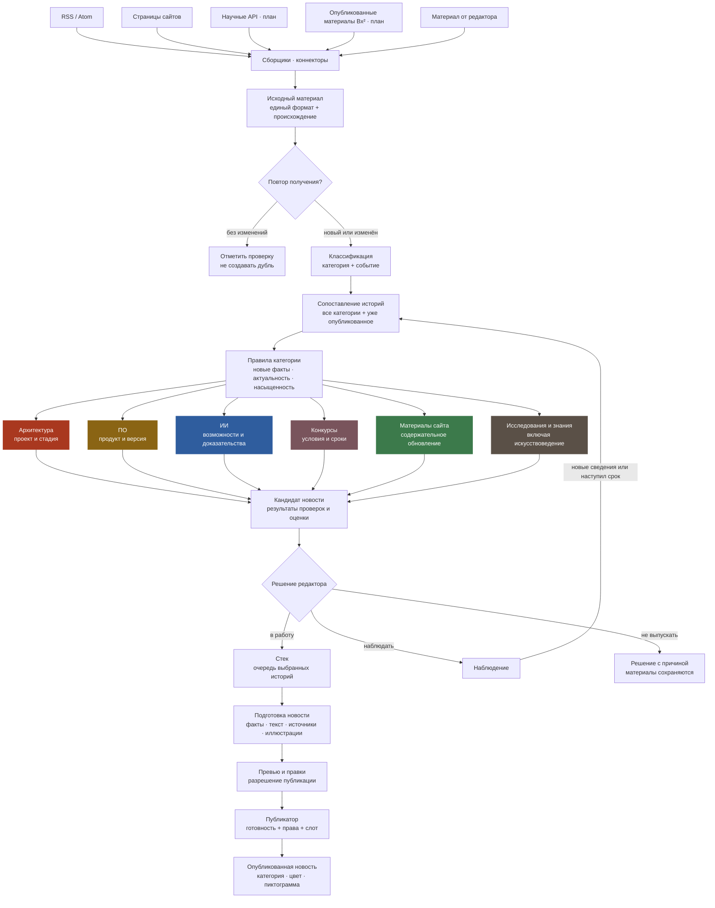

# Прежняя схема конвейера

Заменена 2026-11-09 явным указанием пользователя о трёх блоках. Действующая схема — [три блока обработки](../Новости%20—%20три%20блока%20обработки.md).

```mermaid
flowchart TD
    R["RSS / Atom"] --> C["Сборщики · коннекторы"]
    H["Страницы сайтов"] --> C
    A["Научные API · план"] --> C
    S["Опубликованные материалы Вх² · план"] --> C
    U["Материал от редактора"] --> C
    C --> M["Исходный материал<br/>единый формат + происхождение"]
    M --> D{"Повтор получения?"}
    D -->|"без изменений"| L["Отметить проверку<br/>не создавать дубль"]
    D -->|"новый или изменён"| K["Классификация<br/>категория + событие"]
    K --> I["Сопоставление историй<br/>все категории + уже опубликованное"]
    I --> P["Правила категории<br/>новые факты · актуальность · насыщенность"]
    P --> B["Архитектура<br/>проект и стадия"]
    P --> W["ПО<br/>продукт и версия"]
    P --> N["ИИ<br/>возможности и доказательства"]
    P --> T["Конкурсы<br/>условия и сроки"]
    P --> V["Материалы сайта<br/>содержательное обновление"]
    P --> Q["Исследования и знания<br/>включая искусствоведение"]
    B --> E["Кандидат новости<br/>результаты проверок и оценки"]
    W --> E
    N --> E
    T --> E
    V --> E
    Q --> E
    E --> F{"Решение редактора"}
    F -->|"в работу"| ST["Стек<br/>очередь выбранных историй"]
    F -->|"наблюдать"| O["Наблюдение"]
    F -->|"не выпускать"| X["Решение с причиной<br/>материалы сохраняются"]
    O -->|"новые сведения или наступил срок"| I
    ST --> DR["Подготовка новости<br/>факты · текст · источники · иллюстрации"]
    DR --> PR["Превью и правки<br/>разрешение публикации"]
    PR --> PUB["Публикатор<br/>готовность + права + слот"]
    PUB --> NEWS["Опубликованная новость<br/>категория · цвет · пиктограмма"]
    classDef architecture fill:#A9381F,color:#fff,stroke:#A9381F;
    classDef software fill:#8A6414,color:#fff,stroke:#8A6414;
    classDef ai fill:#2F5D9E,color:#fff,stroke:#2F5D9E;
    classDef competition fill:#79545C,color:#fff,stroke:#79545C;
    classDef own fill:#3C7A4B,color:#fff,stroke:#3C7A4B;
    classDef knowledge fill:#5A5047,color:#fff,stroke:#5A5047;
    class B architecture;
    class W software;
    class N ai;
    class T competition;
    class V own;
    class Q knowledge;
```
