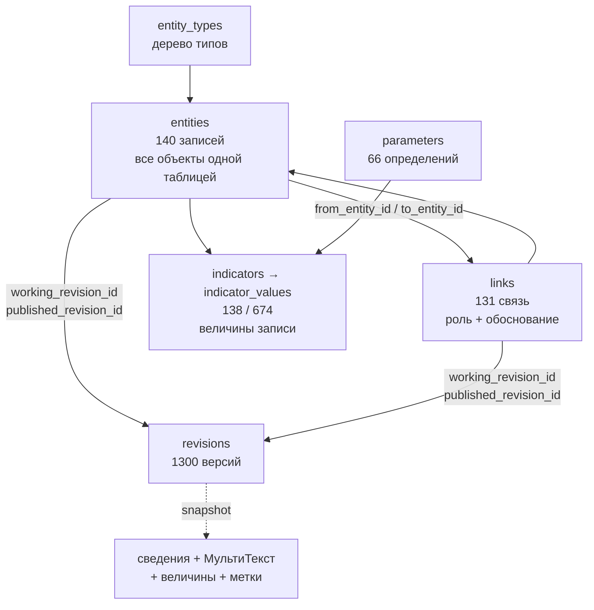
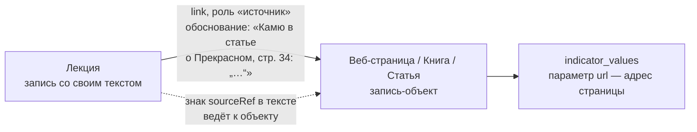

# Структура БД — что есть на самом деле

Снято с рабочей базы 2026-09-30 после применения [Р-78](Решения%20—%20полный%20текст%20до%202026-10-01.md) и [Р-80](Решения%20—%20полный%20текст%20до%202026-10-01.md). Это не целевая схема и не предложение: здесь только то, что существует и работает. Целевое — в [Схеме данных](Схема%20данных%20—%20источники%20и%20отображения.md); расхождения названы в конце.

В схеме `app` 42 таблицы. Ниже они разложены по назначению.

## 1. Ядро: три основы и версия

**`entities`** — одна таблица для всего: здание, человек, лекция, книга, веб-страница, страница проекта. Различает тип из дерева `entity_types`. Оба конца связи ведут сюда же.

**`links`** — отношение двух записей: роль из `link_roles`, порядок, обоснование. Обоснование обязательно.

**Величины** — `parameters` (определение: смысл, единица, тип значения), `parameter_options` (варианты для списков), `indicators` (группа сведений у записи) и `indicator_values` (сами значения). Какие величины подсказаны — решают наборы: `parameter_sets`, `parameter_set_items`, `type_parameter_sets` (набор для ветви дерева), `entity_parameter_sets` (исключение для одной записи).

**`revisions`** — единый журнал версий. После Р-78 у версии есть прямой владелец: `entity_id` или `link_id`. Владелец хранит указатели `working_revision_id` (в работе) и `published_revision_id` (публичная) и свой `status`. Снимок версии содержит сведения записи, её МультиТекст, величины и метки — публикуется всё это одной редакцией.

## 2. Цитата и ссылка

Цитируемое — объект, обстоятельства цитаты — связь ([Р-80](Решения%20—%20полный%20текст%20до%202026-10-01.md)).

- **Объект** — обычная запись: тип `web_page` («Веб-страница», 15 записей), `book`, `article`. Адрес живёт параметром `url` — он принадлежит объекту, потому что один и тот же из любого текста.
- **Связь** с ролью `source` (14 связей) соединяет текст и объект; страница, абзац и сама цитата лежат в обосновании связи, то есть в её версии. Один источник цитируется многими связями с разными страницами — копия источника не нужна.
- **В тексте — только знак** `sourceRef` (7 знаков): номер объекта, номер связи и подсказка. Адрес и цитата в текст не копируются.
- Знак учитывается вхождением в `document_entity_refs`, поэтому источник виден в упоминаниях.

Осталось от старого способа: **17 обычных гиперссылок** внутри текстов. Их предстоит перевести.

## 3. Тексты

МультиТекст — собственное содержимое записи, хранится в снимке её версии. Отдельного процесса публикации у текста нет.

- **`documents`** — 144 строки, из них 143 это прежние тексты, уже свёрнутые в версии владельцев; самостоятельный ровно один. Таблица остаётся историей и опорой для старых адресов (`entities.legacy_description_id`).
- **`document_entity_refs`** — 606 строк, производный указатель: какие записи упомянуты в какой версии, каким способом (`card` — 440, `inline` — 14 на момент снятия) и в каком порядке. Собирается сервером из блоков, руками не заполняется.

## 4. Присоединения и медиа

`targets` (271) → `attachments` (469) → `attachment_roles` — прежний универсальный слой. Сейчас он разделился надвое:

| Роль | Строк | Состояние |
|---|---|---|
| `gallery` | 261 | **Работает.** Изображения записи и их порядок |
| `cover` | 65 | **Работает.** Обложка |
| `justification` | 114 | **История.** Обоснование читается из версии связи |
| `description` | 29 | **История.** Текст читается из версии записи |

Медиа: **`media_assets`** (352) — реестр файлов со сведениями, правами и признаком публикации; **`media_files`** — неизменяемые физические варианты (оригинал, экранный, превью); **`media_kinds`** — вид изображения; **`media_tags`** — метки файла.

По целевой модели изображение должно стать записью, а прикрепление — связью. Это не сделано: файл записью не является, роль и порядок живут в присоединении.

## 5. Справочники, права, служебное

- **`places`** (10) — общий справочник мест, служит ответами для величин с типом «место».
- **`tags`** (128), **`entity_tags`**, **`media_tags`** — метки.
- **`link_roles`**, **`attachment_roles`**, **`media_kinds`**, **`reference_kinds`** — словари.
- **`contributors`**, **`roles`**, **`permissions`**, **`role_permissions`**, **`user_roles`**, **`telegram_accounts`** — участники и права. Отзыв роли не стирает запись: история назначений сохраняется.
- **`materials`** (653), **`material_credits`**, **`revision_reviews`** — реестр авторства, подписи и ход рассмотрения версий. После Р-78 `materials.status` перестал быть истиной для записей и связей, но остаётся способом публикации независимых объектов — файлов и самостоятельных текстов.
- **`slug_history`** — прежние адреса, старые ссылки не умирают.
- **`import_jobs`**, **`import_items`**, **`import_key_map`** — пакетный импорт.
- **`schema_migrations`** — журнал миграций, 25 применённых.

## 6. Что мертво или двоится

- **`reference_items` — 0 строк**, но код до сих пор читает из неё поле «источники» карточки (`entities.ts`, `publicCard.ts`). Прежний механизм источников заменён связями с ролью `source`; таблицу и чтение надо снять.
- **`attachments` с ролями `description` и `justification`** — уже не источник истины, но по ним же код определяет, что текст «свой». Новая логика опирается на уходящий механизм.
- **Два `status` под одним именем:** у `entities` и `links` свой, у `materials` прежний. Для записей и связей второй ничего не решает, но лежит рядом и выглядит решающим.
- **`is_published`** ведётся триггером у записи от её статуса, а у `media_assets` — от `materials.status`. Одно понятие, две механики.

## 7. Чего нет

- **Таблицы отображений.** `type_presentations` и `type_presentation_items` из раздела 6 целевой схемы не существуют: как показывать запись — компактно, карточкой, в редакторе — решает код. Поэтому знак в тексте пока умеет только источник, а не любой тип.
- **Медиа как записи** — см. раздел 4.
- **Параметры у связи.** Величины прикрепляются к записи, но не к отношению: «годы сотрудничества» или «степень участия» хранить негде.

## Числа на 2026-09-30

| Что | Сколько |
|---|---|
| Записи | 140 |
| Связи | 131 |
| Версии | 1300 |
| Величины: определения / значения | 66 / 674 |
| Группы сведений | 138 |
| Файлы | 352 |
| Метки | 128 |
| Места | 10 |
| Присоединения | 469 |
| Документы (прежние тексты) | 144 |
| Указатель вхождений | 606 |
| Таблиц в схеме `app` | 42 |
