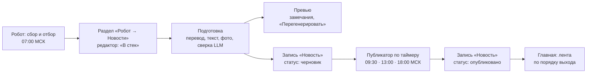

# Новости — механизм публикации

Как новость попадает на сайт и откуда главная её берёт. Подробности робота — [Новости — робот, цепочка и промпты](Новости%20—%20робот,%20цепочка%20и%20промпты.md), требования — [ТЗ «Новости»](Новости.md), решения — Р-88…Р-101 в [реестре](Решения.md).

**Главное для страницы новостей:** она ничего не компонует и не решает. Новость приходит на сайт готовой записью типа «Новость», опубликованной в свой слот; главная показывает опубликованные новости по порядку выхода. Компоновка, тексты, фото, связи и сроки — в разделе «Робот» (решение пользователя 2026-10-03).

## Путь новости

| Шаг | Кто | Где | Состояние |
|---|---|---|---|
| Сбор и отбор | Робот, cron 04:00 UTC | `news-robot/out/<прогон>/` | работает |
| «В стек» — решение редактора | Редактор (su) | `/robot/news`, стек — `news-robot/inbox/queue.json`, слоты `news.release.slots` | работает |
| Подготовка | Робот, cron каждую минуту | `news-robot/.state/prepared/<история>.json` | работает |
| Превью и перегенерация | Редактор | `/robot/preview/<история>` | работает |
| Черновик записи «Новость» | Робот через API под участником «Робот новостей» | `app.entities` (тип `news`) | **в работе** — ждёт учётной записи робота |
| Публикация в слот | Публикатор (то же минутное задание) | `POST /api/v1/entities/{id}/publish` | **в работе** |
| Лента на главной | Сессия дизайна | читает опубликованные записи `news` | **в работе** |

## Запись «Новость» — что в ней будет

Тип `news` в ветви «Служебные» (миграция 0030, [Новости](Новости.md), раздел 2). Робот заполняет:

| Поле | Откуда | Для страницы |
|---|---|---|
| `title_ru` | заголовок новости | заголовок карточки |
| `slug` | латиница из заголовка | адрес `/entities/<slug>` |
| Текст (`body_json`, блоки BlockNote) | лид первым абзацем, затем абзацы; для интервью — цитаты с оригиналом; в конце строка «Первоисточник: …» ссылкой | текст страницы новости; лид — первый абзац |
| Иллюстрации — связи `illustration` к записям «Изображение» | фото источника, скопированные к нам (Р-90), с автором и источником в сведениях изображения | обложка — первое изображение (Р-36); в списках — `compact` (миниатюра + название) |
| `url` — Адрес первоисточника | статья-первоисточник | ссылка «читать в источнике» |
| `publication` — Публикация | дата первоисточника | — |
| `news_topic` — Тема новости | Архитектура · Нейрогенерация · Архитектурное ПО | метка темы |
| `news_score` — Значимость | оценка робота 0–100 | можно не показывать |
| `news_release` + `news_release_time` | слот из стека: дата и ЧЧ:ММ МСК | **порядок ленты** и подпись «когда вышло» |

## Как главная получает новости

- **Только опубликованное.** Черновики гостю не видны; API отдаёт гостю только опубликованные записи.
- **Отбор:** `GET /api/v1/entities?type=news` — опубликованные записи типа «Новость», с компактным видом (`compact`: миниатюра, название) для плиток. Полная запись — `GET /api/v1/entities/{id}`: текст, сведения (`indicators`), иллюстрации (`media`), источники.
- **Порядок:** по `news_release` (день) и `news_release_time` (слот), новые сверху. Запрос: `GET /api/v1/entities?type=news&parameter=news_release&sort=parameter&order=desc&values=news_release,news_release_time,news_topic` — каталог сортирует по значению параметра и добавляет значения в строку ([API](API.md), «Каталог»). Внутри одного дня три слота — их порядок главная досортирует по `news_release_time`. При сортировке по параметру `next_cursor` не выдаётся: страница берёт нужное число последних (`limit`).
- **Сколько:** выпуск — одна новость в слот, три в день (`news.release.per_slot = 1`).
- Новости не должны попадать в общий каталог «Всё» и разделы (ТЗ, раздел 2) — это исключение ещё не сделано; до него опубликованная новость видна и в каталоге.

## Публикатор (в работе)

Минутное задание робота (`run.py --prepare`), после подготовки:

1. Готовая новость из стека без записи — **черновик**: `POST /entities` (тип, название, адрес, текст, сведения) → загрузка фото `POST /media` → сведения изображения (автор, источник) → `POST /media/attachments` (иллюстрация). Номер записи — в `.state/prepared/<история>.json`.
2. Новость перенесли в другой слот — у черновика меняются `news_release` и `news_release_time`; сняли со стека — черновик архивируется (ничего не удаляется).
3. Наступил слот (МСК) — `POST /entities/{id}/publish` от имени участника «Робот новостей». Пропущенный из-за простоя слот выходит при следующем запуске, по порядку. В колонке «Публикация» — «вышла».
4. Перегенерация после выхода не меняет опубликованное: новая версия сохраняется рабочей, публикуется повторно только по решению редактора.

**Учётная запись робота** — участник «Робот новостей» с ролью `editor` (создание, правка, публикация); токен — в `/opt/2vhutemas-services/news-robot/.env` (`NEWS_ROBOT_TOKEN`, `NEWS_API_BASE`), в Git и WIKI его нет. Пообъектное ограничение «только новости» — после Р-87. Заводится по решению пользователя.

## Откуда замечания у новости

Замечания в превью и в колонке «Публикация» — из двух мест: **сверка LLM** (DeepSeek через Polza.AI): утверждения без опоры в фактах, искажения, оценочные слова, пересказ речи героя интервью; **проверки без LLM** (`news-robot/robot/checks.py`): объём, числа без опоры в фактах, назидательный тон, фото без автора (Р-68), дословность цитат, мало текста на странице, перепечатка. Кнопка «Перегенерировать с учётом замечаний» передаёт их LLM вместе с указанием и материалами редактора (Р-101).
