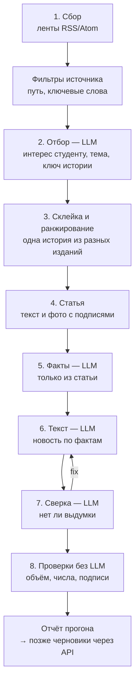

# Новости — робот, цепочка и промпты

Реализация раздела 4 [ТЗ «Новости»](Новости.md). Код — [news-robot/](../news-robot/), источники — [sources.yaml](../news-robot/sources.yaml), промпты — [news-robot/prompts/](../news-robot/prompts/), настройки — `news.*` в [project.parameters.yaml](../config/project.parameters.yaml).

**Язык — Python**, а не Deno, как API ([Р-02](Решения.md) касается API и клиента). Причины: зрелые библиотеки разбора лент и статей (feedparser терпит битый XML и windows-1251, trafilatura вынимает текст статьи), служебные инструменты проекта уже на Python, робот — отдельный фоновый процесс, а не часть API.

## Цепочка



| Этап | Что делает | Где | LLM |
|---|---|---|---|
| 1. Сбор | Читает ленты, условный запрос (`etag`), отсекает старше окна и уже виденное, склеивает одинаковые адреса | `robot/fetch.py`, `feeds.py` | нет |
| Фильтры | `path` — только раздел архитектуры (Wallpaper, Интерьер+Дизайн); `keywords` — шумные ленты (arXiv cs.CV, Хабр, The Decoder) | `sources.yaml` | нет |
| 2. Отбор | Пачками по 15: относится ли к темам, тема, вид (здание, инструмент, конкурс…), **интерес для студента** 0–100 с причиной, конкурс и открыт ли студентам, ключ истории, русский заголовок | `prompts/triage.md` + `examples.yaml` | да |
| 3. Склейка и ранжирование | Одна история из разных изданий — одна; итоговая оценка — интерес, поправленный правилами `news.rank.*` | `pipeline.rank` | нет |
| 4. Статья | Полный текст: лента (Dezeen) → страница → REST API WordPress → описание из ленты. Фото: `og:image`, `figure` + `figcaption`, `srcset` — самый крупный; автор снимка — из подписи или общей строки статьи («photography is by…») | `robot/article.py` | нет |
| 5. Факты | Факты своими словами, числа точно, имена с видом (человек, здание, программа…), фото с автором и пригодностью, конкурс, расхождения, «производитель о себе» | `prompts/facts.md` | да |
| 6. Текст | Новость 150–250 слов по фактам: заголовок, лид, 2–3 абзаца, «что посмотреть студенту», 2–3 фото с подписью «Фото: автор / издание», упоминания | `prompts/write.md` | да |
| 7. Сверка | Утверждения без опоры в фактах, искажения, оценочные слова; при «fix» — одна переделка | `prompts/verify.md` | да |
| 8. Проверки | Объём, числа без опоры в фактах, оценочные слова, фото без автора (Р-68), блок для студента | `robot/checks.py` | нет |

**Образцы вкуса редактора.** В промпт отбора подставляются решения редактора по первому блоку (21 «да», 17 «нет», [первый блок](Новости%20—%20источники%20и%20первый%20блок.md), раздел 4). Когда появятся экраны отбора, его решения будут дополнять `examples.yaml` сами.

**Ранжирование** (`news.rank.*`, значения предложены): интерес LLM + 2 за каждый балл доверия источника выше 7 + 4 за каждое следующее издание той же истории (до трёх) + 10 за конкурс, открытый студентам − 3 за каждый день старше двух.

## Модель и стенд

Модель — `deepseek/deepseek-v4-pro` через Polza.AI, **без рассуждения** (`news.llm.reasoning: off`); ключ — `POLZA_API_KEY` в `news-robot/.env` (вне Git), на сервере — в `.env` робота. DeepSeek v4 — рассуждающая модель: с рассуждением шаг фактов тратил ~9 тыс. токенов на рассуждение и при прежнем пределе 3 тыс. возвращал пустой ответ. Пределы подняты (отбор и факты 16 тыс., текст 12 тыс., сверка 8 тыс.); обрыв ответа робот называет прямо («ответ обрезан… из них рассуждение N»).

**Стенд** [bench.py](../news-robot/bench.py) — совпадает ли отбор с выбором редактора на размеченном первом блоке (38 историй, 21 выбрана). Честно: модель оценивает половину, видя образцами решения только по другой половине. AUC — вероятность, что выбранная история оценена выше отклонённой (0,5 — случайно).

| Вариант (2026-10-03) | AUC | Выбранных в верхней двадцатке одной | Ответ |
|---|---|---|---|
| Исходная оценка «значимости» при исследовании | 0,72 | 15 | — |
| `deepseek-v4.1-flash` | 0,75 | 14 | 22 с |
| `deepseek-v4-pro`, короткое рассуждение | 0,76 | 15 | 111 с |
| **`deepseek-v4-pro` без рассуждения** | **0,80** | **16** | 55 с |
| то же + профиль, выученный по другой половине | 0,83 и 0,74 (два разбиения) | 16 и 14 | — |

Где DeepSeek расходится с редактором: переоценивает «технику, которую можно попробовать» (препринты arXiv, ИИ-агенты для Cinema 4D, локальная LLM), недооценивает архитектурную культуру (исследование Хезервика, стадион, доклад о наследии, биеннале). Выученный по 19 решениям профиль то улучшал, то ухудшал совпадение, поэтому калибровка принимает новый профиль, **только если на отложенной последней четверти решений он совпадает с редактором не хуже прежнего** (проверено: профиль с 0,8 против прежних 0,9 отклонён). Стенд повторяется командой `python news-robot/bench.py [--learned]`.

## Правила обхода

- Робот представляется как `2vhutemas-news-robot/0.1 (+https://2vhutemas.ru/about)`; браузером не притворяется.
- robots.txt соблюдается по правилам Google (шаблоны `*` и `$`, побеждает самое длинное правило). Стандартный `urllib.robotparser` для этого не годится: «Disallow: /?» у stroygaz.ru он читает как запрет всего сайта. `Crawl-delay` соблюдается (до 60 с), иначе пауза 2 с между запросами к одному сайту.
- Защита от ботов (403 Cloudflare) — отказ, а не повод обойти. Текст берётся из ленты или открытого API, иначе робот работает по описанию и пишет об этом в замечаниях.
- Без ключа LLM `etag` лент не запоминается: иначе следующий прогон получил бы «не изменилась» и материалы пропали бы без отбора.

## Источники без ленты — страница-список

Parametric Architecture (решение пользователя: «нам очень важен») закрывает в robots.txt все ленты и REST API, а его карта новостей не обновлялась с 11.09. Защиту робот **не обходит**: статьи и страницы разделов сайт открывает нашему роботу честно (ответ 200, robots.txt разрешает). Поэтому источник читается со страниц-списков — раздела ИИ и раздела новостей: робот берёт адреса статей по шаблону `link_pattern`, у новых открывает статью и читает заголовок, описание, дату и обложку из её разметки (og:*, `article:published_time`, JSON-LD) — как поисковик. Старые адреса помечаются виденными сразу. Проверено 2026-10-03: 24 адреса, 15 открыто, 4 свежих материала, в том числе Cartesian от FORMAS. Тот же механизм (`list_url`) — для Проекта России, Renga и nanoCAD; им нужен свой `link_pattern`.

## Внешние ссылки статей

`article.outbound_links` берёт внешние ссылки из тела статьи (элемент с наибольшим числом абзацев: меню, подвал, кнопки «поделиться» не входят) с текстом ссылки и фразой вокруг; свой сайт и его поддомены не считаются. LLM на шаге «Факты» делит их на первоисточник (пресс-релиз, исходная публикация), другое издание, сайт героя, исследование; первоисточник называется в тексте новости и добавляется в её источники. Проверено: у Хайтек+ найден Reuters, у AEC Magazine — пресс-релиз GlobeNewswire и сайт World Labs.

## Новые источники: найти → проверить → подтвердить

Решение пользователя 2026-10-03: робот через Polza.AI находит новые издания и выдаёт список на подтверждение; редактор при просмотре новостей тоже предлагает сайты.

1. **Кандидат.** Домен, на который статьи ссылаются как на первоисточник или другое издание и которого нет в списке, — или адрес, предложенный редактором.
2. **Проба** (`discover.probe`, без LLM): лента — по ссылке rel=alternate на главной или обычным адресам (/feed/, /rss…), robots.txt, материалов в неделю, свежий материал, примеры заголовков, язык.
3. **Оценка** (`prompts/source.md`, LLM): что это (издание, пресс-релизы, производитель, организация…), подходит ли студенту-архитектору, рекомендация — включить / разово / не нужен, темы, доверие, слова-фильтры для широких сайтов.
4. **Решение редактора**: «Включить» — источник добавляется в обход (сайт без ленты — выключенным, до шаблона адресов); «Разово» — полезен как первоисточник отдельных новостей; «Отклонить». Робот сам ничего не включает.

Не больше `--probe-limit` (5) новых кандидатов за прогон. Включённые редактором источники хранятся в состоянии робота вместе с `sources.yaml`; после миграции — в `news_sources`. Командами: `run.py --candidates`, `--propose URL --note …`, `--include`, `--once`, `--reject ДОМЕН`. Проверено: archi.ru — лента найдена, 19 материалов в неделю (дата «GMT+4» разбирается); reuters.com — ленты закрыты robots.txt; archiscene.net — лента, 6 в неделю.

## Обучение на выборе редактора

Решение пользователя 2026-10-03 ([Р-93](Решения.md)): «анализировать через LLM мой выбор новостей и на основе выбора корректировать систему автоматического ранжирования. Учитывать частоту повторения новости в разных источниках и мои предпочтения по публикации». Код — [robot/learn.py](../news-robot/robot/learn.py), промпт — [prompts/calibrate.md](../news-robot/prompts/calibrate.md).

1. **Решения.** На странице `/robot` у каждой истории отбора — «Да» / «Нет» (выпустил бы или нет); позже их заменят «В очередь» / «Отклонить». Решение уходит в ящик и сохраняется вместе с признаками истории: тема, вид, оценка LLM, итоговая оценка, число изданий, конкурс.
2. **Повторение в изданиях.** Издания каждой истории копятся между прогонами неделю (`state.stories`): история, которую через день подхватили ещё три издания, получает надбавку за каждое (до трёх), а не только за те, что пришли в одном прогоне.
3. **Калибровка** — когда набралось 15 новых решений (`--learn-min-new`) или по команде `run.py --calibrate`:
   - *статистика без LLM* — поправка для каждого вида и темы: насколько чаще или реже редактор их берёт, чем в среднем (сглажено, не больше ±15 баллов, группа от 4 решений); вес «каждое следующее издание» — по тому, насколько повторённые истории выбираются чаще одиночных (0–10);
   - *LLM* — профиль вкуса: что редактор берёт, что отсеивает, где робот ошибся сильнее всего, влияет ли повторение. Текст профиля заменяет в промпте отбора общее описание «ценим / не ценим» ([profile_default.md](../news-robot/prompts/profile_default.md)); прежние версии хранятся (`learned.history`, 30 последних).
   - *образцы* — в промпт отбора идут последние решения (до 20 «да» и 20 «нет») впереди первого блока.
4. **Мера качества** — из трёх лучших историй каждого прогона сколько редактор выбрал; считается при каждой калибровке и видна на странице вместе с поправками и профилем.

Проверено на 60 синтетических решениях: бизнес −15, инструмент +14, конкурс +14, здание +8; вес повторения поднялся с 4 до 7. На настоящих решениях и с профилем от DeepSeek — не проверено.

## Страница робота — /robot, только su

Решение пользователя 2026-10-03: «необходима страница работы червяка, видна при работе от SU». Пункт меню «Робот» виден только `su`; страница — [NewsRobot.tsx](../web/src/pages/NewsRobot.tsx), API — [newsRobot.ts](../api/src/routes/newsRobot.ts):

| Маршрут | Что |
|---|---|
| `GET /api/v1/news-robot/runs` | Последние 40 прогонов с итогами |
| `GET /api/v1/news-robot/runs/:id` | Итог прогона (`summary.json`): ленты, отбор, новости с замечаниями, внешние ссылки |
| `GET /api/v1/news-robot/candidates` | Кандидаты в источники, решения, ждущие запуска робота, и выученное (`learned`) |
| `POST /api/v1/news-robot/inbox` | Решение по источнику (`decide`: include / once / reject), по истории (`judge`: yes / no) или предложенный адрес (`propose`) — с пояснением и автором |

API состояние робота **не меняет**: решение ложится строкой в `news-robot/inbox/inbox.jsonl`, робот применяет его при следующем запуске и переносит в `inbox.done.jsonl` — так у состояния один хозяин. Ещё два маршрута: `GET /runs/:id/log?from=N` — журнал прогона с N-й строки, живое состояние (`progress.json`: этап, последнее сообщение, счёт) и признак «идёт»; `GET /sources` — список источников со состоянием обхода (снимок `.state/sources.json`, робот пишет его в конце каждого прогона и после решений).

**Живой журнал** (решение пользователя 2026-10-03: «видно работу робота в реальном времени, и конечно лог»): блок «Сейчас» показывает последний прогон — этап, последнее сообщение, сколько лент, материалов, историй и новостей; пока итога нет, журнал дочитывается каждые три секунды. Фильтр «только предупреждения и ошибки». У каждого прогона — свой журнал. **Источники в обходе** — по темам, со способом чтения (лента или страница-список, фильтры), доверием, свежим материалом и состоянием (прочитан, ошибка ×N, выключен — с причиной).

На странице сверху — источники на подтверждение с пробой, оценкой LLM и примерами заголовков; форма «Предложить сайт»; решённые; ниже — прогоны.

**Что нужно на сервере (не сделано, ждёт согласия пользователя):** каталог `/opt/2vhutemas-services/news-robot` с кодом и виртуальным окружением Python; запуск по расписанию `news.crawl.schedule`; `.env` робота с `POLZA_API_KEY` и `NEWS_LLM_MODEL`; в `docker-compose.yml` у `api` — тома `./news-robot/out:/news-robot/out:ro`, `./news-robot/.state:/news-robot/state:ro`, `./news-robot/inbox:/news-robot/inbox` и пересборка образа (в Dockerfile добавлено право записи в `/news-robot/inbox`). Без томов страница сообщает, что папки робота не подключены.

## Журнал и уведомления

Каждый прогон — папка `news-robot/out/<ГГГГММДД-ЧЧММСС>/` (вне Git): `log.jsonl` (JSON-строки с `run_id`, этапом и уровнем — правило 13), `items.json`, `candidates.json`, `news.json`, `llm/` — каждый запрос и ответ LLM, `report.html` — прообраз экрана отбора. Состояние между прогонами — `news-robot/.state/state.json` (вне Git); после миграции его заменят `news_sources` и `import_items`. Источник, не прочитанный три прогона подряд, и прерванный прогон — уведомление в Telegram, если заданы `NEWS_TELEGRAM_BOT_TOKEN` и `NEWS_TELEGRAM_CHAT_ID`; иначе — предупреждение в журнале.

## Запуск

```
python news-robot/run.py --no-llm                    # только сбор
python news-robot/run.py --since 2026-10-01 --top 5  # вся цепочка
```

Ключ — переменная окружения `POLZA_API_KEY` (имя — `news.llm.api_key_env`), модель — `--model`, `NEWS_LLM_MODEL` или `news.llm.model`. Без ключа цепочка останавливается после сбора и складывает готовые запросы отбора в `out/<прогон>/llm/`. Предел токенов на прогон — `--token-limit` (по умолчанию 400 000).

## Проверено 2026-10-03

- Сбор по всем лентам за 72 часа: 129 новых материалов, 170 отсеяно фильтрами источников. Запрет robots.txt, защита Cloudflare и пустая лента arXiv по выходным различаются в отчёте.
- **Ленты, закрытые robots.txt, выключены:** Архнадзор (`/feed/`), Parametric Architecture (`/feed/`, `/*/feed/` и REST API), The Decoder (`*/feed/`). Статьи Parametric открыты — для него и для Проекта России, Renga, nanoCAD нужен разбор страницы списка (`list_url`, ещё не написан). buildingSMART закрыт Cloudflare. Итого включено 36 лент.
- Разбор robots.txt проверен на stroygaz.ru (лента разрешена, `Crawl-delay: 30`) и archnadzor.ru (`/feed/` закрыт — источник выключен).
- Извлечение статьи и фото: Dezeen — текст из ленты, автор снимков из общей строки статьи; Architectural Record — «Photo ©» у снимка; AEC Magazine, Хабр — текст со страницы.
- Цепочка без ключа доходит до отбора и сохраняет запрос.

**Не проверено:** этапы 2, 5–7 на DeepSeek — нужен ключ Polza и выбранная модель. Выкладка на сервер и запуск по расписанию `news.crawl.schedule` — после первого прогона на DeepSeek. Запись черновиков через API — после миграции типа «Новость».
