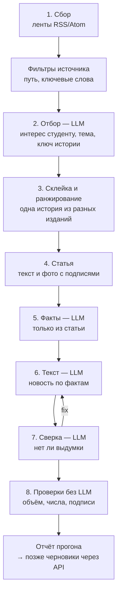

# Новости — робот, цепочка и промпты

Реализация раздела 4 [ТЗ «Новости»](Новости.md). Код — [news-robot/](../news-robot/), источники — [sources.yaml](../news-robot/sources.yaml), промпты — [news-robot/prompts/](../news-robot/prompts/), настройки — `news.*` в [project.parameters.yaml](../config/project.parameters.yaml).

**Язык — Python**, а не Deno, как API ([Р-02](Решения.md) касается API и клиента). Причины: зрелые библиотеки разбора лент и статей (feedparser терпит битый XML и windows-1251, trafilatura вынимает текст статьи), служебные инструменты проекта уже на Python, робот — отдельный фоновый процесс, а не часть API.

## Цепочка



| Этап | Что делает | Где | LLM |
|---|---|---|---|
| 1. Сбор | Читает ленты, условный запрос (`etag`), отсекает старше окна и уже виденное, склеивает одинаковые адреса | `robot/fetch.py`, `feeds.py` | нет |
| Фильтры | `path` — только раздел архитектуры (Wallpaper, Интерьер+Дизайн); `keywords` — шумные ленты (arXiv cs.CV, Хабр, The Decoder) | `sources.yaml` | нет |
| 2. Отбор | Пачками по 15: относится ли к темам, тема, вид (здание, инструмент, конкурс…), **интерес для студента** 0–100 с причиной, конкурс и открыт ли студентам, ключ истории, русский заголовок | `prompts/triage.md` + `examples.yaml` | да |
| 3. Склейка и ранжирование | Одна история из разных изданий — одна; итоговая оценка — интерес, поправленный правилами `news.rank.*` | `pipeline.rank` | нет |
| 4. Статья | Полный текст: лента (Dezeen) → страница → REST API WordPress → описание из ленты. Фото: `og:image`, `figure` + `figcaption`, `srcset` — самый крупный; автор снимка — из подписи или общей строки статьи («photography is by…») | `robot/article.py` | нет |
| 5. Факты | Факты своими словами, числа точно, имена с видом (человек, здание, программа…), фото с автором и пригодностью, конкурс, расхождения, «производитель о себе» | `prompts/facts.md` | да |
| 6. Текст | Новость 150–250 слов по фактам: заголовок, лид, 2–3 абзаца, «что посмотреть студенту», 2–3 фото с подписью «Фото: автор / издание», упоминания | `prompts/write.md` | да |
| 7. Сверка | Утверждения без опоры в фактах, искажения, оценочные слова; при «fix» — одна переделка | `prompts/verify.md` | да |
| 8. Проверки | Объём, числа без опоры в фактах, оценочные слова, фото без автора (Р-68), блок для студента | `robot/checks.py` | нет |

**Образцы вкуса редактора.** В промпт отбора подставляются решения редактора по первому блоку (21 «да», 17 «нет», [первый блок](Новости%20—%20источники%20и%20первый%20блок.md), раздел 4). Когда появятся экраны отбора, его решения будут дополнять `examples.yaml` сами.

**Ранжирование** (`news.rank.*`, значения предложены): интерес LLM + 2 за каждый балл доверия источника выше 7 + 4 за каждое следующее издание той же истории (до трёх) + 10 за конкурс, открытый студентам − 3 за каждый день старше двух.

## Правила обхода

- Робот представляется как `2vhutemas-news-robot/0.1 (+https://2vhutemas.ru/about)`; браузером не притворяется.
- robots.txt соблюдается по правилам Google (шаблоны `*` и `$`, побеждает самое длинное правило). Стандартный `urllib.robotparser` для этого не годится: «Disallow: /?» у stroygaz.ru он читает как запрет всего сайта. `Crawl-delay` соблюдается (до 60 с), иначе пауза 2 с между запросами к одному сайту.
- Защита от ботов (403 Cloudflare) — отказ, а не повод обойти. Текст берётся из ленты или открытого API, иначе робот работает по описанию и пишет об этом в замечаниях.
- Без ключа LLM `etag` лент не запоминается: иначе следующий прогон получил бы «не изменилась» и материалы пропали бы без отбора.

## Журнал и уведомления

Каждый прогон — папка `news-robot/out/<ГГГГММДД-ЧЧММСС>/` (вне Git): `log.jsonl` (JSON-строки с `run_id`, этапом и уровнем — правило 13), `items.json`, `candidates.json`, `news.json`, `llm/` — каждый запрос и ответ LLM, `report.html` — прообраз экрана отбора. Состояние между прогонами — `news-robot/.state/state.json` (вне Git); после миграции его заменят `news_sources` и `import_items`. Источник, не прочитанный три прогона подряд, и прерванный прогон — уведомление в Telegram, если заданы `NEWS_TELEGRAM_BOT_TOKEN` и `NEWS_TELEGRAM_CHAT_ID`; иначе — предупреждение в журнале.

## Запуск

```
python news-robot/run.py --no-llm                    # только сбор
python news-robot/run.py --since 2026-10-01 --top 5  # вся цепочка
```

Ключ — переменная окружения `POLZA_API_KEY` (имя — `news.llm.api_key_env`), модель — `--model`, `NEWS_LLM_MODEL` или `news.llm.model`. Без ключа цепочка останавливается после сбора и складывает готовые запросы отбора в `out/<прогон>/llm/`. Предел токенов на прогон — `--token-limit` (по умолчанию 400 000).

## Проверено 2026-10-03

- Сбор по всем лентам за 72 часа: 129 новых материалов, 170 отсеяно фильтрами источников. Запрет robots.txt, защита Cloudflare и пустая лента arXiv по выходным различаются в отчёте.
- **Ленты, закрытые robots.txt, выключены:** Архнадзор (`/feed/`), Parametric Architecture (`/feed/`, `/*/feed/` и REST API), The Decoder (`*/feed/`). Статьи Parametric открыты — для него и для Проекта России, Renga, nanoCAD нужен разбор страницы списка (`list_url`, ещё не написан). buildingSMART закрыт Cloudflare. Итого включено 36 лент.
- Разбор robots.txt проверен на stroygaz.ru (лента разрешена, `Crawl-delay: 30`) и archnadzor.ru (`/feed/` закрыт — источник выключен).
- Извлечение статьи и фото: Dezeen — текст из ленты, автор снимков из общей строки статьи; Architectural Record — «Photo ©» у снимка; AEC Magazine, Хабр — текст со страницы.
- Цепочка без ключа доходит до отбора и сохраняет запрос.

**Не проверено:** этапы 2, 5–7 на DeepSeek — нужен ключ Polza и выбранная модель. Выкладка на сервер и запуск по расписанию `news.crawl.schedule` — после первого прогона на DeepSeek. Запись черновиков через API — после миграции типа «Новость».
