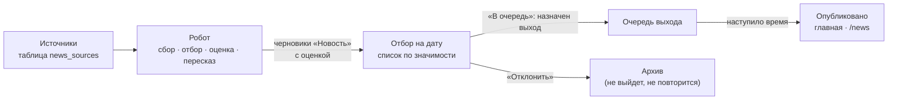

# Новости — техническое задание

Новый механизм сайта: робот собирает новости архитектуры, нейрогенерации и архитектурного ПО, ранжирует их, редактор отбирает, а очередь выпускает их на главную по времени.

**Модель.** Новость, очередь и решение редакции складываются из трёх основ — запись, связь, параметр ([Р-39](Решения.md), правило 18). Журнал прогонов робота ложится на существующие `import_jobs` / `import_items`. Единственная новая таблица — **список источников** `news_sources` (решение пользователя: «этот список и есть новая таблица», раздел 3).

**Решения пользователя 2026-10-01 ([Р-88](Решения.md)):**

1. После заставки — лента новостей; к остальному содержимому — через меню сверху.
2. Время выхода — параметры проекта: 09:30, 13:00, 18:00 (`news.release.*` в [project.parameters.yaml](../config/project.parameters.yaml)).
3. Каждый кандидат — черновик записи «Новость».
4. LLM — Polza.AI, модель выбирается из доступных; предпочтение — DeepSeek.
5. Объём выпуска определим после первого собранного блока.
6. Источники собирает исследование; список — новая таблица.

## 1. Процесс

| Шаг | Кто | Что происходит | Состояние записи |
|---|---|---|---|
| 1. Сбор | Робот, по расписанию | Обходит источники, берёт новые материалы с прошлого прогона | — |
| 2. Отбор и оценка | Робот + внешняя LLM | Отсекает не относящееся к темам, склеивает одну новость с разных сайтов, ставит значимость с обоснованием, пишет черновик на русском | `draft`, кандидат |
| 3. Решение | Редактор | Смотрит список на дату по убыванию значимости, правит текст, ставит «В очередь» или «Отклонить» | `draft` + выход / `archived` |
| 4. Выход | Планировщик | В назначенное время публикует одобренную редакцию | `published` |

Робот **ничего не публикует** — как и импорт (ТЗ, «API и автоматизированное наполнение»). Публикует редактор, планировщик лишь исполняет его решение в назначенное время.

## 2. Новость — запись

Тип **«Новость»** (`news`) в ветви «Служебные» (`service`): это текст сайта, а не предмет изучения ([Р-44](Решения.md)). Новая ветвь не заводится.

**Создан 2026-10-03 миграцией [0030_news_type.sql](../db/migrations/0030_news_type.sql)** ([Р-94](Решения.md)); перед ней снята копия базы `backups/news-0030-pre-20261003T175407Z` ([BackUp](BackUp.md)), после — прогон маршрутов 194/194.

| Что | Как устроено |
|---|---|
| Место в дереве | «Служебные» → «Новость», порядок 5 |
| Сведения | набор «Новость — сведения» (`news_basic`): Адрес первоисточника (`url`), Публикация (`publication`), Тема новости (`news_topic`: Архитектура · Нейрогенерация · Архитектурное ПО, можно несколько), Значимость (`news_score`, 0–100, обоснование — в примечании), Выход (`news_release`, дата), Время выхода (`news_release_time`, ЧЧ:ММ из слотов) |
| Текст | параметр «Текст» ветви (блоки, как у проекта): упоминания, карточки записей, знак источника, иллюстрации, модели |
| Первоисточник, фото | связи «источник» → «Веб-страница», «иллюстрация» → «Изображение» |
| В списках | миниатюра и название (компактный вид ветви) |
| Страница | сведения, связи, текст, галерея, источники, упоминания, «Как цитировать» — как у проекта |
| Редактор | название, метки, сведения, галерея, текст |
| Завести руками | «Создать запись» → тип «Новость» |

**Ещё не сделано:** новости пока попадают в общий каталог (исключение — вместе с лентой на главной); сервер не проверяет, что время выхода — один из слотов; очереди и планировщика нет; робот черновики через API ещё не заводит.

**Текст — как у проекта.** Параметр `text` вида «блоки» (Р-86) со всем стандартным механизмом: упоминание в строке и карточка-блок существующей записи ([Р-23](Решения.md)), знак источника `sourceRef` ([Р-80](Решения.md)), иллюстрации, модели (`modelEmbed`). Из новости можно сослаться на проект, автора, книгу, статью; новую запись (например, новое здание из новости) редактор заводит штатной кнопкой «Создать» в панели вставки ([Р-45](Решения.md)) — робот её только предлагает (п. 4).

**Сведения — набор «Новость — сведения»:**

| Параметр | Вид | Существует | Смысл |
|---|---|---|---|
| `url` — Адрес первоисточника | текст | да (0025) | Главная ссылка новости; ключ от повторов |
| `publication` — Публикация | дата | да | Дата выхода у первоисточника |
| `news_score` — Значимость | целое 0–100 | новый | Оценка робота; в `note` — обоснование одной-двумя фразами |
| `news_topic` — Тема | вариант, повторяемый | новый | Архитектура · Нейрогенерация · Архитектурное ПО |
| `news_release` — Выход | дата | новый | День выхода; заполнен — новость в очереди |
| `news_release_time` — Время выхода | текст `ЧЧ:ММ` | новый | Один из слотов `news.release.slots`; сервер принимает только их |

Точного времени в модели нет: вид значения «дата и время» не заводится (правило 14), выход привязан к слоту из настроек. Смена слотов в настройках не трогает уже назначенные выходы; выход на слот, которого больше нет, редактор видит в очереди как требующий решения.

Название — `title_ru` (русский заголовок), исходный заголовок — `title_original` с `original_language`: колонки уже есть ([Р-18](Решения.md): интерфейс русский, данные многоязычные).

**Связи (существующие роли):**

- «источник» → запись «Веб-страница» первоисточника, обоснование — что именно взято. Если новость пришла с нескольких сайтов — несколько связей; адрес, уже заведённый в базе, второй записью не заводится (как место, [Р-35](Решения.md)).
- «иллюстрация» → запись «Изображение». Чужое изображение — цитата с автором и источником ([Р-68](Решения.md), правило 20); робот подставляет их сразу, иначе это видимая задача редактора. **Файл копируется к нам** (решение пользователя 2026-10-01, [Р-90](Решения.md)): робот скачивает снимок источника в медиаконтур (оригинал, экранный, превью), заводит запись «Изображение» с параметрами «Автор изображения», «Источник», «Адрес источника» и связывает её с новостью. Ссылки на чужой сервер в опубликованной новости нет. Не копируются снимки с пометкой «не для перепечатки» и с пустым автором, если источник сам запрещает использование — такие робот только предлагает редактору.

**Вид новости** (подтверждён пользователем по [эксперименту](Новости%20—%20эксперимент%20с%20текстом%20и%20фото%202026-10-01.md)): 150–250 слов, 2–3 фото с подписью «Фото: автор / издание», сведения и первоисточник. Блок «Что посмотреть студенту» снят ([Р-99](Решения.md)): сайт для архитекторов, указание звучит обидно; вместо него — необязательная нейтральная строка «где подробности» (чертежи, видео, регистрация), тон — коллегиальный, без обращений к читателю. Только факты источника; оценочные слова источника не переносятся.

Программы (Revit, Rhino, Blender…) — записи типа «Программа» и упоминаются в тексте как записи: [Программы](Программы.md).

**Отображение** (таблица отображений, 0027): compact — миниатюра и название, дата выхода; card — как у проекта (`indicators`, `links`, `text`, `gallery`, `sources`, `mentions`, `citation`); editor — как у проекта плюс показ оценки робота и обоснования (только чтение).

**Каталог.** Новости не входят в общий каталог «Всё» и разделы — как изображения (Схема данных, «Записи»). Их место — главная и архив `/news`. Страница новости — обычная страница записи `/entities/:key` с готовым HTML, разметкой `NewsArticle`, «Как цитировать» и попаданием в `sitemap.xml` ([Оптимизация сайта](Оптимизация%20сайта.md)).

**Конкурсы** — отдельный тип записи ([Р-89](Решения.md)): робот распознаёт объявление конкурса, заводит черновик «Конкурса» и вставляет его карточкой в новость, а затем отслеживает сроки и итоги — [Конкурсы](Конкурсы.md).

## 3. Источники новостей

Список источников — новая таблица **`news_sources`** (решение пользователя). Основание по правилу 18: у источника своя жизнь — состояние обхода меняется каждый прогон. Будь источник записью с параметрами, каждый обход порождал бы её новую версию в `revisions`. Поэтому таблица — служебная, как `media_files`: не предмет курса, а настройка робота.

| Колонка | Тип | Смысл |
|---|---|---|
| `id` | uuid PK | |
| `title` | text | Название издания |
| `site_url` | text | Главная страница |
| `feed_url` | text, null | RSS/Atom; пусто — робот разбирает `list_url` |
| `list_url` | text, null | Страница со списком материалов, если ленты нет |
| `language` | text | Язык материалов |
| `topics` | text[] | `architecture` · `neurogeneration` · `software` |
| `trust` | int2 0–10 | Вес источника в значимости |
| `is_enabled` | bool | Выключить, не удаляя |
| `entity_id` | int8, null → `entities` | Запись «Веб-страница» издания, если она нужна сайту для ссылки «источник» |
| `note` | text | Особенности: платный доступ, шум, частота |
| `last_checked_at`, `last_item_at` | timestamptz | Когда обходили, когда был последний материал |
| `etag`, `last_modified` | text | Условный запрос: не качать неизменившуюся ленту |
| `fail_count`, `last_error` | int4, text | Подряд неудачных обходов и последняя ошибка |
| `created_at`, `updated_at`, `created_by`, `updated_by` | | Аудит, как у остальных таблиц |

Ключ от повторов — `feed_url` (или `list_url`), уникальный. Изменение `trust`, `topics`, `is_enabled` пишется с автором (Р-15). Удаление — выключением: прежние новости ссылаются на источник через журнал прогонов.

Стартовый список собирается исследованием: [Новости — источники и первый блок](Новости%20—%20источники%20и%20первый%20блок.md). Ведёт список редактор на экране «Источники новостей» (раздел 5).

## 4. Робот

Реализация — [Новости — робот, цепочка и промпты](Новости%20—%20робот,%20цепочка%20и%20промпты.md), код — `news-robot/` (Python).

Отдельный фоновый сервис, ходит **только через API v1** под своим участником «Робот новостей» — прямой записи в БД нет, как у навыка наполнения (ТЗ, «API и автоматизированное наполнение»).

**Права робота:** создавать и править черновики типа «Новость» и записи «Веб-страница»/«Изображение» для них; публиковать — нет. Это пообъектный доступ ([Р-87](Решения.md)); до его реализации — отдельная ограниченная роль.

**Прогон:**

1. Читает включённые источники, берёт материалы новее прошлого прогона. Соблюдает `robots.txt`, паузу между запросами к одному сайту, свой User-Agent с адресом проекта.
2. Отбрасывает уже известное: адрес первоисточника уже есть в новости, в том числе отклонённой и архивной.
3. LLM на каждый материал отвечает строго по схеме JSON: относится ли к темам; тема; русский заголовок; пересказ 3–6 предложений **своими словами** (не копия: перепечатка чужого текста запрещена, цитата — короткая, со знаком источника); значимость 0–100 с обоснованием; имена людей, бюро, зданий, программ из текста.
4. Склеивает одну новость с разных сайтов в одного кандидата с несколькими связями «источник».
5. Имена из п. 3 ищет в базе: найденные записи вставляет в текст упоминаниями, ненайденные значимые — перечисляет в конце черновика блоком «Предложено завести» для редактора.
6. Создаёт черновики через API, пишет итог прогона.

**Критерий оценки** — интерес для студента-архитектора, а не значимость для отрасли (по выбору редактора из [первого блока](Новости%20—%20источники%20и%20первый%20блок.md), раздел 4). Образцы — решения редактора: первые 38 размеченных, дальше копятся сами. **Значимость** = оценка LLM, поправленная правилами, которые видит редактор: доверие источника, число независимых источников, свежесть, связь с записями курса (упомянуты наши проекты и авторы). Формула и веса — в `config/project.parameters.yaml`, не в коде.

**Журнал.** Прогон — `import_jobs` (`source_namespace = news-robot`), материал — `import_items` (`external_key` = адрес, план, состояние, ошибка, попытки). Неудача прогона и источник, молчащий N прогонов подряд, приходят уведомлением в Telegram (правило 13). Логи JSON с `request_id`.

**LLM.** Polza.AI — OpenAI-совместимый API, адрес и имя переменной ключа — `news.llm.*` в настройках. Модель — DeepSeek, конкретный идентификатор выбирается по каталогу Polza (`news.llm.model`, пока не выбран). Смена модели — правка настройки, не кода. Ключ `POLZA_API_KEY` — в `.env` сервиса робота на сервере; в Git и WIKI его нет (правила 9–10). Ключ общий с личным агентом пользователя: расход робота отделяется лимитом `news.llm.daily_token_limit`, а лучше — отдельным ключом проекта в панели Polza. Лимиты: материалов за прогон, токенов за сутки; превышение — остановка с уведомлением, а не молчаливая неполнота. Ответ, не прошедший проверку схемы, — ошибка материала с повтором, а не черновик.

## 5. Редактор: отбор и очередь

Два экрана; право — `publish` (кто без него — может править черновик, но не ставить в очередь, [Р-04](Решения.md)).

**«Новости — отбор».** Выбор даты (по умолчанию — сегодня; «на дату» — дата сбора). Список кандидатов по убыванию значимости: заголовок, источники, тема, значимость с обоснованием, упомянутые записи. Действия: открыть в редакторе, «В очередь» (с выбором выхода), «Отклонить» (в архив с причиной в `note` решения). Фильтр по теме и источнику. Длинный список — счётчик и подгрузка ([Р-49](Решения.md)).

**«Очередь выхода».** Сетка слотов по дням (09:30 · 13:00 · 18:00); «В очередь» ставит новость в ближайший свободный слот, перетаскивание переносит её в другой. «Снять из очереди» возвращает в кандидаты. Видны пустые слоты на сегодня и завтра.

**«Источники новостей».** Таблица `news_sources`: включить/выключить, доверие, темы; у каждого — дата последнего материала и ошибка обхода. Добавление источника проверяет ленту сразу.

**Что именно выходит.** «В очередь» запоминает текущую рабочую редакцию как одобренную (`revision_reviews`, решение «одобрено», рецензент — редактор). Планировщик публикует **ровно её**. Правка после одобрения снимает новость из очереди до повторного одобрения — читатель не увидит текста, которого редактор не видел.

## 6. Выход на главную

**Планировщик** — задание в сервисе API, срабатывает в слоты `news.release.slots` по `news.release.timezone` (и раз в несколько минут — догнать пропущенное): берёт новости, у которых выход наступил и есть одобренная редакция, и публикует её штатным `POST /entities/{id}/publish` от имени одобрившего редактора ([Р-79](Решения.md)). Сбой — уведомление в Telegram; пропущенный из-за простоя выход публикуется при следующем запуске, порядок сохраняется.

**Главная** — страница после заставки ([Р-58](Решения.md)): **лента опубликованных новостей**, новые сверху, compact-видом в карточке большого размера. Каталог на главной больше не показывается: к проектам, авторам, лекциям и «О проекте» ведёт меню сверху ([Р-75](Решения.md)); отдельного пункта для каталога «Всё» нет (решение пользователя 2026-10-01: «не нужен»). Это заменяет «главная — каталог „Всё“» из решения «Каталог без мигания». Отдаётся сервером готовым HTML той же сеткой, что видит приложение, без мигания (решение «Каталог без мигания»). Архив — `/news`, постраничный, с постоянными адресами; лента RSS `/news.xml` — по желанию (вопрос 5).

**Сделано 2026-10-04 ([Р-103](Решения.md)).** Главная и `/news` — `api/src/lib/news.ts` и `pages.ts`; страница новости — общий рендер карточки (`cardBody`) с надзаголовком, листанием и своими «Сведениями». Макет — холст «2Vhutemas — Новости и Проекты», доски «Главная: лента новостей» и «Страница новости».

**Что страницы читают (договорённость с публикатором робота):**

| Что на странице | Откуда |
|---|---|
| Попадает в ленту | запись типа `news`, опубликованная (`is_published`) |
| Порядок, день, время | `news_release` (дата с днём и месяцем), `news_release_time` (слот `ЧЧ:ММ`); без них — дата публикации |
| Тема, кнопки тем | `news_topic` — варианты параметра; кнопки строятся из вариантов в базе |
| Снимок в ленте | компактный вид (миниатюра первой иллюстрации); нет опубликованного снимка — новость без картинки |
| Начало текста | первый абзац текста записи |
| Издание в ленте | название первой записи-источника (связь «источник») |
| «Первоисточник» в сведениях | параметр `url`; «Опубликовано в источнике» — `publication` |

Снятая с сайта новость должна снять и запись (статус «черновик» или «архив»): удаление из стека робота запись на сайте не трогает.

## 7. Что меняется в системе

| Что | Как | Новая таблица |
|---|---|---|
| Тип «Новость», параметры, наборы, отображения | Миграция данных, как 0029 «Видео» | нет |
| Источники новостей | Служебная таблица со ссылкой на запись «Веб-страница» | **`news_sources`** |
| Решение редакции | Статус записи + `news_release`, `news_release_time` + `revision_reviews` | нет |
| Журнал робота | `import_jobs`, `import_items` | нет |
| Робот | Новый сервис, участник и ограниченная роль | нет |
| Планировщик | Задание в API | нет |
| Главная — лента, `/news`, экраны отбора, очереди, источников | Код сайта и приложения | нет |
| Слоты выхода, LLM, расписание обхода | `news.*` в `config/project.parameters.yaml` | нет |

**BackUp.** Новости, источники и решения — в БД и попадают в обычную копию. Сырые ответы сайтов и LLM не храним: только итог в записи и журнал прогона. Настройки робота — в Git, ключ — в перечне секретов [BackUp](BackUp.md).

## 8. Этапы реализации

Предложение; пользовательская таблица этапов ТЗ не меняется — место механизма в ней определяет пользователь.

1. **Модель и ручная новость.** Тип, параметры, отображения; редактор заводит новость руками, публикует штатно; главная показывает ленту. Уже даёт работающие новости без робота.
2. **Очередь.** Выход, одобрение редакции, планировщик, экран очереди.
3. **Робот.** Источники, сбор, LLM, журнал, уведомления, экран отбора.
4. **Тонкая настройка.** Веса значимости по опыту редакции, склейка, RSS, предложения новых записей.

## 9. Проверка результата

- Повторный прогон не создаёт второго кандидата с тем же адресом, в том числе ранее отклонённого.
- Одна новость с трёх сайтов — один кандидат с тремя связями «источник».
- Робот не может опубликовать запись — проверяется прямым запросом API его токеном.
- Список на дату упорядочен по значимости; у каждой оценки видно обоснование.
- Новость, поставленная в очередь на 10:00, видна на главной не раньше 10:00 и не позже следующего запуска планировщика; правка после одобрения снимает её из очереди.
- Остановка API на время выхода не теряет новость: она выходит при следующем запуске.
- Упоминания проектов и авторов в тексте новости открывают их карточки и возвращают на место; страница новости — готовый HTML с `NewsArticle` и «Как цитировать».
- Отказ LLM или источника виден в журнале прогона и приходит в Telegram.
- Ключ LLM отсутствует в Git, WIKI и логах.

## 10. Открытые вопросы

Решены 2026-10-01 (Р-88): главная, время выхода, кандидаты-черновики, провайдер LLM, таблица источников — см. начало документа.

1. **Объём.** По первому блоку — одна новость в слот, три в день (`news.release.per_slot = 1`). Открыто: нужны ли RSS и анонс в Telegram.
2. **Модель DeepSeek** — конкретный идентификатор из каталога Polza и суточный лимит токенов.
3. **Ключ.** Отдельный ключ Polza для проекта или общий с личным агентом.
4. **Стартовый список источников** — требует доработки (пользователь: «надо поработать»), прежде всего российские источники.
