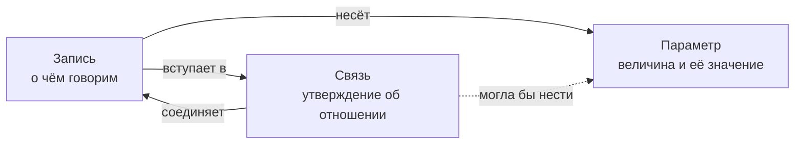

# Описание проекта

## Назначение

2vhutemas — учебный проект об объектах культуры и их месте в истории. Его основная задача — помочь студентам расширить кругозор, запомнить авторов и объекты, увидеть отношения между ними и сформировать критическое знание.

Старая версия опубликована на [2vhutemas.ru](https://2vhutemas.ru). Отправной способ исследования — линия времени. Развитие проекта предполагает другие пространства исследования, в том числе иммерсивность объектов, удалённость от зрителя и игровые формы.

## Три основы

Вся модель стоит на трёх вещах, и новые сущности не заводятся отдельно — они складываются из них ([Р-39](Решения.md)).

| Основа | Что это | Чем держится |
|---|---|---|
| **Запись** | Человек, здание, стиль, постановка — то, о чём говорим | Тип из дерева; строение записи одно для всех ([Р-37](Решения.md)) |
| **Связь** | Утверждение об отношении двух записей | Обоснование обязательно: свобода связи оплачивается обязанностью объяснить |
| **Параметр** | Определение величины и её значение у записи | Справочник: один смысл — один параметр ([Р-38](Решения.md)) |

Сложение основ даёт то, что иначе пришлось бы заводить отдельными таблицами:

| Что нужно | Из чего складывается |
|---|---|
| Карточка объекта | запись + её показатели |
| Авторство | связь «человек → здание» с обоснованием |
| Зрелищное здание как предмет сравнения | запись типа «Здание» + набор величин у ветви дерева |
| Событие | запись + датировка-параметр + связи с участниками |
| Школа, течение, влияние | записи «Когда» + связи с обоснованием |
| Учебное сравнение | отбор записей по ветви + сортировка по параметру |

**Где модель уже так устроена.** Виды записей стали ветвями дерева, предметные величины — параметрами, профили под класс вещей исчезли. Датировки и места тоже стали величинами ([Р-40](Решения.md)): вид даты и роль места — это параметры, а справочник мест служит им набором возможных ответов.

**Где пока нет.** Изображения, документы и источники остаются отдельными таблицами: они не записи, а содержимое, которое прикрепляется. Свести ли их к записям — вопрос открытый, и отвечать на него сейчас не требуется. Параметры сегодня прикрепляются к записи, но не к связи; если основы равноправны, связь тоже должна уметь нести величины — годы сотрудничества, степень участия. Это ближайшее расширение, а не сделанное.

**Что из этого следует для работы.** Появилась потребность в новой предметной таблице — сначала проверяем, не складывается ли она из трёх основ. Правило 18 в [Правилах проекта](Правила%20проекта.md).

## Учебные задачи

- Узнавать объекты, называть авторов и ориентироваться во времени.
- Связывать произведения с культурным, социальным и технологическим контекстом.
- Сравнивать объекты по явно сформулированным критериям.
- Различать факт, интерпретацию и собственное предположение.
- Обосновывать суждения источниками и рассматривать альтернативные объяснения.

Предлагаемый учебный цикл: **увидеть → вспомнить → сравнить → объяснить → проверить по источникам → пересмотреть вывод**.

## Объекты и содержание

Универсальная модель должна поддерживать архитектуру, произведения искусства, книги, фильмы, теории, авторов и коллективы, исторические периоды и понятия. Для каждого объекта важны не только описание и иллюстрации, но и связи, датировки, источники и основания интерпретаций.

Одна и та же сущность должна использоваться во всех представлениях и заданиях без дублирования карточки.

## Пространства исследования

Следующие режимы — предложения для развития, а не перечень уже реализованных функций.

| Режим | Действие студента | Назначение |
|---|---|---|
| Линия времени | Сопоставляет объекты и процессы | Последовательность, одновременность, контекст |
| Пространство сравнения | Размещает объекты по выбранным осям | Выявление и обсуждение критериев |
| Окружение объекта | Исследует авторов, влияния и источники | Понимание отношений и их оснований |
| Узнавание | Вспоминает объект или автора | Запоминание и различение |
| Кураторский маршрут | Собирает подборку вокруг тезиса | Отбор и аргументация |
| Разбор противоречия | Сравнивает интерпретации | Критическое суждение |

### Иммерсивность и удалённость

Смысл осей предстоит уточнить на конкретных примерах. Пока предполагается различать:

- свойства самого объекта;
- условия знакомства с ним: оригинал, фотография, фильм, модель, прогулка;
- оценку опыта конкретным наблюдателем.

Удалённость может быть физической, временной, культурной или связанной со степенью участия. Иммерсивность не следует заранее сводить к единственному числу в карточке объекта.

Размещение объекта студентом в пространстве сравнения должно сохраняться как его работа. Оно не меняет общие сведения об объекте. Различия между размещениями могут становиться предметом обсуждения.

### Игровые формы

Фактические задания допускают проверяемые ответы. В интерпретационных заданиях оцениваются основания, работа с источниками и рассмотрение альтернатив. Несогласие с преподавателем само по себе не является ошибкой.

Игровые механики должны поддерживать учебные задачи. При оценке результата важны узнавание через время и качество объяснений, а не только число действий или скорость ответа.

## Самостоятельные лекции и статьи

Лекция — самостоятельный авторский материал, который объединяет объекты БД в последовательное рассуждение. У неё есть собственный адрес, текст, авторство и версии. Она не обязана принадлежать одному объекту. Объекты имеют устойчивые ссылки и сохраняют самостоятельные карточки.

Автор выбирает объекты через поиск в BlockNote, вставляет их как карточки или упоминания, выстраивает порядок и добавляет пояснения, иллюстрации и вопросы. Например, в материале о зрелищных зданиях можно последовательно рассматривать разные отношения здания и зрителя; порядок определяется замыслом лекции, а не только хронологией.

Студент проходит лекцию последовательно, открывает подробную карточку интересующего объекта и возвращается к своему месту. Один объект участвует в разных лекциях без дублирования данных. В карточке видны доступные лекции с его упоминанием. Текст конкретной лекции может давать собственную интерпретацию объекта.

Порядок и пояснения хранятся в документе BlockNote. Прикрепление лекции как дополнительного материала к объекту возможно, но не является условием её существования. Подробности — в [ТЗ](Техническое%20задание.md) и [структуре БД](Структура%20БД.md).

## Принципы реализации

### Участие студентов и аккаунты

Требования, зафиксированные пользователем 2026-09-22:

- На сервере уже работает ведомость студентов с результатами сессии; эти данные сохраняем и используем при развитии проекта.
- Студенты должны стать пользователями проекта и получить доступ к правке материалов.
- Для работы с аккаунтом нужна интеграция через Telegram-бота.

Предлагается связывать существующие записи студентов с аккаунтами, сохраняя историю результатов. Границы редактирования, порядок публикации, история правок и подтверждение привязки Telegram требуют отдельной проработки. Конкретные команды бота пока не определены.

**Уточнение 2026-09-22:** студенты — обычные пользователи. Заводим их из ведомости и подтверждаем аккаунт через Telegram. Права назначаются независимо от статуса студента: view — просмотр, edit — редактирование, create_delete — единое право создания и удаления, publish — публикация своей версии, review — рассмотрение чужих версий, su — superuser приложения. Роли являются наборами этих прав; отдельная роль студента не нужна. Подробности — в [ТЗ](Техническое%20задание.md).

### Изображения объектов

Сохраняем изображения в хорошем доступном разрешении: неизменяемый оригинал, экранная версия и превью. Файлы обслуживает существующий медиасервис; БД хранит сведения о каждом варианте, его происхождении, размещении и доступности. Авторский документ ссылается на изображение по ID. Полные требования и критерии проверки — в [ТЗ](Техническое%20задание.md), схема хранения — в [структуре БД](Структура%20БД.md).

### Авторские связи и визуальное выделение

Связи между объектами универсальны: например, автор может увидеть связь фильма со зданием. Связь создаётся через прикреплённое описание, которое обосновывает авторскую интерпретацию. Возможность визуально выделять элементы важна; цвет — один из вариантов, окончательное решение относится к будущему дизайну.

### Формат материалов и визуальное редактирование

**Требование пользователя 2026-09-22:** художественный материал требует управления оформлением на уровне блочного редактора, подобного Notion. Храним расширенный документ, а не только текстовое описание. Автор должен уметь менять порядок и отображение текста, изображений и других элементов без программирования.

**Выбранный редактор — BlockNote**, встроенный в сайт (обсуждение 2026-09-22). Это готовый блочный редактор; собственные блоки можно добавить для карточки объекта, источника и сравнения изображений. Для более индивидуального интерфейса альтернативой является Tiptap, но сборка его интерфейса потребует больше работы. В прежней инженерной WIKI упоминался Editor.js; существующие данные этого формата нужно сохранить и преобразовывать явно, если они обнаружатся при проверке БД.

Markdown используем как удобный способ ввода и обмена простыми материалами. Основной формат хранения — JSON документа выбранного редактора в PostgreSQL `jsonb`, с идентификатором формата и версией схемы. Обычный Markdown не сохраняет всю сложную компоновку: сам BlockNote отмечает экспорт в Markdown как преобразование с потерями. Поэтому повторный импорт Markdown не должен молча заменять богатый оригинал. См. [форматы BlockNote](https://www.blocknotejs.org/docs/foundations/supported-formats).

Возможности редактора по этапам (базовое редактирование — этап 1, карточки и сравнения лекций — этап 2):

- заголовки, абзацы, списки, цитаты и выделения;
- изображения с подписью, альтернативным текстом и источником;
- блоки ссылок на объекты, авторов и источники из нашей БД;
- таблицы, видео и аудио из разрешённых источников;
- настраиваемая ширина иллюстрации и выравнивание;
- блок сравнения двух изображений, галерея и колонки — после проверки готовых компонентов.

Базовые возможности берём у редактора; предметные блоки потребуют небольшой интеграции с нашей БД. Не все перечисленные элементы входят в базовый пакет. В частности, готовые колонки BlockNote относятся к XL: разработчик предлагает GPL-3.0 либо коммерческую лицензию. Выбор колонок и условий использования принимается отдельно; обязательную платную подписку в архитектуру пока не закладываем. См. [условия пакетов](https://www.blocknotejs.org/pricing), [собственные блоки](https://www.blocknotejs.org/docs/features/custom-schemas/custom-blocks).

Предлагаемый процесс: автор редактирует блоки на странице, вставляет медиа из общего хранилища, проверяет вид на телефоне и компьютере, сохраняет версию и отправляет её на публикацию. Порядок публикации принят решением [Р-04](Решения.md): с правом `publish` автор публикует сам, без него версия уходит на рассмотрение обладателю `review`. Обязательная роль куратора не вводится. Изменения текста, порядка блоков, оформления и авторских подписей входят в историю версий. Одновременное совместное редактирование можно добавить позднее; первоначально достаточно сохранённых версий и обнаружения конфликтов.

Отображение строится из разрешённых типов блоков и их параметров. Пользователь выбирает варианты оформления, а общая тема сайта задаёт шрифты, отступы и адаптацию к экрану. Произвольные скрипты и исполняемый MDX не являются форматом авторских материалов. Редактор и публичный просмотр используют одну схему блоков, чтобы сохранённая композиция воспроизводилась одинаково.

До внедрения редактора проверяем один реальный материал: текст, цитата, две иллюстрации, источник и карточка объекта; сохранение и повторное открытие без потерь, мобильное отображение, восстановление версии. Формат хранения подробно описан в разделе БД. Для поиска автоматически извлекаем текст из блоков и индексируем его вместе с названиями и авторами. Программные правки и помощь ассистента работают с JSON, сохраняют ID блоков и создают новую версию документа.

### Слои системы

Предлагается разделить четыре слоя:

1. **Знание:** сущности, отношения, датировки, источники.
2. **Представления:** таймлайн, пространства сравнения, маршруты.
3. **Обучение:** задания, попытки, аргументы, повторение.
4. **Интерфейс:** исследование, игры, редактор материалов.

По документации инфраструктуры проект работает на FirstVDS с PostgreSQL / self-hosted Supabase, Deno API и Caddy. Развитие планируется на существующей базе инфраструктуры. Состояние сервера проверено read-only 2026-09-22: [Инвентаризация сервера](Инвентаризация%20сервера.md).

Редактор контента нужен с первой рабочей версии. Поиск, список и понятная навигация должны дополнять пространственные представления.

Подробная последовательность, зависимости и критерии готовности — [План реализации](План%20реализации.md).

## Этапы реализации

Принято разбиение пользователя из [таблицы экранов ТЗ](Техническое%20задание.md):

1. Объекты: главная, каталог, карточка, редактор, медиа, импорт и API; сразу авторство, сохранность данных, контроль доступа и BackUp.
2. Обоснованные связи и самостоятельные лекции: каталог, чтение и конструктор.
3. Экраны истории, аккаунты с подтверждением Telegram и управление пользователями.
4. Таймлайн.

Прежнее предложение включить новый таймлайн в первый учебный срез заменено этим порядком. Восприятие и игровые формы остаются направлением развития. Значения настроек вынесены в [Параметры проекта](Параметры%20проекта.md).

## Открытые вопросы

- Как именно определяются иммерсивность и удалённость от зрителя?
- Какие объекты и тема войдут в первый учебный сценарий?
- Какие наборы прав (из view/edit/create_delete/publish/review/su) получают гость, подтверждённый пользователь и преподаватель? Отдельной роли студента нет.
- Какие критерии используем для оценки аргументации?

## Связанные документы

- [Структура БД](Структура%20БД.md).
- Исходная инженерная WIKI: `E:\Dropbox\Приложения\remotely-save\ArchSite`.
- Инфраструктурная WIKI: `E:\Dropbox\Приложения\remotely-save\Network and HomeAutomation`.

Эта WIKI становится основным местом ведения описания проекта. Ранее созданные документы остаются источниками контекста; ключи и сетевые настройки ведутся в инфраструктурной WIKI.
