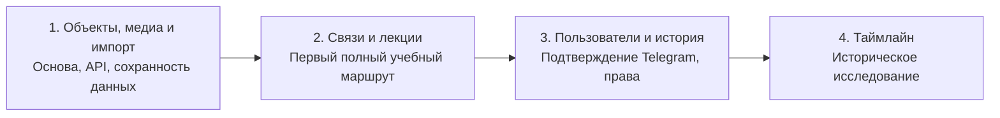

# План реализации

Порядок экранов задан пользователем в [ТЗ](Техническое%20задание.md). Этот план раскрывает зависимости и критерии готовности, не меняя таблицу. Этап закрывается проверенным пользовательским результатом, а не только готовностью таблиц БД.

## Состояние на момент проверки

Есть WIKI, проект модели БД, описание API, YAML с проектными параметрами и исходник навыка. Локальный Git и коммиты созданы. Новый API, интерфейс, автоматический BackUp и журнал коммитов не развёрнуты. 2026-09-22 выполнена read-only [инвентаризация сервера](Инвентаризация%20сервера.md): схема `v2` уже существует (23 периода), legacy и ведомость описаны, найдены открытые права записи для anon в legacy `public`. Снята первая ручная резервная копия; восстановление не проверено. Отдельный GitHub-репозиторий softom/2vhutemas2 подключён; первая отправка main выполнена и проверена 2026-09-22.

## Общая последовательность

## Этап 1 — рабочая база объектов

**Результат:** редактор может создать, найти и изменить объект с богатым описанием и изображениями; ассистент может наполнить ту же базу через API. Данные восстанавливаются из резервной копии.

### 1.1. Подготовить основу и сохранить имеющееся

- Read-only инвентаризация действующих БД, API, media-root, авторизации и ведомости. Зафиксировать версии, зависимости и реальные пути в WIKI без секретов.
- Отдельный GitHub-репозиторий softom/2vhutemas2 подключён. Зафиксировать исходное состояние и порядок выпуска миграций.
- Выбрать место BackUp, расписание, глубину хранения и параметры восстановления. Сохранить БД, файлы и конфигурацию; проверить восстановление в отдельном окружении до изменения рабочих данных.
- Сверить и перерисовать целевую модель с UID: убрать FK по text code, определить границы материала/версии и идентичность импорта. Исторические диаграммы нельзя использовать как готовый SQL.
- Зафиксировать минимальное представление дат для карточки и импорта. Проектирование/строительство/открытие и приблизительность не сводить к одной необъяснимой паре годов. Окончательное решение по датировкам согласовать до миграции этих данных.

### 1.2. БД и прикладной API

Стек принят решением Р-02: API на Deno + TypeScript (Hono), клиент React + TypeScript (Vite), статику отдаёт Caddy.

- Создать версионируемые миграции универсальных сущностей, профилей, документов, вложений, медиа, авторства, версий и прав по UID.
- Реализовать реестр коммитов/миграций/применений; первичное создание журнала оформить миграцией и зарегистрировать после её успешного применения.
- Зафиксировать OpenAPI для операций этапа 1. Остальные операции оставить явно запланированными, не выдавать за работающие.
- Реализовать создание/чтение/изменение/архивирование, конфликт версий, поиск, ограничения и проверку доступа. Использовать существующий подтверждённый аккаунт редактора и ограниченный доступ автоматизации; массовый онбординг относится к этапу 3.
- Версии и авторство записывать с первого изменения. Экран сравнения/восстановления пока не требуется, но данные для него уже сохраняются.
- Порядок публикации принят решением Р-04: право `publish` публикует самостоятельно, без него версия уходит на рассмотрение обладателю `review`. Роль куратора не вводится. Остаётся согласовать состав начальных ролей.

### 1.3. Медиа и BlockNote

- Подключить существующий медиаконтур; зарегистрировать original/screen/thumbnail и состояния обработки. Оригиналы неизменяемы; ошибки генерации допускают повтор.
- Встроить BlockNote в редактор объекта: текст, подписи, изображения, источники и базовое оформление. Сохранение/повторное открытие не теряет блоки.
- Связать файлы по UID. Поисковый текст производить из доступной версии документа. Проверить загрузку и чтение на телефоне.
- Подключить валидируемую конфигурацию проекта. null в важных лимитах нельзя трактовать как отсутствие ограничений.

### 1.4. Экраны и наполнение

- Главная, каталог, карточка, редактор, медиатека и импорт — согласно этапу 1 таблицы пользователя.
- Реализовать validate/apply импорта, внешние ключи источника, отчёт по элементам и идемпотентность. Подключить реальный API-клиент навыка и проверить на тестовом окружении.
- Перенести тестовую выборку существующих объектов и медиа с таблицей соответствий UID; затем проверить полный перенос предусмотренного состава legacy-данных. Сохранять исходные данные и отчёт расхождений.
- Основу links и хранение обоснований предусмотреть для зависимостей и переноса; специальный пользовательский редактор связей — этап 2. Старые связи без обоснований не заполнять вымышленным текстом: сохранять в исходнике/отчёте до редакторского решения.

**Готовность:** объект проходит путь API → БД → карточка → изменение → новая версия; повторный импорт не создаёт дубль; все три варианта изображения доступны согласно правам; параллельная правка не затирается; резервная копия успешно восстановлена; поиск не раскрывает черновики. Существующая ведомость и её результаты сохранены.

## Этап 2 — связи и лекции

**Результат:** преподаватель собирает самостоятельную лекцию из объектов, а читатель проходит её и открывает подробности без потери места.

- Реализовать создание связи только вместе с непустым обоснованием, её изменение и отображение автора/источников. Сохранение согласовано одной транзакцией.
- Добавить профиль самостоятельной статьи/лекции, устойчивый адрес, версии и производный индекс вхождений сущностей из BlockNote.
- Конструктор: поиск объектов, inline-ссылки, карточки, перестановка блоков, локальные пояснения, выбранные изображения и сравнения. Порядок один — в документе; индекс БД вычисляется из него.
- Каталог лекций, чтение, оглавление, возврат к месту, обратные ссылки из объекта и переход к фрагменту описания. Недоступные цели не раскрывают закрытые сведения.
- Расширить API и навык операциями связей и лекций. Проверить версионирование ссылок и работу актуальной/закреплённой карточки.
- Собрать пилот «Залы и сцены: кто на кого смотрит» из девяти объектов. Повторное использование Терракотовой армии и Sphere в сравнении не создаёт копии объектов.

**Готовность:** лекция сохраняет авторский порядок и оформление; переход к подробностям и возврат работают; удаление карточки из лекции не удаляет объект; все связи имеют обоснования; обратные ссылки показывают только доступные версии. Полноценная сборка материала выполнена через UI и воспроизводима через API.

## Этап 3 — пользователи, Telegram и экраны истории

**Результат:** человек из ведомости подтверждает аккаунт в Telegram, получает назначенные права обычного пользователя и работает с материалами с сохранением авторства.

- Сверить действующие students.student_account, profile, link_code и auth. Подготовить повторяемый импорт аккаунтов без изменения оценок.
- Подтверждение через бот: одноразовый код, срок, конфликт привязки, активация; отдельно определить восстановление доступа и смену Telegram. Не считать username подтверждением личности.
- Реализовать экраны входа/аккаунта, эффективных прав и управления пользователями. Разрешения: view, edit, единое create_delete, publish, review, su. Проверки действуют в API; su — уровень приложения, не PostgreSQL superuser.
- Добавить экран истории, сравнение и восстановление новой версией. Показать отдельно авторские подписи и исполнителей правок.
- Протестировать выдачу/отзыв прав и прямые запросы API. Права контента не открывают чужие оценки. Аккаунт студента не является особой ролью доступа.

**Готовность:** повторное заведение не создаёт дубль; просроченный/использованный код отвергается; пользователь действует только в рамках назначений; редактор не выдаёт себе su; история корректно показывает коллективную работу и восстановление; ведомость не потеряла данные.

## Этап 4 — таймлайн и карта

К этому этапу отнесён и справочник мест: он становится картой ([Р-25](Решения.md)). До него места выбираются и создаются в карточке объекта.

**Результат:** пользователь исследует те же объекты во времени и в пространстве, переходит к карточкам и лекциям; нет второй базы ни для таймлайна, ни для карты.

- Уточнить временную проекцию принятой модели: несколько типов дат, интервалы, приблизительность, неизвестные даты, открытые границы и даты до н. э.
- Разделить исторически заданные периоды и диапазоны, вычисленные по составу объектов. Тип даты должен быть понятен читателю.
- Реализовать API временных выборок с фильтрами и ограничением объёма, затем экран масштаба/навигации и переходы по UID.
- Проверить понятность плотных/пересекающихся интервалов, фильтры, адаптивность и отсутствие потери ссылок из лекций.

**Готовность:** одна и та же сущность открывается из каталога, лекции и таймлайна; фильтры и даты согласованы; неопределённость не превращается в ложную точность; производительность проверена на фактическом объёме.

## Выпуск и сохранение данных

Параллельный перенос остаётся принятым подходом. До переключения старая модель — источник записи старого сайта; новый контур служит проверке и ограниченному наполнению. Нужны явные правила владения записями: повторный ETL не перезаписывает новые редакторские правки. Не допускаем неявной двусторонней синхронизации.

После готовности функций принимается отдельное решение о переключении основного адреса: резервная копия, согласованная пауза записи, финальная сверка, смена источника записи и проверка. После появления новых данных простой откат фронтенда не является откатом БД. Старые данные и сопоставления сохраняются. Готовность этапа не означает автоматический деплой в прод.

## Что решить перед зависимыми работами

Принятые 2026-09-22 решения — в [журнале решений](Решения.md): схема `v2` развивается миграциями (Р-01), стек Deno + TypeScript и React + TypeScript (Р-02), состояние материала как атрибут (Р-03), публикация по правам `publish`/`review` (Р-04), закрытие записи anon (Р-05).

| Решение | Когда требуется |
|---|---|
| GitHub подключён: softom/2vhutemas2, push main проверен; видимость не менялась | Подключение remote выполнено |
| RLS и политики для `v2` и `students` | До записи в `v2` и до онбординга |
| Состав начальных ролей и кто получает `publish`/`review` | До записи пользователями |
| Место, расписание и глубина BackUp | До изменения рабочих данных |
| Целевая UID-схема и минимальная модель дат | До SQL/ETL этапа 1 |
| Область действия прав и видимость черновиков | До записи пользователями и публичного выпуска |
| Лимиты загрузки и рецепты screen/thumbnail | До включения медиазагрузки |
| Первоначальные роли и восстановление Telegram | До онбординга этапа 3 |

Игры, редактор осей восприятия, совместное редактирование в реальном времени и дополнительные механики обучения остаются дальнейшим развитием. Их сроки и самостоятельные этапы пока не согласованы. Календарные оценки даём после инвентаризации и принятия целевой схемы.
