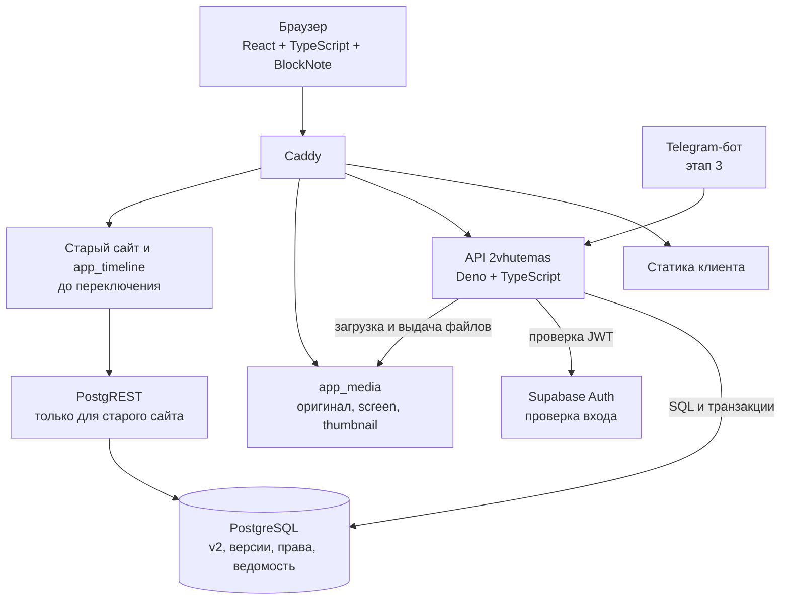

# Журнал решений

Хронологический список **действующих** решений. Подробности — на связанных страницах. Изменение решения не удаляет прежнюю запись, а добавляет новую со ссылкой на неё.

Решение, которое больше ничем не управляет — отменённое, замещённое или исполненное разовым действием, — переезжает в [Архив решений](Архив%20решений.md) целиком. Ничего не удаляется: нумерация сквозная, ссылки из других страниц продолжают работать.

## Перенесено в архив

| Решение | Почему в архиве |
|---|---|
| [Р-01. Схема `v2` развивается, новая схема не создаётся](Архив%20решений.md) | Замещено [Р-21](Решения.md): новый контур живёт в схеме `app`, `v2` не трогаем. |
| [Р-05. Закрыть запись anon в legacy-схеме `public`](Архив%20решений.md) | Исполнено 2026-09-22: права записи у `anon` отозваны, проверено. |
| [Р-06. Первая резервная копия снята до изменений на сервере](Архив%20решений.md) | Исполнено 2026-09-22: копия снята до изменений на сервере. |
| [Р-08. Датировки — отдельная таблица, привязанная к объекту](Архив%20решений.md) | Отменено [Р-38](Решения.md): датировки становятся параметрами. |
| [Р-10. Существующая схема `v2` — основа DDL](Архив%20решений.md) | Отменено [Р-21](Решения.md): `v2` не служит основой DDL нового контура. |
| [Р-14. Наблюдаемость входит в правила проекта](Архив%20решений.md) | Перенесено в [правила проекта](Правила%20проекта.md), правило 13. |
| [Р-24. Откат колонок объекта, добавленных без запроса](Архив%20решений.md) | Исполнено: откат миграцией 0010; правило на будущее — правило 14 в [правилах](Правила%20проекта.md). |

Номер Р-32 не использовался.

## 2026-09-22

### Р-02. Стек: API на Deno + TypeScript, клиент React + TypeScript

**Решение пользователя:** API на TypeScript, клиентская часть на React; TypeScript и на клиенте, дальше по потребностям.

- **API:** Deno (рантайм уже обслуживает `app_media` и `app_timeline`), HTTP-слой Hono, TypeScript без отдельной сборки, права рантайма задаются флагами.
- **Клиент:** React + Vite + TypeScript. React обязателен, потому что BlockNote существует только как React-компонент.
- **Раздача:** статику отдаёт существующий Caddy.
- Серверный рендеринг публичных страниц для SEO в первую версию не входит; решение о нём принимается отдельно.

**Почему Deno:** не появляется второго рантайма и второго способа деплоя. Слабое место Deno — нативные npm-модули, но обработка изображений уже выполняется вызовом ImageMagick из `app_media`, поэтому `sharp` не требуется.

**Отклонено:** Next.js на Node (второй рантайм); работа фронтенда напрямую с PostgREST (валидацию BlockNote, версии и импорт пришлось бы писать в SQL).

**Уточнение:** клиент не обращается к БД напрямую — только к нашему API. API подключается к PostgreSQL напрямую (SQL и транзакции), а не через PostgREST: обязательные атомарные операции — связь вместе с обоснованием, версия вместе с индексом вхождений, публикация вместе с переводом указателя — в PostgREST невыразимы. Вход пользователя проверяется по JWT существующего Supabase Auth. PostgREST остаётся только для старого сайта; после переключения схему `v2` следует убрать из его открытых схем.

Единственная точка записи новых данных — API: те же проверки прав, версии и правила действуют и для веб-интерфейса, и для бота, и для навыка наполнения.

### Р-03. Состояние материала — атрибут записи

**Решение пользователя:** черновик, публикация и архив — атрибуты записи, а не отдельные сущности.

Материал имеет статус: `draft` — черновик, `published` — опубликован, `archived` — архив. История правок ведётся в `revisions`; статус говорит, в каком состоянии находится материал, а указатель опубликованной версии определяет, что видит читатель. Правка опубликованного материала не попадает читателю до отдельного действия публикации.

Связано: [Структура БД](Структура%20БД.md), раздел о правилах истории и публикации.

### Р-04. Публикация зависит от роли: сразу или через ревью

**Решение пользователя:** у одних пользователей правка уходит сразу в публикацию, у других — сначала на ревью.

Из этого следует, что прежнего набора `view / edit / create_delete / su` недостаточно: право публиковать выделяется отдельно.

- `publish` — перевести версию в опубликованную самостоятельно.
- Пользователь без `publish` при сохранении отправляет версию на рассмотрение; материал остаётся в прежнем опубликованном состоянии.
- `review` — рассматривать чужие предложения: принять (что означает публикацию) или отклонить с объяснением.
- Решения о рассмотрении пишутся в `revision_reviews`, который перестаёт быть необязательным.

Это уточняет более раннее решение о четырёх правах (см. [ТЗ](Техническое%20задание.md)): роль куратора по-прежнему не вводится, разделяются именно права, а не должности. Состав начальных ролей ещё предстоит согласовать.

### Р-09. Черновик редактора имеет автосохранение

**Решение пользователя:** противоречия между статусом и автосохранением нет. Материал со статусом `draft` сохраняется редактором автоматически; отдельной сущности для автосохранения не заводим. Автосохранение обновляет черновик, а не опубликованную версию; читатель продолжает видеть опубликованное.

### Р-11. Разработка ведётся на сервере

**Решение пользователя:** отдельное локальное окружение не заводим. Проект учебный, простой сервера не трагедия; разработка прямо на VDS даёт работу с разных компьютеров и разными моделями без синхронизации баз.

Границы, чтобы это не стоило данных:

- Новый код работает в схеме `v2` и новых схемах проекта. Схемы `students`, `public` (legacy) и ГИС для разработки доступны только на чтение.
- Перед каждой миграцией снимается резервная копия; копия проверяется по манифесту.
- Разрабатываемый API до готовности доступен на отдельном поддомене и не заменяет действующий сайт.
- Ведомость с персональными данными студентов в разработке не используется; для проверки прав заводятся тестовые записи.

### Р-12. Механизм миграций

Выбран на основании общей практики, отдельного обсуждения не требовалось.

- Нумерованные SQL-файлы в репозитории: `db/migrations/NNNN_описание.sql`, только вперёд.
- Каждая миграция выполняется одной транзакцией. Обратных миграций не пишем: откат — это новая миграция либо восстановление из копии.
- Таблица `v2.schema_migrations`: номер, имя файла, контрольная сумма, время применения, кто применил. Повторное применение с изменившейся контрольной суммой отклоняется.
- Применяет отдельная команда от роли `supabase_admin` — не старт сервиса. Сервис, обнаружив непримененную миграцию, сообщает об этом и не стартует.
- Первая миграция создаёт сам журнал и регистрирует себя после успешного применения.

### Р-13. Деплой на время разработки — простой

**Решение пользователя:** пока идёт разработка, правки схемы, API и клиента идут вместе; усложнять выкладку не нужно.

Один скрипт: получить код, применить миграции, собрать клиент, перезапустить контейнер API. Отдельных стадий, промежуточных сред и автоматической выкладки нет. Порядок выпуска пересматриваем, когда появится публичный доступ.

### Р-15. Аудит пока атрибутом

**Решение пользователя:** отдельный журнал административных действий нужен, но на этом этапе достаточно атрибутов записи — кто создал, кто изменил, когда. Полноценный журнал выдачи ролей, публикаций и импорта добавляем, когда появятся пользователи помимо администратора.

### Р-16. Безопасность — после каркаса

**Решение пользователя:** проект учебный, сначала работающий каркас, защита и интерфейс поверх него.

В каркас всё же входит то, что ничего не стоит и потом дорого встраивается: проверка подписи токена в API, разрешённые источники запросов, проверка содержимого загружаемого файла. Ограничение частоты запросов, политика содержимого и хранение токена в защищённом виде откладываются до публичного доступа.

### Р-17. Ориентиры объёма и совместимости

**Решение пользователя:** принято. До 5000 объектов, до 20 000 файлов, десятки одновременных читателей, список отвечает быстрее 300 мс. Браузеры — две последние версии Chrome, Safari, Firefox, Edge, минимальная ширина экрана 360 px. Платный пакет BlockNote с колонками не используем; при необходимости — отдельное решение.

### Р-18. Интерфейс на русском, без механики переключения языков

**Решение пользователя:** интерфейс пока только русский; отдельный слой перевода не строим, пока проект не заработал.

Данные остаются многоязычными: `title_ru`, `title_en`, `title_original` с языком оригинала, `documents.lang`, поисковые конфигурации для русского и английского — это содержимое, а не интерфейс. Ошибка API возвращает машинный код латиницей и русский текст для человека. Второй язык интерфейса — отдельное решение, когда в нём появится нужда.

### Р-19. Латинское название сохраняется

**Решение пользователя:** `entities.title_la` остаётся в модели — латинское наименование нужно научному проекту. Колонка сохраняется и заполняется там, где такое название есть; пустое значение допустимо.

### Р-20. Начальные роли

**Решение пользователя подтверждено.** Первая миграция создаёт четыре набора прав:

| Роль | Права | Смысл |
|---|---|---|
| `su` | все, включая управление ролями | Администратор приложения |
| `editor` | view, edit, create_delete, publish, review | Публикует сам и рассматривает чужие версии |
| `contributor` | view, edit, create_delete | Пишет и правит; его версия уходит на рассмотрение |
| `reader` | view | Чтение доступного |

Опубликованные материалы читаются без назначения роли. Кто из пользователей получает какую роль — отдельная административная операция, не следствие статуса студента.

### Р-21. Новый контур в схеме `app`, старый не трогаем

**Решение пользователя 2026-09-22:** 23 периода в схеме `v2` — база старого проекта; её не трогаем вообще. Новый проект разрабатывается параллельно со старым и заменит его, когда обгонит по возможностям.

**Это отменяет часть [Р-01](Архив%20решений.md):** схема `v2` больше не является основой нового контура. Причина изменения — уточнение статуса `v2`: это не заготовка новой модели, а часть работающего старого проекта.

Что остаётся от Р-01: модель, заложенная в `v2`, признана правильной и воспроизводится в новом контуре. Что меняется: новые таблицы создаются в отдельной схеме `app`, структура и данные `public` и `v2` миграциями не изменяются.

Следствия:

- Имя схемы нового контура — `app`. Версия в имени не нужна: схема одна и заменит старые целиком.
- `id` сущностей — `bigint`, как и в старой модели; новые служебные таблицы получают UUID (правило 1).
- Перенос данных старого контура в `app` — отдельная работа с таблицей соответствия идентификаторов, без обратной синхронизации.
- Переключение на новый контур — отдельное решение после того, как он обгонит старый.

### Р-22. У нового контура собственный реестр медиа

**Решение пользователя 2026-09-22:** новый контур ведёт собственный реестр медиа, а не дополняет реестр старого проекта.

- `app.media_assets` — реестр нового контура: подпись, альтернативный текст, атрибуция, источник, лицензия, видимость, архивирование. Ключ — UUID.
- `app.media_files` — неизменяемые физические варианты: `original`, `screen`, `thumbnail`, с контрольной суммой, состоянием обработки и параметрами рецепта.
- Ссылки модели (`entities.cover_media_id`, `attachments.asset_id`) ведут в новый реестр.
- `public.media_assets` и файлы старого проекта не изменяются. Перенос — отдельная работа с таблицей соответствия идентификаторов; она же решает, копировать файлы или ссылаться на существующие.
- Новому контуру нужен собственный корень хранения файлов. Его расположение и порядок обслуживания — ближайшее решение, до включения загрузки.

Это уточняет пункт 9 [схемы этапа 1](Схема%20этапа%201%20—%20предложение.md), где предлагался общий реестр.

### Р-23. Вставка объектов в текст по ссылке

**Требование пользователя 2026-09-23:** модель держится на связях, поэтому объекты нужно уметь размещать прямо в тексте; рядом с редактором — панель связанных элементов, откуда их берут по ходу письма.

Как сделано:

- **Два собственных элемента редактора.** Блок-карточка `entityCard` занимает строку и двигается вместе с текстом; упоминание `entityMention` живёт внутри абзаца. Оба хранят только идентификатор сущности и идентификатор появления — объект не копируется.
- **Панель сбоку** с тремя источниками: связанные с этим объектом, поиск по каталогу, недавно вставленные. Вставка щелчком — карточкой или ссылкой в строку; перетаскивание работает как дополнение, а не единственный способ.
- **Указатель вхождений** `app.document_entity_refs` собирается сервером из блоков при сохранении каждой версии, в одной транзакции с ней. Порядок один — тот, что в документе. Ссылка на несуществующий объект не сохраняется.
- **Обратные ссылки**: представление `app.published_entity_mentions` показывает, в каких опубликованных материалах упомянут объект. Черновики через него не раскрываются.
- **Связи в API**: создание связи вместе с обоснованием одной транзакцией, окружение объекта с обоснованиями, удаление с записью в историю. Связь без обоснования отклоняется и приложением, и базой.

Следующие шаги: вызов вставки из текста по «/» и «@», выбор иллюстрации для конкретного появления объекта, закрепление версии сущности для неизменяемой учебной подборки.

### Р-25. Места: отдельная таблица, назначение — положение на карте

**Решения пользователя 2026-09-23.**

**Назначение.** Адрес нужен, чтобы определить положение на карте. Из этого следует: исторические написания и прежние названия мест не храним. Вопрос «как заполнять русское и международное написание для адреса» снят вместе с самой задачей хранить варианты написания.

**Тип принадлежит привязке, а не месту.** Место одно, а смысл у каждой привязки свой: адрес объекта, место рождения, захоронение, офис организации. Поэтому роль задаётся при привязке; в самой записи места её нет. Одно и то же место переиспользуется сколько угодно раз с разными ролями.

**Отдельная таблица мест.** Место — справочная запись, а не сущность наравне с объектами. К объектам оно привязывается связью с ролью из словаря.

**Пустое не создаётся.** Нет сведений — нет записи места и нет привязки. Пустая запись «место неизвестно» не заводится.

**Справочник мест — это карта, и он относится к этапу 4.** Отдельного экрана управления местами в первых этапах нет: выбор и создание места происходит в карточке объекта. Карта мест добавляется вместе с таймлайном.

**Подтверждено пользователем и выполнено (миграция 0011):**

1. Состав полей (уточнён 2026-09-23 после разбора): страна, населённый пункт, улица, дом, помещение, координаты, точность (точка, здание, населённый пункт, область), ссылка на источник. Координаты указываются парой — одинокая широта отклоняется.

   **Убрано как дубли смыслов:** «название места» — выдумка исполнителя: имя носит объект («Новосибирский оперный театр»), а не его положение на карте; «адрес одной строкой» — повторял элементы адреса. Раз адрес спрашивается по элементам, строка не нужна. Подпись для показа собирается из элементов и не хранится.
2. Привязка — механизмом вложений: место стало четвёртым видом содержимого наряду с документом, медиа и источником. Роль берётся из общего словаря: адрес объекта, место рождения, захоронение, офис организации. Обоснование не требуется.
3. `city`, `country` и `address` из профиля объекта удалены; заполненные значения перенесены в места и привязаны к своим объектам до удаления колонок.

Проверено: одно место одновременно служит адресом одного объекта, местом рождения и захоронением другого; повторная привязка той же роли отклоняется.

### Р-26. Универсальные элементы правятся в собственном окне

**Решение пользователя 2026-09-23.** Место оказалось первым универсальным элементом присоединения, и из работы с ним выведено общее правило (правило 15 в [Правилах проекта](Правила%20проекта.md)):

1. У каждого универсального элемента — собственный экран создания и правки, всплывающее окно.
2. Окно одно на оба действия: создание и правка отличаются только заполненностью полей.
3. В редакторе объекта остаются кнопки «Прикрепить» и «Создать». Щелчок по прикреплённому элементу открывает то же окно в режиме правки.

**Выполнено 2026-09-23.** Появился общий вид всплывающего окна: закрытие по Esc и по щелчку вне окна, предупреждение при несохранённых изменениях, блокировка прокрутки страницы.

- **Места.** В редакторе объекта остались две кнопки: «Прикрепить» открывает окно поиска по справочнику с выбором роли, «Создать» — окно места. Щелчок по прикреплённому месту открывает то же окно в режиме правки. Окно правки показывает, в каких карточках это место используется, — правка меняет сведения везде.
- **Медиа.** Загрузка и правка сведений о файле выполняются одним окном; щелчок по файлу в медиатеке открывает его.
- Справочник мест закрыт от гостя: это рабочий инструмент редактора. Места опубликованных объектов по-прежнему видны в их карточках.

**К кому применяется.** Ко всем универсальным элементам: места, медиа, документы, источники, связи. Каждый получает своё окно по мере работы над ним.

**Следствия, которые предстоит учесть при реализации:**

- правка элемента затрагивает все объекты, где он прикреплён: окно должно показывать, где элемент используется, прежде чем менять общие сведения;
- отвязать и удалить — разные действия. Из окна доступна правка, отвязка выполняется из списка прикреплённых;
- права: создание требует `create_delete`, правка — `edit`; у читателя окно открывается на просмотр.

### Р-27. Панели прикреплений справа, по уровням карточки

**Решение пользователя 2026-09-23.** Справа от редактора объекта идёт колонка панелей, и каждая панель стоит напротив своего уровня:

- напротив блока мест — **панель адресов**: поиск, прикрепление с ролью, создание;
- напротив текста — **панель объектов** и **панель файлов**: поиск, создание, вставка в текст;
- объекты и файлы из панелей переносятся в текст перетаскиванием либо щелчком.

**Файл в тексте хранится идентификатором.** Вставка добавляет блок со ссылкой на файл, а не адрес: приватность и выбор варианта (экранный, превью) остаются на стороне сервера.

**Сессионная кука для показа файлов.** Тег изображения не может приложить токен, поэтому приватные файлы иначе не показать. Клиент меняет свой токен на куку: подписана секретом сервера, живёт час, недоступна сценариям страницы, отправляется только на адреса медиа. Без неё и без входа приватный файл по-прежнему отдаёт 404.

### Р-28. У файла нет собственной ручки доступа; форма сокращена

**Решение пользователя 2026-09-23.** Переключатель «приватный / публичный» у каждого файла — не наша модель: задача доступа в проекте другая, это доступ студентов к материалам.

**Что сделано:** переключатель убран из формы. Файл виден публично ровно тогда, когда опубликован материал, к которому он относится. Признак `is_published` у файла по-прежнему ведёт триггер от состояния материала. Колонка `visibility` в проверках доступа больше не участвует; удалять ли её из базы — отдельное решение.

**Форма файла сокращена.** Набор полей выбирал исполнитель, и их оказалось четырнадцать. Осталось шесть: файл, вид изображения, подпись, автор изображения, ссылка на источник, лицензия, плюс ключевые слова. Убраны из формы описание, атрибуция, год съёмки и уточнение даты, место хранения, инвентарный номер, подпись источника, альтернативный текст. Колонки этих сведений пока остаются в базе.

**Ключевые слова признаны полезными** и, по замечанию пользователя, должны быть у всех объектов системы, а не только у файлов. Конкретный способ (свободное поле у каждой записи либо общий справочник меток как универсальный элемент) требует решения.

### Р-29. Метки: общий справочник, ввод по «#»

**Решение пользователя 2026-09-23.** Ключевые слова нужны всем записям системы, а не только файлам. Ввод: по «#» появляется список стандартных слов, по мере набора список сужается до подходящих; выбранное слово берётся из справочника, новое слово его пополняет.

**Что сделано (миграция 0013):**

- `app.tags` — общий справочник. Совпадение ищется без учёта регистра и лишних пробелов, поэтому «Сиань» и «сиань» — одна метка. Написание сохраняется таким, каким введено впервые.
- `app.entity_tags` и `app.media_tags` — метки объектов и файлов. Для новых видов записей заводятся такие же явные связи, без полиморфных ссылок без внешних ключей.
- Ключевые слова файлов перенесены в справочник, колонка `media_assets.keywords` удалена: два источника одного сведения недопустимы.
- В подсказке рядом со словом показано, сколько записей им помечено: часто используемые идут первыми.

**Решётка в базу не попадает:** она только приглашение к вводу. При разборе ведущий знак отбрасывается, в справочнике лежит чистое слово, а в интерфейсе оно показывается с решёткой.

**Чем метка не является:** она не заменяет связь с периодом и не заменяет тип объекта. Это слово для поиска и группировки, а не утверждение об объекте.

Проверено: повтор в другом регистре метку не плодит, «#» в начале слова отбрасывается, снятие метки не трогает справочник, гость метки менять не может.

### Р-30. Зона файла принимает перетаскивание

**Решение пользователя 2026-09-23.** Зона выбора файла становится зоной перетаскивания. Кнопка выбора в ней остаётся, но брошенный файл загружается сразу, без нажатия «Загрузить».

После загрузки окно переходит к правке созданной записи: сведения дописываются поверх уже загруженного файла. Введённые до перетаскивания подпись, вид, автор, источник и метки уходят вместе с файлом — вводить их дважды не нужно.

### Р-31. Файл, загруженный из карточки объекта, сразу к ней прикрепляется

**Решение пользователя 2026-09-23.** Когда файл создаётся во время правки объекта, привязка к объекту возникает сама. Из этого следует возможность загружать пачку файлов за раз: каждый окажется в карточке.

- Окно загрузки принимает несколько файлов — перетаскиванием или выбором.
- Роль привязки по умолчанию — галерея; выбор другой роли останется на будущее.
- Общие сведения (вид, автор, источник, лицензия, метки) применяются ко всем файлам пачки. Подпись у одиночного файла берётся из формы, у пачки — из имени файла: одна подпись на десять разных изображений была бы неправдой.
- Неудача одного файла не останавливает остальные: окно перечисляет, что не загрузилось.
- После загрузки пачки показывается список; щелчок по файлу открывает его для дописывания сведений.
- Повторная привязка того же файла с той же ролью отклоняется.

Загрузка из медиатеки работает как раньше — там объекта нет и привязывать не к чему.

### Р-33. Публикация доступна через API

Механизм публикации принят решениями [Р-03](Решения.md) и [Р-04](Решения.md), но операций не было. Добавлены: публикация версии обладателем `publish`, отправка на рассмотрение для тех, у кого права нет, решение по чужой версии обладателем `review`, архивирование.

Правила соблюдаются сервером: публикуется версия того же материала, повторная публикация той же версии отклоняется, принятие при рассмотрении означает публикацию, архивирование снимает указатель опубликованной версии и сохраняет историю.

Проверено: до публикации объект посторонним не виден, после — виден; состояние и ход рассмотрения читаются из `GET /materials/{id}`.

### Р-34. Порядок изображений задаёт автор

**Решение пользователя 2026-09-23.** У привязки изображения к объекту есть порядок; изображения показываются по нему, а переставляются перетаскиванием за «хваталку», как блоки в редакторе.

- Порядок хранится в самой привязке (`attachments.sort_order`), а не в файле: один и тот же файл может стоять по-разному в разных карточках.
- Новый файл встаёт в конец, а не в начало: порядок задаёт автор, а не случайность вставки.
- Перестановка присылается списком привязок целиком — так она не зависит от того, что клиент видел раньше, и не оставляет дыр в нумерации. Чужая привязка в списке отклоняется.
- При одинаковых значениях порядок устойчив: вторым ключом идёт идентификатор привязки.

### Р-35. Место не заводится дважды

**Наблюдение пользователя 2026-09-23:** в справочнике оказалось три записи «Россия, Новосибирск, Красный проспект, 36» и по две «Китай, Сиань» — создание места не проверяло, нет ли такого же. Для универсального элемента, смысл которого в переиспользовании, это ошибка.

- Совпадением считается одинаковый адрес без учёта регистра и лишних пробелов. Найденное место переиспользуется, недостающие координаты дописываются.
- Запрет держит и база: частичный уникальный указатель по нормализованному адресу. Записи, заданные только координатами, им не охвачены — надёжного признака тождества у них нет.
- Накопленные повторы сведены миграцией 0014: осталась самая ранняя запись группы, привязки переведены на неё, координаты не потеряны. Было пятнадцать записей, стало десять.
- Лишние пробелы в адрес больше не попадают: значения обрезаются при записи.

### Р-36. Обложка — первое прикреплённое изображение

**Решение пользователя 2026-09-23.** Карточки в каталоге показываются с изображением; обложкой считается первое по порядку прикреплённое изображение объекта.

Отдельного признака «это обложка» нет: порядок задаёт автор перетаскиванием ([Р-34](Решения.md)), и первое в списке становится обложкой. Так не появляется второе место, где хранится одно и то же сведение.

Объект без изображений показывается с пустым местом и подписью «без изображения» — в каталоге не должно быть пропусков разной высоты.

### Р-37. Вид записи — верхняя ветвь дерева типов; запись и отображение едины

**Решение пользователя 2026-09-23.** Вид записи не остаётся самостоятельным понятием: это первые ветви дерева типов. Человек, здание и стиль — записи одного устройства, различаются они типом и набором параметров, а не строением.

- Словари `entity_kinds`, `object_types`, `person_types`, `period_types` сходятся в одно дерево `app.entity_types`; прежние виды становятся его корневыми ветвями. У записи ровно один тип, тип обязателен.
- Профили `object_profile`, `person_profile`, `period_profile` снимаются: типология и полное имя становятся параметрами, координаты уже хранятся местами ([Р-25](Решения.md)). Составной внешний ключ «профиль соответствует виду» больше не нужен — целостность держит обязательный тип.
- Отбор идёт по ветви целиком: фильтр по виду и фильтр по типу — один механизм.
- Отображение едино: карточка, места, метки, версии, публикация и права от типа не зависят.
- Отвергнуто моё предложение плоских типов без дерева: оно оставляло «вид записи» отдельным понятием и множило механизмы отбора.

Момент выбран намеренно: в базе одиннадцать записей, перенос дешёвый; через год он стоил бы сотен.

**Выполнено 2026-09-23, миграция 0015.** Что сложилось при переносе:

- Корневые ветви получили коды `who`, `what`, `when` и названия «Кто», «Что», «Когда». Идентификаторы прежних видов сохранены — снимки версий остались осмысленными.
- Прежние словари стали ветвями с теми же кодами и названиями. Периоды хранились двумя уровнями (тема и раздел) — дерево передало это прямо: «Когда → Искусство → Стили».
- Прежнее `kind` принимается как псевдоним корневой ветви и в теле запроса, и в фильтре: выданные сценарии наполнения работают без правки.
- Тип меняется обычной правкой: запись одна, меняется ветвь.
- `slug` стал уникальным среди всех записей: уникальность «в пределах вида» потеряла смысл. `entities.cover_media_id` снят — обложка считается по порядку прикреплений ([Р-36](Решения.md)).
- Из двенадцати записей одна осталась на корневой ветви «Что»: у неё не было типа объекта и раньше. Пустое не домысливается.
- `object_profile` доживает с одной колонкой `typology` — на этапе Б она станет значением параметра, и таблица уйдёт. `entity_dates` не тронуты: они переезжают на этапе В.

Проверено прогоном из 68 проверок: отбор по ветви, отказ на неизвестный тип, работа прежнего фильтра по виду, смена типа правкой.

### Р-38. Предметные величины — параметры, наборы и показатели

**Постановка пользователя 2026-09-23:** у зрелищных зданий свой набор величин — вместимость зала, безопорный пролёт, габариты сцены, — по ним нужно сортировать и сравнивать со студентами. Вопрос: не получится ли зоопарк от специализированных сущностей.

Принят справочник параметров и значения; таблица под каждый класс объектов и отдельный вид сущности отклонены. Зоопарк возникает от множества механизмов, а не от множества параметров — механизм здесь один.

- **Параметр** — определение величины: код, название, единица, тип значения, как измеряется. Один смысл — один параметр.
- **Набор** — список параметров, привязанный к узлу дерева типов и действующий для всего, что ниже. Подсказывает, а не запрещает.
- **Показатели** — прикрепление к записи с источником, датой и тем, кем измерено; их может быть несколько (по проекту и после реконструкции). Признак «действующие» определяет, по каким считаются сортировки; в карточке видно всё.
- **Значение** — параметр и его величина внутри показателей, число в базовой единице.
- Спорный случай (музей в бывшем вокзале) решается вторым набором на самой записи, а не переносом узла в дереве.
- Показатели входят в материал записи: их правка создаёт версию и проходит обычную публикацию.
- Датировки переезжают в параметры (предложение пользователя): появляется тип значения «дата, возможно сдвоенная» с приблизительностью и открытым концом. Это отменяет [Р-08](Архив%20решений.md).

Состав и полная диаграмма — в [Схеме данных](Схема%20данных.md); работа разделена на три этапа — дерево типов, параметры, датировки.

**Выполнено 2026-09-23, миграция 0016.** Что сложилось при переносе:

- **Верхние наборы взяты из прежней структуры данных** по указанию пользователя: `who_basic` — из таблицы `authors` (полное имя, краткая справка, Википедия, сайт), `what_basic` — из `projects` (типология, краткое описание, Википедия, девиз с языком и источником), `when_basic` — из `phenomena` и `styles` (краткое определение). Ничего нового не придумано: прежние колонки разложены по параметрам.
- Один параметр служит нескольким наборам: «Ссылка на Википедию» стоит и у «Кто», и у «Что» — ради этого справочник и общий.
- Типология девяти объектов переехала из остатка профиля в значения; `object_profile` снят. `profile.typology` в API по-прежнему принимается и ложится значением параметра.
- Справочник ведёт обладатель `su`. Тип значения у заполненного параметра не меняется, заполненный параметр не удаляется: значения дороже порядка в справочнике.
- Значение проверяется базой на соответствие типу параметра, а не договорённостью в коде.
- Отбор и сортировка в каталоге считают по показателям с признаком «действующие».
- Появился экран «Параметры»: справочник, составы наборов и привязка набора к ветви дерева.

Проверено прогоном из 83 проверок: подсказка набора по ветви, запись показателей с созданием версии, отказ на значение не того типа, отбор по диапазону величины, отказ удалить заполненный параметр.

### Р-39. Три основы модели: запись, связь, параметр

**Решение пользователя 2026-09-24.** У проекта три основы — запись (объект), связь и параметр. Новые сущности получаются их сложением, а не заведением новых таблиц.

- **Запись** — то, о чём говорим. Строение одно для всех, различает тип из дерева ([Р-37](Решения.md)).
- **Связь** — утверждение об отношении двух записей, всегда с обоснованием.
- **Параметр** — определение величины и её значение ([Р-38](Решения.md)).

Сложением получаются карточка (запись + показатели), авторство (связь с обоснованием), событие (запись + датировка + связи), учебное сравнение (ветвь + сортировка по величине).

Записано в [Описании проекта](Описание%20проекта.md) и правилом 18: прежде чем заводить предметную таблицу, проверяем, не складывается ли нужное из трёх основ. Это продолжение правила 14 — там запрет расширять модель по своей воле, здесь способ обойтись без расширения.

**Чего основам недостаёт на сегодня:** параметры прикрепляются к записи, но не к связи. Если основы равноправны, связь тоже должна нести величины — годы сотрудничества, степень участия, уверенность. Расширение предложено, не выполнено.

**Что пока не сведено к основам:** места, изображения, документы и источники — отдельные таблицы прикрепляемого содержимого. Сводить ли их к записям — открытый вопрос, решения нет.

### Р-40. Датировки и места — параметры

**Решение пользователя 2026-09-24.** Из отдельных сущностей забираем не только датировки, но и места: место — такая же величина. Вид даты и роль места становятся параметрами.

**Выполнено 2026-09-24, миграция 0017.**

- Двенадцать видов дат из `date_kinds` стали параметрами с типом «дата», четыре роли мест — параметрами с типом «место». Коды и названия сохранены.
- **Справочник мест остаётся.** Для параметра с типом «место» он то же, чем список значений служит параметру с типом «выбор», — общий набор возможных ответов. Переиспользование и защита от повторов ([Р-35](Решения.md)) сохраняются, карта на этапе 4 тоже.
- **У вопроса бывает несколько ответов.** Появился признак `is_repeatable`: две реконструкции, два адреса допустимы, у величин для сравнения ответ один. Проверку держит база.
- Прикрепление места перестало быть вложением: у `attachments` осталось три вида содержимого — документ, файл, источник.
- `entity_dates` и `date_kinds` сняты; 13 датировок и 11 привязок мест переехали значениями.
- Маршрут `PUT /entities-dates/{id}` сохранён и переводит привычный список в значения параметров: выданные сценарии наполнения не ломаются.
- В карточке даты и места показываются отдельными разделами: читателю привычнее так, хотя хранятся они наравне с прочими величинами.

Проверено прогоном из 89 проверок. Прогон же поймал и мою ошибку: `capabilities` продолжал спрашивать снятый словарь дат.

### Р-41. Наборы параметров собираются в своём окне

**Решение пользователя 2026-09-24.** Чтобы новой моделью можно было пользоваться, нужен универсальный создатель и редактор наборов: выбирается тип записи, вводится название набора, в него складываются параметры с описанием.

**Выполнено 2026-09-24.** Одно окно на создание и правку, как у прочих универсальных элементов (правило 15):

- **Ветвь дерева** выбирается списком с отступами и показывается метками — набор можно привязать к нескольким ветвям и отвязать. Напоминание в окне: набор действует и для всего, что ниже.
- **Код** набора и параметра получается из названия сам (латиницей), но правится вручную. У заведённого набора код не меняется: по нему обращаются в API.
- **Состав** собирается из справочника, переставляется стрелками, у каждой величины своя подсказка для этого набора. Подсказка отличается от определения параметра: определение общее, подсказка — про этот набор.
- **Нужной величины нет — заводится тут же**: окно параметра открывается поверх окна набора и добавляет новую величину прямо в состав. Тип значения у заполненной величины не меняется, и это видно в окне.
- Esc закрывает верхнее окно, а не оба: окна теперь знают свой порядок.

Добавлен маршрут `PATCH /parameter-sets/{код}` — прежде название набора нельзя было исправить.

**Найдено при проверке типов:** выкладка не удаляла с сервера файлы, удалённые в проекте, и там оставались экраны, обращавшиеся к снятым маршрутам. Теперь выкладка удаляет лишнее и проверяет типы клиента отдельным шагом — сборка идёт с отключённой проверкой ради скорости.

### Р-42. Выкладка не трогает настройки сервера

**Найдено пользователем 2026-09-24:** по адресу `/new` с другого компьютера встретил чёрный экран.

**Причина — моя.** Накануне выкладка научилась удалять с сервера файлы, удалённые в проекте ([Р-41](Решения.md)). Вместе с лишним она удалила `app-web/.env` — настройки клиента, которых в репозитории нет и быть не должно ([правило 9](Правила%20проекта.md)). Собранный клиент остался без адреса Supabase и падал до первой отрисовки: страница пустая, а прогон маршрутов этого не видел — API работал исправно.

**Устранено 2026-09-24:**

- Настройки исключены из удаления: выкладка чистит код, но не касается `.env`.
- Перед сборкой проверяется, что настройки на месте и непустые. Нет настроек — сборка не начинается.
- После сборки проверяется, что адрес из настроек действительно попал в собранный клиент. Это ловит именно тот случай, когда сборка «успешна», а страница мертва.

**Чему это учит.** Прогон проверяет API, но не то, что клиент вообще запускается; «собралось» не значит «работает». Проверка живости клиента встала отдельным шагом выкладки рядом с проверкой типов.

### Р-43. Список отделён от текста и бывает с одним ответом и с несколькими

**Решение пользователя 2026-09-24.** Текстовую величину надо разделить на текст и список, а список сделать с одним выбором и множественным.

**Как сделано.** В окне параметра вместо «тип значения» теперь «вид значения», и список стоит отдельно от текста двумя строками: «список: один выбор» и «список: несколько».

**В базе новой сущности не появилось** — по правилу 18 проверил, складывается ли нужное из имеющегося, и оказалось, что да:

- список — это `parameters.value_type = 'option'` и строки в `parameter_options` (код, название, порядок);
- ответ хранится в `indicator_values.option_id` — ссылкой на строку списка, а не текстом. Переименование значения не трогает карточки, а опечатка невозможна;
- множественный выбор — несколько ответов на один параметр в одних показателях; разрешает их признак `is_repeatable`, введённый для дат и мест ([Р-40](Решения.md)). Одиночный список — тот же тип с `is_repeatable = false`, и второй ответ отклоняет база.

Миграция не потребовалась: хранилище уже было таким. Добавлена правка списка значений вместе с параметром — значение, которым уже ответили в карточках, убрать нельзя.

В карточке показывается название значения, а не его код: прежде читатель видел `brick` вместо «кирпич».

Проверено прогоном из 98 проверок: выбор из списка, отказ на значение чужого списка, отказ на второй ответ в одиночном списке, два ответа в множественном.

### Р-44. Лекция — запись в ветви «Учебное», а не новая сущность

**Постановка пользователя 2026-09-24:** нужна лекция — текст со ссылками на объекты; похоже, она вкладывается в существующую запись с небольшим набором параметров, но портит дерево типов.

**Проверка по [правилу 18](Правила%20проекта.md) подтвердила:** новой сущности не нужно. Текст лекции — документ-описание, как у любой записи; ссылки на объекты собирает указатель вхождений ([Р-23](Решения.md)); номер и курс — параметры.

**Название параметром не делаем:** оно у записи уже есть. Два места для одного сведения недопустимы.

**Дерево не портится — ему не хватало верхней ветви.** Нынешние «Кто», «Что», «Когда» описывают предмет изучения; лекция — наш материал об этом предмете. Это другой род записи, поэтому заведена четвёртая корневая ветвь **«Служебные»** (миграция 0019 — сначала я назвал её «Учебное», пользователь поправил: там не учебные материалы как жанр, а наши собственные записи о предмете изучения), а под ней тип «Лекция». Отбор по ветви сразу отделяет учебное от энциклопедического, и для этого не понадобилось нового механизма. Ограничения «ровно три ветви» в [Р-37](Решения.md) не было: там сказано, что верхние ветви заменяют прежние виды записи.

**Выполнено миграциями 0018 и 0019:** ветвь «Служебные», тип «Лекция», набор «Лекция» с параметрами «Курс» и «Номер лекции».

«Курс» пока текст. Как только курсы будут названы, он станет списком — перевод возможен, пока величина не заполнена.

**Страница «Лекции» (2026-09-24).** В меню после каталога; показывает записи ветви «Служебные» по возрастанию номера: номер, название, курс, состояние. Отдельного механизма не появилось — это тот же каталог с отбором по ветви и сортировкой по величине.

- Запись без номера не прячется, а уходит в конец. Прежде выбор величины отбрасывал записи, у которых её нет; для сортировки это неверно — величина может быть просто не заполнена.
- В каталоге появился запрос `?values=код,код`: список отдаёт значения названных величин, чтобы показать их колонками. Иначе для номера и курса пришлось бы запрашивать каждую запись отдельно.
- Страница отбирает по ветви, а не по типу: появятся задания или подборки — попадут сюда же с подписью своего типа.
- **Тип передаётся экрану создания параметром адреса** (`/entities/new?type=lecture`). Экран создания один на все записи — с чем его открыли, определяет вызывающая страница: «Создать лекцию» подставляет лекцию, каталог — ту ветвь, которую сейчас смотрят. Заголовок показывает выбранный тип: «Новая запись: Лекция».

### Р-45. Панель вставки: одна, с разделами; вставка — не связь

**Замечание пользователя 2026-09-24:** панель «Объекты» стала неполной и неудобной — вставляются не только файлы, но и записи, а связь при этом иное.

**Подтверждено пользователем:** вставка в текст — это ссылка на элемент и его отображение в системе; связь — другое ([Р-23](Решения.md)).

**Сделано.**

- **Одна панель с разделами** вместо двух панелей подряд: «Записи» и «Файлы». Разделов два, потому что в текст вставляются две вещи. Места переехали в показатели ([Р-40](Решения.md)) и в тексте не появляются; источники пока прикрепляются к связям, а не вставляются — обещанные мной разделы «Места» и «Источники» оказались выдумкой, и я их не делал.
- **Раздела «Объекты» нет, и не должно быть.** После [Р-37](Решения.md) объект перестал быть отдельным видом: здание, человек и лекция — записи одного устройства. Поэтому раздел один — «Записи», а привычные объекты выбираются отбором по ветви «Что».
- **Быстрый отбор по ветви** прямо в панели: Все · Кто · Что · Когда · Служебные.
- **Связывание отделено от вставки.** У найденной записи три действия: «Карточка» и «В строку» кладут ссылку в текст, «Связать» открывает окно связи с ролью и обоснованием. Связанные записи помечены, чтобы не связывать дважды.
- **Окно связи требует основания** — пустое обоснование отклоняется до обращения к серверу, а сервер отклонит и подавно: связь без обоснования не существует.

**Отвергнуто:** предлагать связывание сразу после вставки в текст. Это смешивало бы два разных действия.

### Р-07. Правила обращения с секретами

**Решение пользователя:** секреты хранятся в папке проекта; перед коммитом проверяется `.gitignore`; в WIKI секретов нет; WIKI копируется в Dropbox; история коммитов проверяется на секреты.

Записано правилами 9–12 в [Правилах проекта](Правила%20проекта.md). Каталог копии WIKI — `E:/Dropbox/Приложения/remotely-save/2Vhutemas`, скрипт `tools/backup_wiki.py` (отказывается копировать файлы, похожие на секреты). Проверка истории 2026-09-22: ключей, паролей и приватных ключей в коммитах нет.
