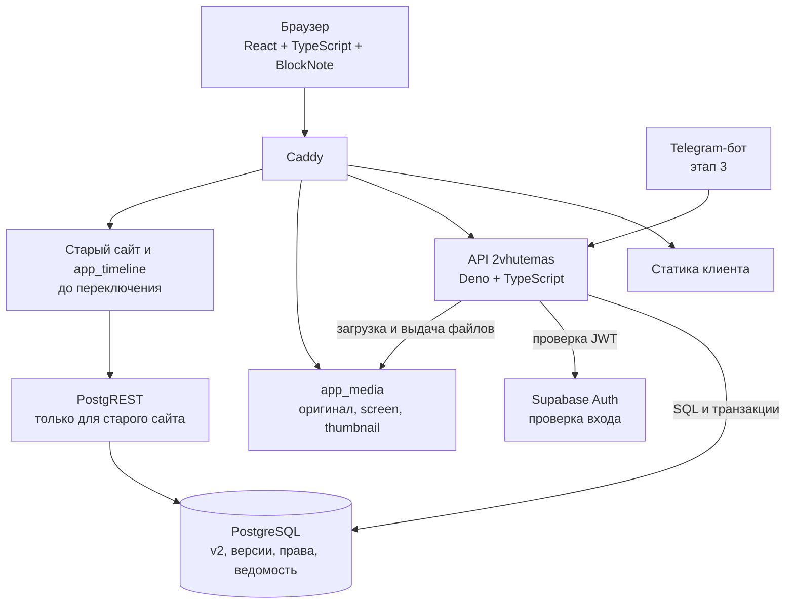

# Журнал решений

Хронологический список принятых решений. Подробности — на связанных страницах. Изменение решения не удаляет прежнюю запись, а добавляет новую со ссылкой на неё.

## 2026-09-22

### Р-01. Схема `v2` развивается, новая схема не создаётся

**Решение пользователя.** Существующая схема `v2` в живой БД остаётся основой. `bigint` ID сущностей сохраняются — на них строятся устойчивые адреса. Миграциями переводим ссылки по text code на `*_id`, добавляем недостающие поля, RLS и политики. Новым таблицам (версии, авторство, права, импорт) даём UUID.

**Почему:** в `v2` уже есть 23 периода и рабочие триггеры, структура соответствует принятой модели; вторая параллельная схема означала бы два набора таблиц и два типа идентификаторов для одних и тех же сущностей.

**Отклонено:** новая схема с UUID везде.

Связано: [Инвентаризация сервера](Инвентаризация%20сервера.md), [Структура БД](Структура%20БД.md), правило 1 в [Правилах проекта](Правила%20проекта.md).

### Р-02. Стек: API на Deno + TypeScript, клиент React + TypeScript

**Решение пользователя:** API на TypeScript, клиентская часть на React; TypeScript и на клиенте, дальше по потребностям.

- **API:** Deno (рантайм уже обслуживает `app_media` и `app_timeline`), HTTP-слой Hono, TypeScript без отдельной сборки, права рантайма задаются флагами.
- **Клиент:** React + Vite + TypeScript. React обязателен, потому что BlockNote существует только как React-компонент.
- **Раздача:** статику отдаёт существующий Caddy.
- Серверный рендеринг публичных страниц для SEO в первую версию не входит; решение о нём принимается отдельно.

**Почему Deno:** не появляется второго рантайма и второго способа деплоя. Слабое место Deno — нативные npm-модули, но обработка изображений уже выполняется вызовом ImageMagick из `app_media`, поэтому `sharp` не требуется.

**Отклонено:** Next.js на Node (второй рантайм); работа фронтенда напрямую с PostgREST (валидацию BlockNote, версии и импорт пришлось бы писать в SQL).

**Уточнение:** клиент не обращается к БД напрямую — только к нашему API. API подключается к PostgreSQL напрямую (SQL и транзакции), а не через PostgREST: обязательные атомарные операции — связь вместе с обоснованием, версия вместе с индексом вхождений, публикация вместе с переводом указателя — в PostgREST невыразимы. Вход пользователя проверяется по JWT существующего Supabase Auth. PostgREST остаётся только для старого сайта; после переключения схему `v2` следует убрать из его открытых схем.

Единственная точка записи новых данных — API: те же проверки прав, версии и правила действуют и для веб-интерфейса, и для бота, и для навыка наполнения.

### Р-03. Состояние материала — атрибут записи

**Решение пользователя:** черновик, публикация и архив — атрибуты записи, а не отдельные сущности.

Материал имеет статус: `draft` — черновик, `published` — опубликован, `archived` — архив. История правок ведётся в `revisions`; статус говорит, в каком состоянии находится материал, а указатель опубликованной версии определяет, что видит читатель. Правка опубликованного материала не попадает читателю до отдельного действия публикации.

Связано: [Структура БД](Структура%20БД.md), раздел о правилах истории и публикации.

### Р-04. Публикация зависит от роли: сразу или через ревью

**Решение пользователя:** у одних пользователей правка уходит сразу в публикацию, у других — сначала на ревью.

Из этого следует, что прежнего набора `view / edit / create_delete / su` недостаточно: право публиковать выделяется отдельно.

- `publish` — перевести версию в опубликованную самостоятельно.
- Пользователь без `publish` при сохранении отправляет версию на рассмотрение; материал остаётся в прежнем опубликованном состоянии.
- `review` — рассматривать чужие предложения: принять (что означает публикацию) или отклонить с объяснением.
- Решения о рассмотрении пишутся в `revision_reviews`, который перестаёт быть необязательным.

Это уточняет более раннее решение о четырёх правах (см. [ТЗ](Техническое%20задание.md)): роль куратора по-прежнему не вводится, разделяются именно права, а не должности. Состав начальных ролей ещё предстоит согласовать.

### Р-05. Закрыть запись anon в legacy-схеме `public`

**Решение пользователя:** закрываем сразу.

Найдено при инвентаризации: у роли `anon` есть INSERT/UPDATE/DELETE/TRUNCATE на legacy-таблицах при выключенном RLS, схема `public` открыта через PostgREST. Владелец публичного ключа сайта мог менять и удалять данные.

Выполнено 2026-09-22: права записи у `anon` отозваны, новые таблицы их больше не наследуют, проверка выполнена. Ход работы и что осталось — в [Инвентаризации сервера](Инвентаризация%20сервера.md). Контур ГИС (`public.gis_project`) и системные таблицы PostGIS не трогаем: там анонимная запись разрешена намеренно либо относится к чужому контуру.

### Р-06. Первая резервная копия снята до изменений на сервере

Перед любыми изменениями снята копия: дамп всей БД, роли кластера и файлы сервера вместе с media-data. Целостность архива проверена, пробное восстановление ещё не выполнялось. Подробности — [BackUp](BackUp.md).

### Р-08. Датировки — отдельная таблица, привязанная к объекту

**Решение пользователя:** даты прикрепляются к объекту и лежат в отдельной таблице как атрибуты. Одна запись — одна датировка своего вида: рождение, смерть, проектирование, строительство, открытие, реконструкция и так далее. Отдельными сущностями датировки не становятся.

Предлагаемая таблица `v2.entity_dates` (состав полей — к подтверждению):

| Поле | Назначение |
|---|---|
| `id` | UUID записи |
| `entity_id` | Объект, человек или период |
| `kind_id` | Вид даты из словаря `v2.date_kinds` |
| `start_year`, `start_month`, `start_day` | Начало; месяц и день необязательны, год может быть отрицательным для дат до н. э. |
| `end_year`, `end_month`, `end_day` | Окончание для интервалов; пусто для точечной даты |
| `is_approximate` | Приблизительность |
| `is_ongoing` | Открытый интервал: «по настоящее время» |
| `source_reference_item_id` | Источник датировки |
| `note` | Пояснение |
| `sort_order`, аудит | Порядок показа и поля создания/правки |

Существующие `object_profile.year_start/year_end`, `person_profile.birth_year/death_year` и `period_profile.start_year/end_year` остаются до переноса; после него они становятся производными от `entity_dates` либо убираются отдельной миграцией.

### Р-09. Черновик редактора имеет автосохранение

**Решение пользователя:** противоречия между статусом и автосохранением нет. Материал со статусом `draft` сохраняется редактором автоматически; отдельной сущности для автосохранения не заводим. Автосохранение обновляет черновик, а не опубликованную версию; читатель продолжает видеть опубликованное.

### Р-10. Существующая схема `v2` — основа DDL

**Решение пользователя:** перерисовывать модель заново не требуется. Действующая схема `v2` в БД и снимок `db/snapshots/20260922_v2_before.sql` служат отправной точкой; диаграммы в [Структуре БД](Структура%20БД.md) описывают ту же модель. Миграции пишутся как изменения поверх существующей схемы, а не как создание модели с нуля.

### Р-11. Разработка ведётся на сервере

**Решение пользователя:** отдельное локальное окружение не заводим. Проект учебный, простой сервера не трагедия; разработка прямо на VDS даёт работу с разных компьютеров и разными моделями без синхронизации баз.

Границы, чтобы это не стоило данных:

- Новый код работает в схеме `v2` и новых схемах проекта. Схемы `students`, `public` (legacy) и ГИС для разработки доступны только на чтение.
- Перед каждой миграцией снимается резервная копия; копия проверяется по манифесту.
- Разрабатываемый API до готовности доступен на отдельном поддомене и не заменяет действующий сайт.
- Ведомость с персональными данными студентов в разработке не используется; для проверки прав заводятся тестовые записи.

### Р-12. Механизм миграций

Выбран на основании общей практики, отдельного обсуждения не требовалось.

- Нумерованные SQL-файлы в репозитории: `db/migrations/NNNN_описание.sql`, только вперёд.
- Каждая миграция выполняется одной транзакцией. Обратных миграций не пишем: откат — это новая миграция либо восстановление из копии.
- Таблица `v2.schema_migrations`: номер, имя файла, контрольная сумма, время применения, кто применил. Повторное применение с изменившейся контрольной суммой отклоняется.
- Применяет отдельная команда от роли `supabase_admin` — не старт сервиса. Сервис, обнаружив непримененную миграцию, сообщает об этом и не стартует.
- Первая миграция создаёт сам журнал и регистрирует себя после успешного применения.

### Р-13. Деплой на время разработки — простой

**Решение пользователя:** пока идёт разработка, правки схемы, API и клиента идут вместе; усложнять выкладку не нужно.

Один скрипт: получить код, применить миграции, собрать клиент, перезапустить контейнер API. Отдельных стадий, промежуточных сред и автоматической выкладки нет. Порядок выпуска пересматриваем, когда появится публичный доступ.

### Р-14. Наблюдаемость входит в правила проекта

**Решение пользователя:** принято и вынесено в [правила проекта](Правила%20проекта.md), правило 13. Логи в формате JSON, сквозной `request_id`, проверка живости, уведомления об ошибках резервирования и обработки медиа в Telegram.

### Р-15. Аудит пока атрибутом

**Решение пользователя:** отдельный журнал административных действий нужен, но на этом этапе достаточно атрибутов записи — кто создал, кто изменил, когда. Полноценный журнал выдачи ролей, публикаций и импорта добавляем, когда появятся пользователи помимо администратора.

### Р-16. Безопасность — после каркаса

**Решение пользователя:** проект учебный, сначала работающий каркас, защита и интерфейс поверх него.

В каркас всё же входит то, что ничего не стоит и потом дорого встраивается: проверка подписи токена в API, разрешённые источники запросов, проверка содержимого загружаемого файла. Ограничение частоты запросов, политика содержимого и хранение токена в защищённом виде откладываются до публичного доступа.

### Р-17. Ориентиры объёма и совместимости

**Решение пользователя:** принято. До 5000 объектов, до 20 000 файлов, десятки одновременных читателей, список отвечает быстрее 300 мс. Браузеры — две последние версии Chrome, Safari, Firefox, Edge, минимальная ширина экрана 360 px. Платный пакет BlockNote с колонками не используем; при необходимости — отдельное решение.

### Р-18. Интерфейс на русском, без механики переключения языков

**Решение пользователя:** интерфейс пока только русский; отдельный слой перевода не строим, пока проект не заработал.

Данные остаются многоязычными: `title_ru`, `title_en`, `title_original` с языком оригинала, `documents.lang`, поисковые конфигурации для русского и английского — это содержимое, а не интерфейс. Ошибка API возвращает машинный код латиницей и русский текст для человека. Второй язык интерфейса — отдельное решение, когда в нём появится нужда.

### Р-19. Латинское название сохраняется

**Решение пользователя:** `entities.title_la` остаётся в модели — латинское наименование нужно научному проекту. Колонка сохраняется и заполняется там, где такое название есть; пустое значение допустимо.

### Р-20. Начальные роли

**Решение пользователя подтверждено.** Первая миграция создаёт четыре набора прав:

| Роль | Права | Смысл |
|---|---|---|
| `su` | все, включая управление ролями | Администратор приложения |
| `editor` | view, edit, create_delete, publish, review | Публикует сам и рассматривает чужие версии |
| `contributor` | view, edit, create_delete | Пишет и правит; его версия уходит на рассмотрение |
| `reader` | view | Чтение доступного |

Опубликованные материалы читаются без назначения роли. Кто из пользователей получает какую роль — отдельная административная операция, не следствие статуса студента.

### Р-21. Новый контур в схеме `app`, старый не трогаем

**Решение пользователя 2026-09-22:** 23 периода в схеме `v2` — база старого проекта; её не трогаем вообще. Новый проект разрабатывается параллельно со старым и заменит его, когда обгонит по возможностям.

**Это отменяет часть [Р-01](#р-01-схема-v2-развивается-новая-схема-не-создаётся):** схема `v2` больше не является основой нового контура. Причина изменения — уточнение статуса `v2`: это не заготовка новой модели, а часть работающего старого проекта.

Что остаётся от Р-01: модель, заложенная в `v2`, признана правильной и воспроизводится в новом контуре. Что меняется: новые таблицы создаются в отдельной схеме `app`, структура и данные `public` и `v2` миграциями не изменяются.

Следствия:

- Имя схемы нового контура — `app`. Версия в имени не нужна: схема одна и заменит старые целиком.
- `id` сущностей — `bigint`, как и в старой модели; новые служебные таблицы получают UUID (правило 1).
- Перенос данных старого контура в `app` — отдельная работа с таблицей соответствия идентификаторов, без обратной синхронизации.
- Переключение на новый контур — отдельное решение после того, как он обгонит старый.

### Р-22. У нового контура собственный реестр медиа

**Решение пользователя 2026-09-22:** новый контур ведёт собственный реестр медиа, а не дополняет реестр старого проекта.

- `app.media_assets` — реестр нового контура: подпись, альтернативный текст, атрибуция, источник, лицензия, видимость, архивирование. Ключ — UUID.
- `app.media_files` — неизменяемые физические варианты: `original`, `screen`, `thumbnail`, с контрольной суммой, состоянием обработки и параметрами рецепта.
- Ссылки модели (`entities.cover_media_id`, `attachments.asset_id`) ведут в новый реестр.
- `public.media_assets` и файлы старого проекта не изменяются. Перенос — отдельная работа с таблицей соответствия идентификаторов; она же решает, копировать файлы или ссылаться на существующие.
- Новому контуру нужен собственный корень хранения файлов. Его расположение и порядок обслуживания — ближайшее решение, до включения загрузки.

Это уточняет пункт 9 [схемы этапа 1](Схема%20этапа%201%20—%20предложение.md), где предлагался общий реестр.

### Р-23. Вставка объектов в текст по ссылке

**Требование пользователя 2026-09-23:** модель держится на связях, поэтому объекты нужно уметь размещать прямо в тексте; рядом с редактором — панель связанных элементов, откуда их берут по ходу письма.

Как сделано:

- **Два собственных элемента редактора.** Блок-карточка `entityCard` занимает строку и двигается вместе с текстом; упоминание `entityMention` живёт внутри абзаца. Оба хранят только идентификатор сущности и идентификатор появления — объект не копируется.
- **Панель сбоку** с тремя источниками: связанные с этим объектом, поиск по каталогу, недавно вставленные. Вставка щелчком — карточкой или ссылкой в строку; перетаскивание работает как дополнение, а не единственный способ.
- **Указатель вхождений** `app.document_entity_refs` собирается сервером из блоков при сохранении каждой версии, в одной транзакции с ней. Порядок один — тот, что в документе. Ссылка на несуществующий объект не сохраняется.
- **Обратные ссылки**: представление `app.published_entity_mentions` показывает, в каких опубликованных материалах упомянут объект. Черновики через него не раскрываются.
- **Связи в API**: создание связи вместе с обоснованием одной транзакцией, окружение объекта с обоснованиями, удаление с записью в историю. Связь без обоснования отклоняется и приложением, и базой.

Следующие шаги: вызов вставки из текста по «/» и «@», выбор иллюстрации для конкретного появления объекта, закрепление версии сущности для неизменяемой учебной подборки.

### Р-24. Откат колонок объекта, добавленных без запроса

**Разбор 2026-09-23.** Пользователь просил расширить сведения **по медиа**. Я вместо этого расширил и профиль объекта: сохранность, использование, материалы, этажность, высота, площадь, вместимость, охранный статус; у участника — «чем известен», страна, сайт. Этого никто не просил, и это ломало общность модели: вид «объект» охватывает книгу, фильм, постановку и концепцию, где этажность и площадь бессмысленны.

**Откат выполнен миграцией 0010.** Данных в этих колонках не было (проверено до удаления), поэтому ничего не потеряно. Словарь `object_statuses` удалён. `object_profile` вернулся к составу: тип объекта, город, страна, адрес, координаты, типология. `person_profile`: тип участника, полное имя.

**Что сохранено:** расширенные сведения о медиа из 0008 — они и были предметом запроса. Колонка `address` остаётся: она заполнена пользователем и относится к размещению объекта наравне с городом и страной; её судьба — отдельное решение.

**Правило на будущее:** правило 14 в [Правилах проекта](Правила%20проекта.md) — модель данных не расширяется по инициативе исполнителя.

### Р-07. Правила обращения с секретами

**Решение пользователя:** секреты хранятся в папке проекта; перед коммитом проверяется `.gitignore`; в WIKI секретов нет; WIKI копируется в Dropbox; история коммитов проверяется на секреты.

Записано правилами 9–12 в [Правилах проекта](Правила%20проекта.md). Каталог копии WIKI — `E:/Dropbox/Приложения/remotely-save/2Vhutemas`, скрипт `tools/backup_wiki.py` (отказывается копировать файлы, похожие на секреты). Проверка истории 2026-09-22: ключей, паролей и приватных ключей в коммитах нет.
