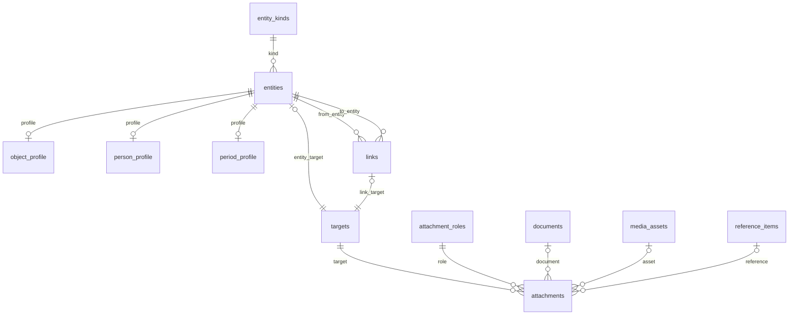
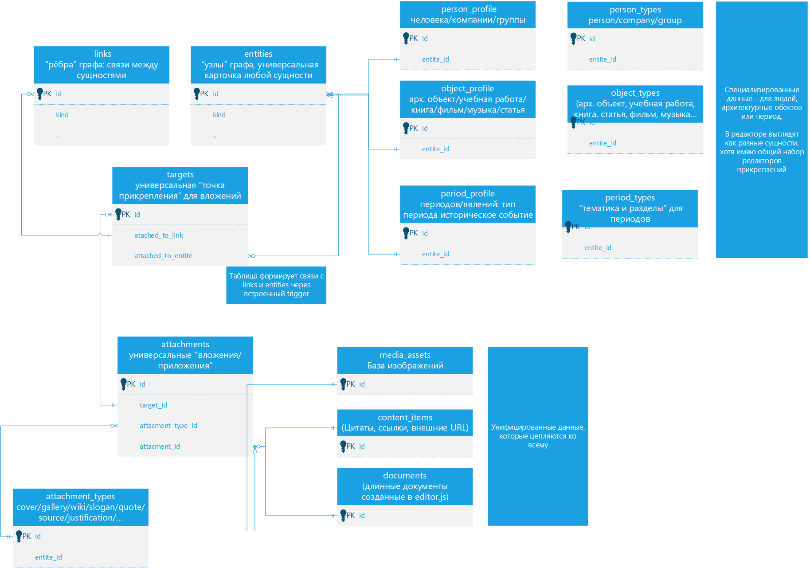
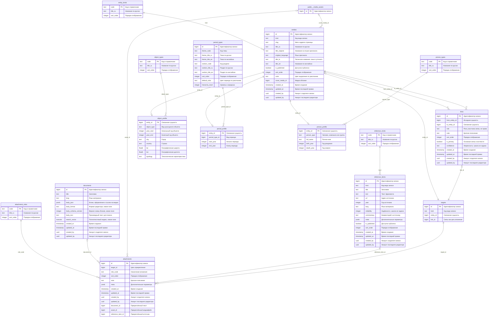
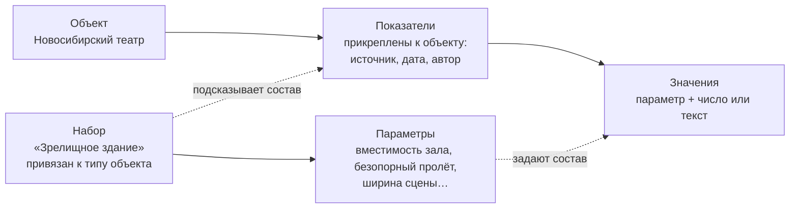
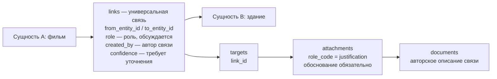
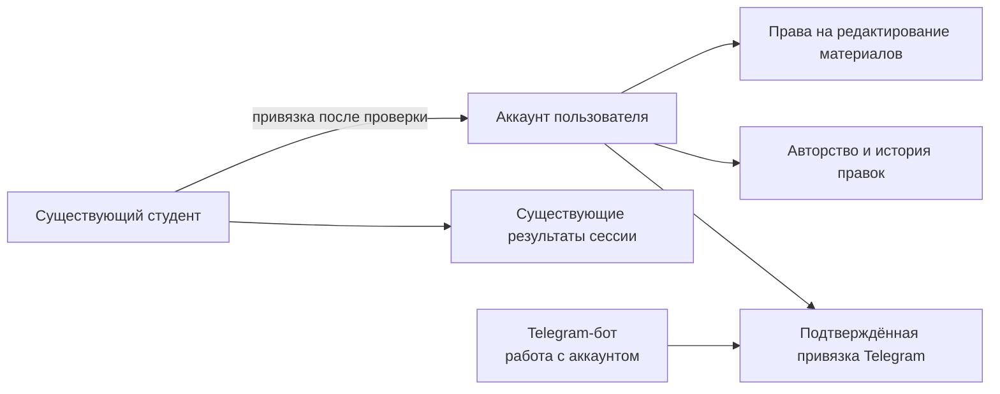
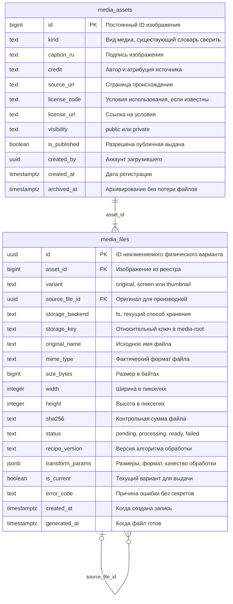
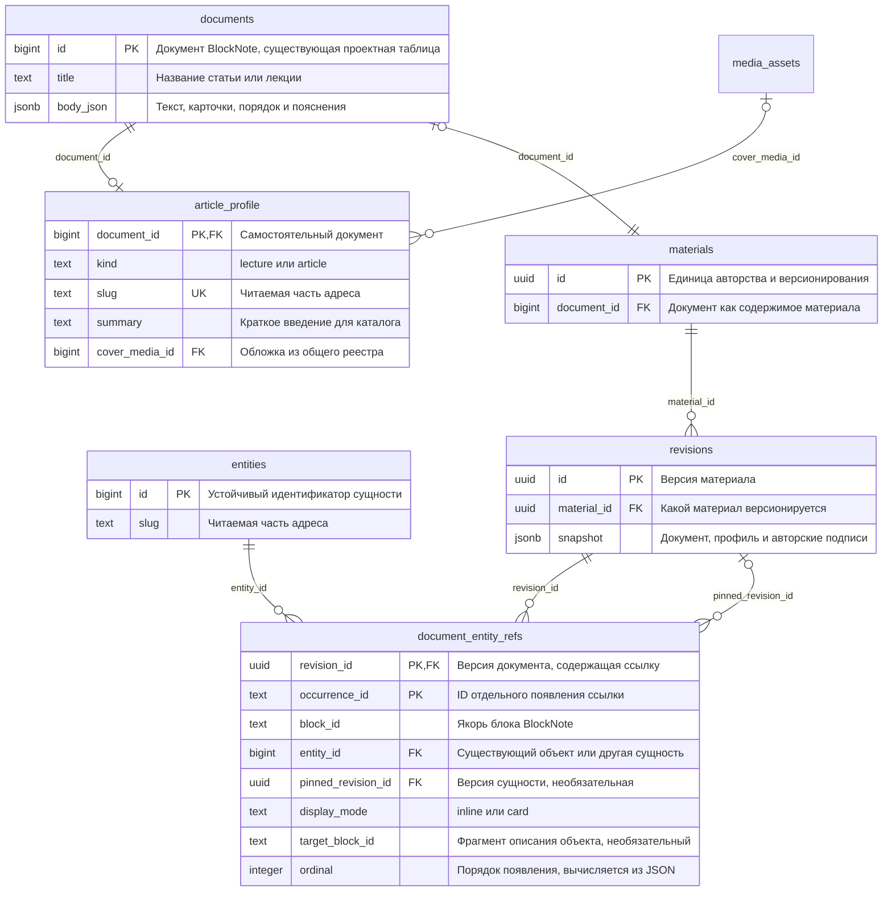

# Структура БД

## Актуальные правила идентификации

См. [Правила проекта](Правила%20проекта.md). Все внутренние ссылки — только по UID. Исходные диаграммы ниже сохраняют исторические text code PK/FK и составные естественные ключи, но **не являются актуальной целевой SQL-схемой** в этой части. До реализации: справочники получают id UUID PK, code остаётся уникальным атрибутом; kind/role_code/object_type и аналогичные ссылки становятся *_id FK. roles и permissions также получают UID; user_roles и role_permissions ссылаются на role_id/permission_id. Значения view/edit/create_delete/su — атрибуты разрешений, а не внешние ключи. Индексы UNIQUE на кодах допустимы, связи по кодам — нет. По решению [Р-10](Решения.md) отправная точка DDL — действующая схема `v2` и её снимок; миграции пишутся как изменения поверх неё. Диаграммы ниже описывают ту же модель, но остаются документацией: копировать их блоки в миграцию без сверки со снимком нельзя.

## Статус и границы

Документ описывает три разных состояния:

1. **Legacy:** модель, на которой по инженерной WIKI работает опубликованный таймлайн.
2. **Спроектированная универсальная модель:** схема из `D:\WORK\ArchSite\DB STRUCTURE\mermaid_schema.md` и её уточнения в инженерной WIKI.
3. **Предложения:** изменения, обсуждённые 2026-09-22 для новых учебных сценариев. Они ещё не оформлены в SQL и не внедрены.

Живая БД проверена read-only 2026-09-22 — см. [Инвентаризация сервера](Инвентаризация%20сервера.md). Схема `v2` уже создана по исходной диаграмме и содержит только 23 периода; журнала миграций нет.

Базовая платформа — существующий PostgreSQL / self-hosted Supabase проекта. Переход к универсальным сущностям не требует сам по себе смены СУБД.

## Действующая модель по документации

| Таблицы | Назначение |
|---|---|
| `projects` | Объекты и проекты |
| `authors` | Авторы и бюро |
| `styles` | Стили |
| `phenomena` | Феномены и эпохи |
| `features` | Признаки |
| `reference_entries` | Цитаты, манифесты, ссылки |
| `media_assets` | Медиа |
| `project_author`, `project_style`, `project_feature`, `project_media` | Связи объектов |
| `phenomenon_style`, `style_reference`, `reference_author` | Контекст и источники |

Сведения об этой структуре есть в `D:\WORK\ArchSite\supabase\migrations\20260202144504_remote_schema.sql`. Это исторический снимок, не гарантия полного совпадения с текущей БД.

## Спроектированная универсальная модель

### Сущности и профили

`entities` хранит общие идентификаторы, тип, slug, названия, публикацию, обложку и поля аудита. `entity_kinds` задаёт виды: `person`, `object`, `period`, `feature`.

| Профиль | Специальные свойства |
|---|---|
| `object_profile` | Тип объекта, годы, город, страна, координаты, типология |
| `person_profile` | Тип участника, имя, годы рождения и смерти |
| `period_profile` | Тип периода, начальный и конечный годы |

Словари: `object_types`, `person_types`, `period_types`. В исходном проекте компании и группы относятся к `person`, а стили и исторические процессы — к `period`.

### Связи

`links` связывает `from_entity_id` и `to_entity_id`, содержит пояснение, порядок, признак основной связи и уверенность.

В инженерной WIKI дополнительно предусмотрен `role` для роли участника: архитектор, инженер, автор, редактор. Поле добавлено в подробную диаграмму ниже для обсуждения. Его назначение и допустимые значения ещё не утверждены пользователем; в исходной Mermaid-схеме этого поля нет.

**Решение 2026-09-22:** связи остаются универсальными. Автор может связать фильм со зданием, если описывает основание связи. Создание связи происходит через описание с прикреплением: связь без обосновывающего вложения не допускается. Обоснование может быть авторской интерпретацией, а не только внешней ссылкой. Это не делает интерпретацию установленным фактом.

### Тексты, источники и медиа

- `documents`: длинные тексты, структурированное тело и текстовое представление.
- `reference_items`: цитаты, ссылки и библиографические материалы; типы задаёт `reference_kinds`.
- `media_assets`: существующий общий реестр медиа. В исходной диаграмме обозначен как `public__media_assets` и показан сокращённо.
- `attachments`: прикрепление документа, медиа или источника к цели, с ролью и порядком.
- `attachment_roles`: обложка, галерея, ключевой текст, чтение, контекст, источник, обоснование и другие роли.
- `targets`: цель вложения — сущность либо связь.

Сильная сторона этой конструкции — возможность прикрепить обоснование непосредственно к связи между объектами.

### Обзор отношений

Диаграмма ниже — сокращённое представление проектной модели с учётом описанных в WIKI инвариантов; она не является SQL-миграцией.

Две связи с `targets` — альтернативы: каждая цель указывает ровно на одну сущность или одну связь. Три вида содержимого `attachments` также взаимоисключающие.

### Графическая схема данных

Исходный концептуальный эскиз показывает общий принцип организации данных. В нём сохранены ранние названия (`content_items`, `attachment_types`) и условные поля; точные названия и состав полей см. в ER-диаграмме ниже.

### Полная ER-диаграмма

Диаграмма построена по исходному `mermaid_schema.md`. Кратности связей профилей, целей и необязательных вложений уточнены по инвариантам этого раздела. `float8` обозначает PostgreSQL `double precision`. `public__media_assets` — сокращённое изображение существующей таблицы `public.media_assets`, а не новая таблица.

Предложения по новым отношениям, датировкам и учебным пространствам сюда пока не включены. В `links` добавлено поле `role`, предусмотренное инженерной WIKI: это расширение исходной диаграммы для обсуждения, не отметка о выполненной SQL-миграции.

Mermaid отображается графически в режиме чтения Obsidian и других редакторах с поддержкой Mermaid. `PK` обозначает первичный ключ; подписи линий указывают поля связи. Ограничения «ровно один из вариантов» описаны отдельно в инвариантах.

### Инварианты для реализации

- Связь создаётся вместе с описанием-обоснованием через `targets` и `attachments`; связь без обосновывающего вложения не допускается. Удаление последнего обоснования не должно оставлять связь без основания. Способ обеспечения этого правила в БД ещё предстоит реализовать.
- У `targets` заполнено ровно одно из `entity_id` и `link_id`; `kind` соответствует выбранной цели.
- Для каждой сущности и связи создаётся единственная цель. По исходному проекту это обеспечивают триггеры.
- У `attachments` заполнено ровно одно из `document_id`, `asset_id`, `reference_item_id`.
- Профиль уникален по `entity_id` и соответствует виду сущности.
- Внешние ключи, правила удаления, ограничения дат и защита от нежелательных дублей задаются явно.
- Публикация и доступ проверяются также для связанных материалов, чтобы черновик не раскрывался через вложения или API.

## Расширение сведений 2026-09-23

По решению пользователя сведения о медиа и объектах расширены (миграция 0008).

**Изображения.** Словарь `app.media_kinds`: фотография, план, разрез, фасад, чертёж, схема, эскиз, макет, карта, портрет, документ, афиша, кадр. У `media_assets` добавлены вид, описание, автор изображения, год съёмки и уточнение датировки, где хранится оригинал, инвентарный номер, подпись источника дословно и ключевые слова. Автор снимка, правообладатель и загрузивший файл — три разных сведения и три разных поля.

**Объекты и участники: отменено.** Добавленные тогда же колонки профиля объекта и участника отменены миграцией 0010 — см. [Р-24](Решения.md). Профиль объекта остаётся общим для всех видов объектов; предметные характеристики делаются справочником признаков, когда это потребуется.

Незаполненное остаётся пустым: домысливать сведения об объектах нельзя.

## Места — проект, решение Р-25

Место хранится отдельной справочной записью и привязывается к сущностям с ролью. Назначение — положение на карте, поэтому история названий и варианты написания не хранятся ([Р-25](Решения.md)).

Ключевое свойство: **роль принадлежит привязке, а не месту**. Адрес здания, место рождения архитектора, его захоронение и офис бюро могут указывать на одну и ту же запись места — различает их роль привязки.

Состав записи `app.places` (миграции 0011 и 0012): страна, населённый пункт, улица, дом, помещение, координаты, точность, источник сведений. Названия места и адреса одной строкой нет — это были дубли элементов адреса; подпись собирается из них при показе. Запись не создаётся пустой: нужен хотя бы один элемент адреса или координаты. Координаты хранятся парой: широта без долготы не принимается. Привязка — через `targets` и `attachments`, где место стало четвёртым взаимоисключающим видом содержимого; роли: адрес объекта, место рождения, захоронение, офис организации. Точность обязательна: «Сиань» и «No. 136, Qinling North Road» — разные уровни, и на карте их нельзя показывать одинаково.

Пустая запись не создаётся: нет сведений — нет ни места, ни привязки.

Отдельный экран справочника мест не делается в первых этапах: он становится картой и относится к этапу 4.

## Параметры объектов — проект, к утверждению

Обсуждение 2026-09-23. Модель универсальна, и это хорошо для энциклопедии, но по ней неудобно работать с данными: у зрелищных зданий есть свой набор величин — вместимость зала, безопорный пролёт, габариты сцены, — по которым нужно сортировать и сравнивать со студентами.

Принято направление: **справочник параметров и значения**, а не таблица под каждый класс объектов и не отдельный вид сущности. Зоопарк возникает от множества механизмов, а не от множества параметров; механизм здесь один.

### Три уровня

| Слой | Назначение |
|---|---|
| **Параметр** | Определение величины: код, название, единица измерения, тип значения, как измеряется. Заводится один раз и переиспользуется |
| **Набор** | Список параметров для типа объекта. Подсказывает состав при заполнении, не запрещая дополнять и убирать |
| **Показатели** | Прикрепление к объекту: у кого взято, когда, кем измерено. Их может быть несколько: по проекту и после реконструкции |
| **Значение** | Параметр и его величина внутри показателей; число хранится в базовой единице |

### Правила против расползания

1. Один смысл — один параметр. Реестр не даёт завести «вместимость зала» и «Вместимость (мест)» порознь, как и у меток.
2. Единица измерения — часть определения параметра, а не текст рядом со значением.
3. У параметра есть определение: что именно считается вместимостью — только зал, с балконами или с приставными. Для учебного сравнения это важнее самого числа.
4. Справочник параметров ведёт не каждый редактор.
5. Набор подсказывает, а не запрещает: у конкретного здания может не быть сцены, и параметр просто не заполняется.

Сортировка и отбор по числовому параметру — обычный указатель по паре «параметр + значение».

Если какой-то набор станет опорным и потребует жёстких проверок, его можно вынести в отдельную типизированную таблицу поверх тех же данных: путь назад остаётся открытым.

### Что требует подтверждения

- Состав первого набора «Зрелищное здание» — предметное знание пользователя.
- Нужны ли у значения источник и признак приблизительности.
- Нужна ли история значений во времени (до и после реконструкции) или достаточно нескольких прикреплённых показателей с датой.
- Типы значений: число с единицей, целое, текст, да/нет, выбор из словаря.

## Предлагаемые доработки

### Семантика связей и происхождение утверждений

Первоначальное предложение об обязательном типе отношения не принято как требование. По решению пользователя связи универсальны и обязательно имеют прикреплённое описание-обоснование. Возможные дополнительные метки отношений и поле `role` остаются предметом обсуждения; они не должны ограничивать возможность авторской связи между разными видами объектов.

Если типизация будет введена, потребуется определить направление и правила симметрии. Не запрещать все повторные пары: между двумя сущностями возможны разные отношения и конкурирующие утверждения.

Для интерпретаций нужны автор утверждения, статус проверки, источник и пояснение. Поле `confidence` не заменяет эти сведения. Должна сохраняться возможность представить несколько версий, не перезаписывая одну другой.

### Время, события и понятия

**Позиция пользователя 2026-09-22:** временная привязка в целом возникает из объектов. Расширение датировок принимается как направление; конкретную структуру ещё нужно разработать. Рассмотреть присоединение датировок или событий к объектам через связи.

**Рабочий вариант для обсуждения:** датировку хранить как структурированное значение с точностью и источником; самостоятельное событие связывать с объектом через `links` с обязательным обоснованием. Периоды в представлении могут вычисляться по связанным объектам, но такой диапазон нужно отличать от исторически обоснованных границ периода: состав коллекции может изменяться. Не решено, должны ли все датировки становиться отдельными сущностями.

**Решение [Р-08](Решения.md):** датировки хранятся в отдельной таблице `v2.entity_dates`, привязанной к сущности, по одной записи на вид даты — рождение, смерть, проектирование, строительство, открытие, реконструкция. Вид берётся из словаря `date_kinds`; запись хранит начало и окончание, приблизительность, открытый интервал, источник и пояснение. Самостоятельными сущностями датировки не становятся; события вводятся отдельно там, где у них есть собственные участники и контекст.

Неизвестная дата, приблизительная дата и открытый период должны различаться. Для ранних объектов нужно явно определить соглашение о датах до нашей эры.

Стиль как понятие следует отделить от периодов его распространения в разных регионах. Конкретная схема этого разделения ещё не выбрана.

### Участники и источники

Людей и организации можно объединять на общем уровне участников, но их профили должны различаться. Книгу как изучаемое произведение следует отличать от библиографической записи издания и конкретного цитируемого фрагмента.

### Пространства и оценки восприятия

Предлагается отдельный слой представлений. Его ориентировочные сущности:

| Сущность | Назначение |
|---|---|
| Пространство | Название, назначение, автор, версия настроек |
| Ось | Критерий, описание шкалы и правила интерпретации |
| Размещение | Объект и его положение в конкретном пространстве |
| Оценка | Объект, критерий, значение, наблюдатель, условия восприятия, обоснование |
| Маршрут | Подборка объектов с порядком и пояснениями |

Это концептуальные названия, не утверждённые имена SQL-таблиц.

**Решение пользователя 2026-09-22:** возможность визуально выделять элементы важна. Цвет — один из вариантов; его участие в дизайне будет определено позднее. Поля `color` и `sort_order` не удаляем из проектной модели на основании текущего обсуждения.

Предлагаемое разделение: координаты на экране, цвет и порядок могут переопределяться в представлении; общие значения в `entities` служат значениями по умолчанию. Это ещё не окончательное решение дизайна. Географические координаты объекта имеют другой смысл и сохраняются отдельно.

Иммерсивность и удалённость нельзя заранее считать неизменными свойствами объекта: оценка зависит от наблюдателя и условий знакомства. Студенческое размещение не должно менять общую карточку.

### Учебный слой

Задания, версии заданий, попытки, ответы, аргументы и состояние повторения предлагается хранить отдельно от общего знания. Попытка должна сохранять связь с версией задания, чтобы последующая правка не меняла смысл результата.

Личные результаты доступны студенту и уполномоченному преподавателю. Общедоступные материалы, черновики и учебные данные требуют разных политик доступа. Существующие пользователи и ведомости переиспользуются через явные связи после проверки их действующей схемы.

### Укрупнённая схема связи с обоснованием

Эта схема отражает принятое правило создания связи. `role` показан явно, но пока обсуждается. Здесь `attachments` показаны только для случая обоснования связи текстовым документом; полная модель допускает другие виды вложений.

### Студенты, пользователи и Telegram

**Требование пользователя 2026-09-22:** на сервере уже есть ведомость студентов с результатами сессии. Студентам нужны аккаунты пользователей, доступ к правке материалов и интеграция работы с аккаунтом через Telegram-бота.

**Предлагаемая структура, ещё не SQL-схема:** существующую запись студента связать с аккаунтом авторизации; результаты сессии сохранять в действующей ведомости. Исторический автор культурного объекта (`person_profile`) и пользователь-редактор — разные роли данных, их не следует автоматически объединять.

Предлагается хранить подтверждённый Telegram ID отдельно от отображаемого имени. Способ привязки, восстановления доступа, набор команд бота, назначения прав пользователям и порядок публикации правок нужно определить. Наличие Telegram-имени в ведомости само по себе не означает подтверждённую принадлежность аккаунта.

Доступ к редактированию не подразумевает доступ к чужим результатам сессии. Для правок потребуется сохранять автора и историю изменений. Схему существующих аккаунтов и ведомости проверяем перед проектированием новых таблиц, чтобы не создавать дубли.

## Хранение оригиналов и производных изображений

**Принято:** original + screen + thumbnail. Реестр `public.media_assets` сохраняется; предлагаем добавить `media_files` для физических вариантов. Ссылки карточек, вложений и блоков продолжают указывать на media_assets.id. Здесь расширение показано отдельно от исходной ER-схемы; это не миграция живой БД.

Инженерная WIKI описывает хранение на ФС через app_media, оригиналы и cache с thumb/preview. Её снимок помечен design, а более поздняя инфраструктурная WIKI перечисляет app_media среди работающих сервисов. Перед реализацией сверяем фактические поля и пути. В API потребуется явное сопоставление старого preview с новым screen, старого thumb с thumbnail — слово «превью» иначе неоднозначно.

Правила проектной модели:

- У зарегистрированного изображения один текущий original; у готового к обычному показу изображения также есть текущие screen и thumbnail. Частичный уникальный индекс по `(asset_id, variant)` для `is_current=true`; проверка обязательного набора при переводе в готовность.
- Оригинал неизменяемый, `source_file_id=NULL`. У производных source_file_id указывает на оригинал того же изображения. Замена оригинала создаёт новый asset, чтобы старые документы не менялись незаметно. Перегенерация производной создаёт новую запись файла и переключает текущий вариант атомарно.
- Поля файла и ключ хранения обязательны для ready; для pending могут отсутствовать. Пока производные готовятся, интерфейс показывает состояние обработки, а не автоматически скачивает большой оригинал.
- `storage_key` — устойчивый относительный путь, например `orig/<sha256>/<file>` или `derived/<asset_id>/<recipe>/<file_id>.webp`; конкретные пути согласуются с текущим сервисом. Публичный URL вычисляется API и не является идентификатором файла.
- Существующие `fs_path`, `mime`, `bytes`, `width`, `height`, `sha256` и legacy storage-поля сверяются и переносятся/сопоставляются с записью original. Не поддерживаем две независимо редактируемые копии метаданных; совместимость сохраняем до перевода всех потребителей.
- SHA-256 используется для проверки целостности и обнаружения повторов. Повторные байты не объединяют права доступа и атрибуцию автоматически. Физическая дедупликация допустима при отдельном учёте ссылок; её поведение в существующем сервисе нужно проверить.
- Авторство загрузки отличается от автора фотографии (`credit`). Подпись и alt конкретного использования могут переопределяться в блоке документа, не меняя сам файл.
- Все варианты проверяют доступ через asset. Произвольный прямой путь не должен обходить приватность. Исторические варианты не удаляются, пока нужны опубликованным материалам или версиям.

Размеры, процесс обработки и критерии приёмки — в [ТЗ](Техническое%20задание.md).

## Расширенный формат документов

**Принятое требование:** документ включает содержание и управляемое оформление. Для нового редактора выбран BlockNote; основной формат — его блочный JSON. Существующие документы Editor.js, если они есть, сохраняются до проверенного преобразования.

В основной ER-диаграмме у `documents` добавлены проектные поля `body_format` и `body_schema_version`, а назначение `body_json` уточнено. Миграция не выполнена.

| Поле | Как используем |
|---|---|
| `body_json` | Полное дерево/список блоков редактора: текст, порядок, устойчивые ID, свойства оформления, ссылки на объекты и медиа |
| `body_format` | Например `blocknote` или `editorjs`; формат проверяется до открытия |
| `body_schema_version` | Версия нашей схемы блоков; при изменении нужны явные преобразования |
| `body_text` | Производное текстовое представление для поиска и кратких выдержек, не самостоятельный редактируемый оригинал |

Файлы не помещаются в JSON: изображение или видео ссылается на `media_assets` через устойчивый ID, а адрес доставки формируется при отображении. Для этого потребуется предметный медиаблок/адаптер; стандартное поле URL редактора само по себе не создаёт такую связь. Аналогично упоминания используют ID сущностей и источников. Вложения определяют связь материала с объектом, а блоки определяют его композицию.

Ссылки внутри JSON нельзя защитить обычным FK: сервер валидирует ID и права, извлекает зависимости и не допускает удаление используемого ресурса без обработки ссылок. Публикация проверяет доступность зависимостей; закрытое медиа не становится публичным из-за вставки в документ. Сохраняемые версии включают формат, версию схемы и полный `body_json`. Архивирование медиа не должно уничтожать файлы, необходимые старым версиям.

Неизвестный тип блока не удаляется при открытии: показываем заглушку или запрещаем редактирование до обновления совместимого редактора. Производные HTML/Markdown и поисковый текст можно генерировать из JSON; их не редактируем как параллельные оригиналы. Markdown-экспорт может терять оформление, поэтому не используется для резервного восстановления богатого документа.

Источники для выбора: [BlockNote — форматы](https://www.blocknotejs.org/docs/foundations/supported-formats), [BlockNote — расширение блоков](https://www.blocknotejs.org/docs/features/custom-schemas/custom-blocks), [Tiptap — сохранение JSON](https://tiptap.dev/docs/editor/core-concepts/persistence). Требования к интерфейсу — в [описании проекта](Описание%20проекта.md).

### Индексация, поиск и программное редактирование BlockNote

BlockNote выбран для нового редактора. Храним его JSON без промежуточного преобразования в Markdown. `body_text` генерируется на сервере из текстового содержания блоков и обновляется вместе с принятой версией, а не поступает как независимое поле от клиента. Индексируем также заголовки, авторов, подписи изображений и доступные цитаты. ID блоков позволяют ссылаться на конкретный фрагмент результата.

Предлагаемое расширение `documents`: `search_vector tsvector` — производный полнотекстовый индекс с GIN; конфигурация языка выбирается явно (русский/английский и нейтральный fallback). Связанные названия сущностей включаются отдельной поисковой проекцией; изменения названия должны обновлять её. Опубликованные версии и черновики индексируются с учётом доступа: поиск не раскрывает закрытые тексты, авторские правки или оценки. Не индексируем скрытый черновик вместо опубликованного документа.

Программное редактирование и помощь ассистента выполняются над JSON конкретной версии: изменения блоков по устойчивым ID, проверка схемы, сравнение изменений, сохранение новой версии с указанием исполнителя. Неизвестные блоки сохраняются без потери. Формат `body_schema_version` относится к нашей схеме и адаптерам; изменение версии библиотеки не означает автоматическую миграцию содержимого. Массовая миграция проверяется на копии и сохраняет оригиналы.

По решению [Р-09](Решения.md) автосохранение обновляет черновик материала (`status = draft`) и не трогает опубликованную версию, её `body_json` и поисковый текст. Отдельной сущности для автосохранения нет. История версий уже предусмотрена в revisions. Реальное время совместной работы не требуется для первой версии.

## Самостоятельные статьи, лекции и ссылки на объекты

**Принятое требование:** самостоятельная лекция/статья содержит ссылки на сущности БД, позволяет задать их порядок и перейти к подробностям. Для этого не создаём дубли объектов и не требуем прикрепления статьи к единственной сущности.

**Предлагаемая реализация:** `documents` остаётся носителем BlockNote JSON; `article_profile` добавляет документу свойства самостоятельной публикации. Это дополнительный профиль документа, а не новый kind культурной сущности. Авторство, разрешения и версии используются через уже предложенный `materials.document_id` — отдельная параллельная система авторов для лекций не нужна.

На диаграмме общие таблицы показаны сокращённо. `materials` по-прежнему может представлять и другие виды материалов; XOR-инвариант содержимого сохраняется. `article_profile` входит в снимок документа. Заголовок не дублируется: источник — documents.title в соответствующей версии.

### Порядок и ссылочная целостность

- Основной источник композиции — JSON BlockNote. Предлагаемые пользовательские блоки `entityCard` и inline-упоминания содержат entity_id, устойчивый ID вхождения и при необходимости ID закреплённой версии. Локальное пояснение хранится в лекции, а не в карточке объекта.
- Для лекции о зрелищных зданиях дополнительно нужны ссылка на фрагмент подробного описания (`target_block_id`) и выбор иллюстрации конкретного появления объекта. ID документа фрагмента и ID выбранного медиа хранятся в свойствах блока; сервер проверяет принадлежность фрагмента описанию сущности и доступность медиа. Такие зависимости также извлекаются и проверяются при сохранении. `target_block_id` в индексе — якорь, не самостоятельный FK; при удалении фрагмента переход ведёт к карточке с пояснением. Полный индекс зависимостей документов/медиа предстоит спроектировать.
- `document_entity_refs` — производный индекс вхождений, извлекаемый сервером при сохранении каждой версии в одной транзакции. Его не редактируют отдельно от JSON. `ordinal` вычисляется обходом документа; нет второго независимого порядка.
- `occurrence_id` позволяет различать несколько ссылок внутри одного блока; повторное упоминание того же объекта допустимо. Перед сохранением проверяются уникальность ID вхождений и существование целей.
- `revision_id` должен принадлежать материалу документа. Закреплённая версия должна принадлежать материалу указанной сущности. Эти межтабличные условия обеспечиваются сервером и ограничениями/триггерами БД при реализации.
- Стабильные маршруты предлагаются в виде `/objects/<id>/<slug>` и `/articles/<document_id>/<slug>`. ID определяет запись; устаревший slug перенаправляет на актуальный адрес. Это проект маршрутов, ещё не работающие адреса сайта.
- По умолчанию карточка получает текущую опубликованную версию сущности. Поэтому публикация лекции фиксирует её порядок и авторский текст, но не замораживает все связанные знания. Явное закрепление версии сохраняет учебный контекст; переход к актуальной карточке также доступен.
- Список объектов и обратные ссылки строятся по индексу опубликованной версии, с проверкой прав как на документ, так и на сущность. Закреплённая версия не обходит приватность или отзыв публикации.
- Структурная ссылка «упомянуто в лекции» не является содержательной связью `links` и не требует отдельного доказательства. Если автор утверждает связь двух культурных объектов, действует принятое правило `links`: обязательное описание-обоснование.
- Архивирование статьи не удаляет упомянутые объекты. Физическое удаление сущности, на которую ссылаются версии, запрещается до явного разрешения зависимостей; при недоступности интерфейс показывает безопасную заглушку.

## Пользователи, роли, авторство и версии

**Требование принято 2026-09-22:** студенты участвуют как авторы и редакторы. Фиксируем авторство материалов и каждую правку. Следующая схема — проект расширения, не выполненная миграция. Названия новых таблиц рабочие.

В локальной миграции `20260628121000_students_works_rpc.sql` уже определены `students.student_account` (student_id, auth_uid, linked_at, linked_via), `students.profile` и `students.link_code`. Переиспользуем эту привязку после сверки с сервером. На диаграмме `auth_users`, `students_student` и `students_student_account` обозначают существующие `auth.users`, `students.student` и `students.student_account`; показаны только необходимые поля. Связь auth_uid с аккаунтом — требуемая логическая связь: в прочитанной миграции внешний ключ к auth.users не объявлен.

### Три разных значения роли

| Где | Что означает | Пример |
|---|---|---|
| `links.role` | Участие в связи культурных сущностей | Архитектор здания |
| `user_roles` | Наборы разрешений view/edit/create_delete/publish/review/su | Редактор (view+edit+create_delete) |
| `material_credits.credit_role` | Авторский вклад в материал | Автор текста, соавтор, переводчик |

Статус студента следует из ведомости и не является разрешением на всё редактирование. Исторический автор объекта остаётся культурной сущностью. Пользователь может иметь такую карточку, но создание аккаунта не должно автоматически создавать историческую персону. Студент как автор статьи указывается через `material_credits`; его действия сохраняются через `revisions`.

### ER-диаграмма расширения

```mermaid
erDiagram
    auth_users {
        uuid id PK "Идентификатор входа, существующий"
    }
    students_student {
        bigint id PK "Студент существующей ведомости"
    }
    students_student_account {
        bigint student_id PK "Студент, одна привязка"
        uuid auth_uid UK "Аккаунт студента"
        timestamptz linked_at "Когда привязан"
        text linked_via "Способ привязки"
    }
    contributors {
        uuid id PK "Постоянный ID автора или редактора"
        uuid auth_uid UK "Аккаунт, может быть отключён"
        text display_name "Имя для подписи материала"
        text status "active или disabled"
    }
    roles {
        text code PK "Код набора разрешений"
        text title "Название роли доступа"
    }
    user_roles {
        uuid id PK "Назначение роли"
        uuid contributor_id FK "Кому выдана роль"
        text role_code FK "Какая роль"
        uuid granted_by FK "Кто выдал роль"
        timestamptz granted_at "Когда выдана"
        timestamptz revoked_at "Когда отозвана, иначе NULL"
    }
    materials {
        uuid id PK "Постоянный ID редактируемого материала"
        text status "draft, published, archived — состояние материала"
        text kind "entity, link, document, reference, asset, attachment"
        bigint entity_id FK "Карточка сущности, один из вариантов"
        bigint link_id FK "Связь, один из вариантов"
        bigint document_id FK "Текст, один из вариантов"
        bigint reference_item_id FK "Источник, один из вариантов"
        bigint asset_id FK "Медиа, один из вариантов"
        bigint attachment_id FK "Прикрепление, один из вариантов"
        uuid published_revision_id FK "Опубликованная версия, может отсутствовать"
        timestamptz archived_at "Архивирование без потери истории"
    }
    material_credits {
        uuid material_id PK,FK "Материал авторского вклада"
        uuid contributor_id PK,FK "Автор или соавтор"
        text credit_role PK "author, coauthor, translator"
    }
    revisions {
        uuid id PK "Неизменяемая версия"
        uuid material_id FK "Какой материал изменён"
        uuid base_revision_id FK "Версия, на основе которой правили"
        uuid edited_by FK "Кто внёс правку"
        timestamptz created_at "Когда сохранена"
        text operation "create, edit, archive, restore"
        text summary "Краткое объяснение изменения"
        jsonb snapshot "Полное состояние материала и авторских подписей"
        integer schema_version "Формат снимка для восстановления"
        uuid change_set_id "Общая операция для нескольких материалов"
    }
    revision_reviews {
        uuid id PK "Событие рассмотрения версии"
        uuid revision_id FK "Рассматриваемая версия"
        uuid reviewer_id FK "Кто рассмотрел"
        text decision "submitted, approved, rejected, published"
        text note "Объяснение решения"
        timestamptz created_at "Когда принято решение"
    }
    telegram_accounts {
        bigint telegram_user_id PK "Подтверждённый ID Telegram"
        uuid contributor_id FK,UK "Пользователь проекта"
        timestamptz verified_at "Когда подтверждена привязка"
    }
    auth_users ||--o| students_student_account : auth_uid
    students_student ||--o| students_student_account : student_id
    auth_users o|--o| contributors : auth_uid
    contributors ||--o{ user_roles : contributor_id
    permissions {
        text resource PK "Область: content, access_control"
        text action PK "view, edit, create_delete, su"
        text description "Смысл разрешённого действия"
    }
    role_permissions {
        text role_code PK,FK "Набор разрешений"
        text resource PK,FK "Область действия"
        text action PK,FK "Разрешённое действие"
    }
    roles ||--o{ role_permissions : role_code
    permissions ||--o{ role_permissions : resource_action
    roles ||--o{ user_roles : role_code
    contributors ||--o{ user_roles : granted_by
    contributors ||--o{ material_credits : contributor_id
    materials ||--o{ material_credits : material_id
    materials ||--o{ revisions : material_id
    contributors ||--o{ revisions : edited_by
    revisions o|--o{ revisions : base_revision_id
    revisions o|--o| materials : published_revision_id
    revisions ||--o{ revision_reviews : revision_id
    contributors ||--o{ revision_reviews : reviewer_id
    contributors ||--o| telegram_accounts : contributor_id
    entities o|--|| materials : entity_id
    links o|--|| materials : link_id
    documents o|--|| materials : document_id
    reference_items o|--|| materials : reference_item_id
    public__media_assets o|--|| materials : asset_id
    attachments o|--|| materials : attachment_id
```

`PK` — первичный ключ, `FK` — внешний ключ, `UK` — уникальное значение. Совместные `PK` в `material_credits` образуют составной ключ. Блоки entities, links, documents, reference_items, public__media_assets, attachments раскрыты в основной ER-диаграмме выше.

`materials` — реестр редактируемых единиц, не замена `targets`. `targets` отвечает за прикрепление к сущности/связи; `materials` позволяет одинаково учитывать авторство и версии карточек, текстов, медиа и прикреплений. У материала заполнена ровно одна ссылка на содержимое; каждая такая ссылка уникальна. Профили входят в снимок своей сущности. Файлы медиа должны иметь неизменяемые версии или ключи хранения: история только метаданных не восстановит перезаписанный файл. Словари в первой версии правит администратор с отдельным журналированием; их нельзя оставлять обходным путём без истории.

### Модель прав: решение пользователя

Студенты — обычные пользователи, создаваемые из ведомости с подтверждением через Telegram. Отдельной роли студента нет. `contributors` фиксирует авторов и редакторов независимо от учебного статуса. Авторская подпись не предоставляет разрешений.

Предыдущая матрица author/editor/curator заменена независимыми разрешениями. `roles` содержит именованные наборы; `permissions` — действия по ресурсу; `role_permissions` — состав набора; `user_roles` — назначения пользователям. Например, view/edit/create_delete/publish/review/su для ресурса content. Конкретные начальные наборы ролей ещё не утверждены. Права ведомости не входят в content.

| Код | Действие |
|---|---|
| view | Просмотр доступных материалов |
| edit | Изменение существующих материалов с фиксацией версии |
| create_delete | Создание и удаление материалов — единое разрешение |
| publish | Перевод версии в опубликованную без чужого рассмотрения |
| review | Рассмотрение чужих предложений: принять или отклонить с объяснением |
| su | Полный административный доступ приложения с аудитом |

В первой версии предлагается проверять права на уровне ресурса; объектные ограничения при необходимости проектируются отдельно. Публично опубликованное читается без назначения роли. Право view не означает доступ ко всем черновикам и приватным файлам. Политики видимости согласуются отдельно. Управление ролями — отдельное административное разрешение на ресурсе access_control, не следствие права edit на content.

Подтверждение Telegram не выдаёт привилегий автоматически. Используем существующую связку ведомости с аккаунтами, уникальность привязок и одноразовые коды. Механизм подробно зафиксирован в [ТЗ](Техническое%20задание.md).

### Правила истории и публикации

**Решения 2026-09-22 (Р-03, Р-04):** состояние материала — атрибут записи `materials.status`: `draft`, `published`, `archived`. Публикация зависит от прав: обладатель `publish` переводит свою версию в опубликованную сам, остальные отправляют её на рассмотрение. `revision_reviews` становится обязательной частью механизма, а не опциональным проектом. Роль куратора не вводится: разделяются права, а не должности.

Статус и указатель работают вместе: `status` говорит, в каком состоянии материал, `published_revision_id` — какую версию видит читатель. Правка опубликованного материала создаёт версию и не меняет видимое читателю содержание до публикации. Архивирование меняет `status`, сохраняя историю и файлы.

Авторство не определяет доступ к черновику; его определяют разрешения и политика видимости.

- `created_by` и `updated_by` в основной схеме — технические аккаунты создателя и последнего редактора. Они не заменяют коллективное авторство. В расширении `edited_by`, `reviewer_id`, `contributor_id` указывают на постоянную запись `contributors`, связанную с аккаунтом.
- Снимок версии включает содержимое и состав авторских подписей. `material_credits` отражает принятые подписи, а изменения этого состава фиксируются в версиях. Для нового черновика принятыми считаются его текущие авторские назначения.
- Сохранённые версии и события рассмотрения не перезаписываются обычными редакторами. Исправление или откат создаёт новую версию. Блокировка аккаунта не удаляет историю и авторские подписи.
- Пользовательская правка опубликованного материала создаёт отдельную версию. До публикации читатель продолжает видеть прежнюю версию. Новую версию чужого материала пользователь может предложить при разрешении edit, но не может менять чужой черновик без доступа.
- `base_revision_id` должен относиться к тому же материалу. При публикации устаревшей версии конфликт с текущей версией разрешается явно, чтобы параллельные правки не затирали друг друга.
- `published_revision_id` указывает только на версию того же материала. Указатель, запись решения и применение изменений обновляются атомарно. `is_published` в исходной модели становится согласованным признаком наличия публичной версии, а не независимым переключателем в браузере.
- Создание связи, её описания и прикрепления — единая транзакция. Нельзя сохранять связь без обоснования. Публикация связи требует доступного читателю обоснования; общие изменения связываются `change_set_id` и публикуются согласованно. Структурные заголовки нового материала могут существовать без публичной версии, но не должны раскрываться через публичный API.
- Автор действия определяется сервером из подтверждённого входа, а не принимается как произвольный ID из формы или сообщения боту. Импорт оформляется отдельным техническим участником; неизвестное историческое авторство не приписывается импортёру.
- Назначение и отзыв ролей журналируются; активное назначение пары пользователь/роль уникально. Пользователь не может выдать себе роль через правку профиля. Одновременные роли складывают только явно разрешённые возможности.

В существующем ADR-007 регистрация закрыта, а доступ ведомости и модерации ограничен конкретными проверками. Их не расширяем автоматически до всех вошедших пользователей. Проверка 2026-09-22 подтвердила: в живой БД политики `auth_all` действительно дают любому вошедшему полный доступ ко всей ведомости ([инвентаризация](Инвентаризация%20сервера.md)). До включения студенческих аккаунтов эти политики должны быть заменены. Права приложения обеспечиваются на сервере и в БД, а не только скрытием кнопок. См. [документацию Supabase о RLS](https://supabase.com/docs/guides/database/postgres/row-level-security).

Telegram-привязку переиспользуем или расширяем после проверки существующих `tg_id` и `link_code`. Новая `telegram_accounts` описывает подтверждённый доступ, а не дублирующий список имён студентов. Одноразовый код должен иметь срок действия, храниться безопасно и потребляться атомарно. Бот не получает расширенные права автоматически; действие пользователя через бота подчиняется тем же правам и журналированию.

## Повторный разбор замечаний

| № | Вопрос | Что уже зафиксировано | Что предлагается определить дальше |
|---|---|---|---|
| 1 | Универсальные связи | Разрешены между разными сущностями, описание-обоснование обязательно | Считать обоснованием непустой документ; создавать и публиковать связь вместе с ним |
| 2 | `links.role` | Теперь виден с пояснением; не имеет отношения к доступу пользователя | Оставить необязательной меткой участия, например architect; свободная связь может быть без неё |
| 3 | `confidence` и `reliability` | Поля теперь подписаны, шкалы ещё нет | Не вводить числовой рейтинг без критериев; статус проверки и источник показывать отдельно |
| 4 | Стили и периоды | Время в целом возникает из объектов | Различать вычисленную по коллекции протяжённость и датировку, указанную исследователем |
| 5 | Несколько дат | Направление расширения принято | Датировки как структурированные записи; события как сущности со связями и обоснованием |
| 6 | Человек и организация | В исходной модели оба относятся к person | Общий участник + разные профили; создание/закрытие организации можно описывать событиями |
| 7 | Произведение и источник | Нужна проработка расширения | Книга-объект, отдельные издания и цитируемые фрагменты, связанные с ней |
| 8 | Выделение объектов | Необходимость принята, цвет сохранён | Переопределять оформление в представлении; дизайн ещё не выбран |
| 9 | Студенты как авторы | Аккаунты, правки, авторство и бот нужны | Приняты view/edit/create_delete/publish/review/su; порядок публикации определён Р-04, начальные наборы ролей ещё определить |

Неполную реплику о невидимом поле не считаем автоматически замечанием о `confidence`: оно вынесено в строку 3 для повторного обсуждения. Назначение `title_la`, контекст `is_primary` и шкалы уверенности также нужно уточнить до SQL.

### Протокол уточнений от 2026-09-22

- Принято: универсальная связь создаётся только через прикреплённое описание-обоснование.
- Выполнено в документации: поле `role` добавлено в подробную ER-диаграмму и отдельную схему связи. Семантика поля ещё обсуждается.
- Реплика «В представленной графической схеме не вижу» не содержит названия поля. Требуется уточнение; возможная связь с замечанием о `confidence` не считается установленной.
- Ответы «принимается (расширяем БД)» и «принимается (пока не понимаю как расширить структуру)» сохранены как согласие с направлением расширения, но без однозначного утверждения конкретных таблиц. По порядку исходных замечаний они могут относиться к датировкам и разделению произведения/издания; это соответствие нужно подтвердить.
- Рассматривается связывание датировок или событий с объектами. Конкретный вариант не утверждён.
- Принято: выделение элементов необходимо; его дизайн определяется позднее.
- Добавлены требования: аккаунты студентов, редактирование материалов, Telegram-бот для работы с аккаунтом и сохранение существующих результатов сессии.

## Порядок миграции

Ранее принят ADR-002: параллельная миграция. Старые таблицы остаются источником данных для работающего сайта до завершения переноса и переключения.

1. Сверить фактическую структуру и состав данных с документацией.
2. Проверить доработанную модель на разнообразных учебных примерах.
3. Подготовить SQL-миграции и проверить их на отдельной тестовой базе.
4. Реализовать повторяемый перенос с явным соответствием старых и новых ID. Таблица `legacy_id_map` — предлагаемое решение; slug не использовать как единственный идентификатор переноса.
5. Сверить количество записей, связи, датировки, тексты, медиа и выборку карточек.
6. Подключить новый API и тестовый интерфейс.
7. Перед переключением проверить резервное копирование и восстановление, остановить редактирование старых данных на время финального переноса.
8. После переключения определить новую модель единственным источником записи. План отката должен учитывать изменения, внесённые после переключения.

Legacy-совместимые views под старыми именами ранее решено не создавать. Контуры GIS, авторизации и ведомостей не входят в перенос культурных объектов; их зависимости нужно проверить до миграции.

## Что уточнить до SQL

- Назначение `role` и необходимость дополнительных меток универсальных связей.
- Атомарное создание связи с обоснованием и правила изменения/удаления обоснований.
- К каким замечаниям относятся неполная реплика и ответы без названия пункта (см. протокол уточнений).
- Модель понятий, периодов и событий.
- Представление спорных утверждений и их источников.
- Определения осей восприятия на примерах.
- Границы первого учебного сценария и необходимые права.
- Привязка существующих студентов к аккаунтам, права редакторов и сценарии Telegram-бота.

## Источники

- Исходная ER-схема: `D:\WORK\ArchSite\DB STRUCTURE\mermaid_schema.md`.
- Инженерная WIKI: `E:\Dropbox\Приложения\remotely-save\ArchSite\architecture\database-entity-model.md` и `database-legacy.md`.
- Решение о миграции: `E:\Dropbox\Приложения\remotely-save\ArchSite\decisions\ADR-002-parallel-migration-path-a.md`.
- [Описание проекта](Описание%20проекта.md).

Дальнейшее развитие описания модели ведётся здесь. Исходная схема сохранена в прежнем месте; этот документ не объявляет предложенные доработки внедрёнными.
