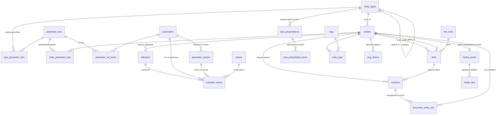

# Единая схема данных

Одна картина для всей модели: три основы — **запись, связь, параметр** — плюс версия и отображение. Всё, что раньше было отдельными механизмами (присоединения, источники, сведения о файле), выражено через них ([Р-39](Решения.md), [Р-76](Решения.md), [Р-78](Решения.md), [Р-80](Решения.md), [Р-84](Решения.md)).

Состояние на 2026-10-01: **есть** — работает в рабочей базе; **частично** — работает, но ещё со старым путём рядом; **план** — описано, не построено.

## Диаграмма

## Где живёт каждый объект

### Записи — `entities`

Одна таблица для **всего, о чём можно говорить и на что можно сослаться**. Различает тип из дерева `entity_types`; какие сведения у записи — решает набор параметров её ветви.

| Ветвь дерева | Типы | Что это | Состояние |
|---|---|---|---|
| Кто | Человек, Компания, Группа | Авторы, бюро, коллективы | есть |
| Что | Архитектурный объект, Градостроительная концепция, Конкурсная работа, Учебная работа, Постановка, Событие… | Предметы изучения | есть |
| Что | Книга, Статья, **Веб-страница** | Источники: на них ссылаются тексты | есть (Р-80) |
| Когда | Стили, эпохи, методы, учения | Периоды и течения | есть |
| Служебные | Лекция | Учебные тексты | есть |
| Страницы проекта | Логотип, Философия, Манифест, Обратная связь | Раздел «О проекте» | есть |
| *место решается* | **Изображение**, **Документ** | Файлы и самостоятельные тексты | план (Р-84) |

У **каждой** записи: название, слаг, тип, собственный МультиТекст ([Р-77](Решения.md)) и сведения по набору параметров.

### Сведения — параметры

| Таблица | Что хранит | Пример |
|---|---|---|
| `parameters` | Определение величины: смысл, единица, тип значения | «Пролёт, м», «Адрес страницы», «Автор снимка» |
| `parameter_options` | Варианты для величины-списка | виды изображения: фото, план, разрез |
| `parameter_sets` + `parameter_set_items` | Наборы величин | «Зрелищное здание», «Изображение — сведения» |
| `type_parameter_sets` | Какой набор действует для ветви дерева (вниз по ветви) | «Веб-страница» → набор с `url` |
| `entity_parameter_sets` | Исключение для одной записи | музей в бывшем вокзале получает «Вокзал» |
| `indicators` | Группа сведений записи | «по проекту», «после реконструкции» |
| `indicator_values` | Сами значения: число, текст, вариант, дата, место | пролёт = 43, url = https://… |
| `places` | Справочник мест — ответы для величины «место» | Новосибирск, Красный проспект, 36 |

**Сведения о файле — тоже здесь** (Р-84): автор, правообладатель, источник, лицензия, место хранения, год, вид — значения параметров записи «Изображение», а не колонки реестра файлов.

### Связи — `links`

Любое отношение двух записей и любое **использование** одной записи другой.

| Поле | Значение |
|---|---|
| `from_entity_id`, `to_entity_id` | Обе стороны — записи |
| `role_id` → `link_roles` | Архитектор, автор, влияние, место, **источник**, иллюстрация… |
| `sort_order` | Порядок: например, изображений в галерее |
| `is_primary` | Главная: например, **обложка** |
| обоснование (в версии связи) | Почему связь есть; для источника — «на стр. 34 сказано „…“»; для иллюстрации — подпись к этому месту |

Что выражается связью:

| Было отдельным механизмом | Теперь | Состояние |
|---|---|---|
| Автор здания, влияние, участие | связь с ролью | есть |
| Источник цитаты (`reference_items`) | связь «источник» к Книге / Статье / Веб-странице | есть (Р-80) |
| Обоснование связи (документ на присоединении) | содержимое версии связи | есть (Р-78) |
| Описание записи (документ на присоединении) | МультиТекст в версии записи | есть (Р-78) |
| Изображение в галерее, обложка (`attachments`) | связь «иллюстрация» к записи-Изображению, порядок, `is_primary` | план (Р-84) |

### Версии — `revisions`

Единый журнал. Владелец версии — запись **или** связь (`entity_id` / `link_id`). Владелец хранит два указателя: `working_revision_id` (в работе) и `published_revision_id` (видно всем) — и свой статус. Снимок версии записи: сведения, МультиТекст, параметры, метки; связи — её поля и обоснование. Публикуется владелец целиком, одной редакцией. Сохранённая версия неизменна. **Есть** (Р-78).

### Отображение — `type_presentations`, `type_presentation_items`

Как запись выглядит в трёх местах — `compact` (в тексте, в списке), `card` (карточка), `editor` — задаёт тип; берётся ближайшая настройка вверх по дереву. Компоненты собирают вид из данных самой записи: у здания — миниатюра и место, у книги — автор и год, у источника — знак и обоснование связи. Отсюда пиктограмма любой записи в тексте. **План** — сейчас вид задан кодом, знак есть только у источника.

### Техническое хранилище — не модель, а склад

| Таблица | Что | Состояние |
|---|---|---|
| `media_assets` | Реестр файла: ссылка на свою запись, публичность через запись | частично: сведения пока в колонках |
| `media_files` | Физические варианты: оригинал, экранный, превью; контрольные суммы | есть |
| `document_entity_refs` | Производный указатель: кто упомянут в какой версии текста | есть |
| `slug_history` | Прежние адреса записи | есть |
| `tags`, `entity_tags` | Метки | есть; `media_tags` уйдёт в `entity_tags` |

### Служебное — авторство, права, импорт

| Таблицы | Что |
|---|---|
| `materials`, `material_credits`, `revision_reviews` | Авторские подписи и ход рассмотрения версий |
| `contributors`, `roles`, `permissions`, `role_permissions`, `user_roles`, `telegram_accounts` | Участники и права |
| `import_jobs`, `import_items`, `import_key_map` | Пакетный импорт |
| `schema_migrations` | Журнал миграций |

## Что уходит

| Таблица | Чем заменена | Когда можно снять |
|---|---|---|
| `reference_items`, `reference_kinds` | связь «источник» к записи-источнику | сейчас: пусты |
| `targets`, `attachments`, `attachment_roles` | связь; присоединяемое — запись | после переноса изображений (Р-84) |
| `media_kinds` | варианты параметра «вид» | вместе с изображениями |
| `media_tags` | `entity_tags` | вместе с изображениями |
| `documents` | МультиТекст в версии записи | остаётся историей и для старых адресов |

Итог: уходят семь таблиц, приходят две таблицы отображений — **42 → 37**, и единственный механизм отношений в модели — связь.
