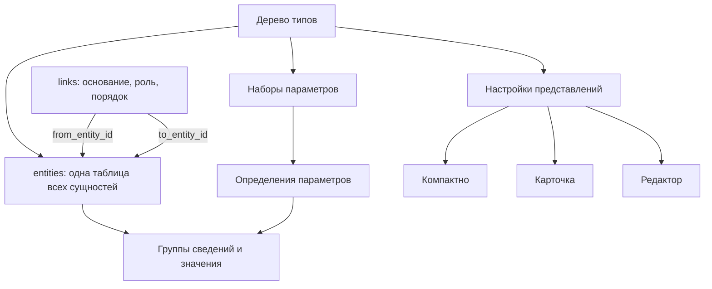

# Целевая схема данных: присоединение через сущность и связь

Обновлено 2026-09-29 после уточнения пользователя: механизм присоединений сохраняется и реализуется через **СУЩНОСТЬ + СВЯЗЬ**. Присоединяемый объект — сущность; его использование другой сущностью — связь. Отдельный универсальный слой `targets` / `attachments` не является целевой реализацией этого механизма. Предыдущая редакция смешивала действующее хранение и целевую схему; история сохранена в Git.

**Принцип подтверждён пользователем:** сущность, связь, параметр; присоединения выражаются через сущность и связь; настройки представлений связаны с типом; каждая сущность всегда содержит собственный МультиТекст. **Физическая реализация ниже — предложение**, не применённая миграция. Названия новых полей и способ хранения текста не считаются уже согласованными. Существующая БД продолжает работать по прежней схеме. Присоединения из пользовательского процесса не убираются.

## 1. Предметная схема

**`entities` — одна таблица для автора, проекта, ссылки, книги и других типов.** Два конца связи указывают на две строки этой же таблицы. Отдельных предметных таблиц авторов, проектов, ссылок или книг эта схема не вводит. В каждой строке — название, тип и собственный МультиТекст; набор параметров определяется типом.

Ссылка как учитываемый объект — сущность типа «Ссылка»; URL — её адрес, хранимый параметром. В связи с этой сущностью — детали нужной веб-страницы. В связи с книгой — страницы и абзац. Обычный URL внутри МультиТекста сам по себе не требует автоматического создания сущности. Цитата, страница и глава относятся к конкретному обоснованию связи. Это и есть присоединение: существующая сущность используется через новую связь, без создания её копии или дополнительного объекта отношения другого вида.

Внутренние ссылки задаются по UID, не по названию, slug или URL. Существующие `bigint` ID сущностей и `uuid` ID справочников не требуется менять ради унификации.

## 2. Объекты и место хранения

| Объект | Целевое хранение | Что хранится |
|---|---|---|
| Сущность | `entities` | ID, тип, названия, slug и собственный МультиТекст — общее содержимое любой сущности |
| Тип | `entity_types` | ID, родитель, название, порядок |
| Автор, проект, ссылка, книга | Строки одной таблицы `entities` | Различаются типом и набором параметров; «источник» — роль в отношении к другой строке той же таблицы |
| Характеристика | `parameters`, `parameter_options` | Определение, тип значения, единица, варианты |
| Набор характеристик | `parameter_sets`, `parameter_set_items` | Состав набора, порядок, подсказки |
| Применимость набора | `type_parameter_sets`, `entity_parameter_sets` | Наборы для ветви типов и дополнения конкретной сущности |
| Конкретные сведения | `indicators`, `indicator_values` | Группа сведений и значения параметров: год, URL, ISBN и другие согласованные параметры |
| Отношение | `links`, `link_roles` | Две сущности по ID, роль, порядок, собственное обоснование |
| МультиТекст | Собственное содержимое каждой сущности | Описание и другие блоки стандартного редактора; отдельная сущность-описание и связь для него не требуются |
| Обоснование связи | Текст, непосредственно указанный связью | Причина отношения, точная цитата, страницы, глава, таймкод |
| Самостоятельная статья / лекция | `entities` соответствующего типа со своим МультиТекстом | Название, параметры, содержание; вхождения других сущностей по UID |
| Место | `places`, на которое ссылается значение параметра | Общий справочник мест сохраняется согласно Р-40 |
| Отображение | Предлагаемые `type_presentations`, `type_presentation_items` | Три режима, порядок и настройки общих компонентов; предметные значения здесь не копируются |

Таблицы состава наборов и значений — нормализованное хранение параметров. Они не вводят самостоятельный универсальный объект «присоединение».

## 3. Присоединяемый объект и содержимое

МультиТекст всегда принадлежит самой сущности. У музея в нём хранится описание музея, у книги — собственный материал о книге, у статьи — содержание статьи. Наличие МультиТекста не требует заполненной развёрнутой статьи и не означает хранения полного текста внешней книги.

Присоединение другого самостоятельного объекта выражается сущностью и связью:

| Исходная сущность | Связь: назначение использования | Присоединяемая сущность |
|---|---|---|
| Музей | Связанный материал | Самостоятельная статья о музее |
| Музей | Иллюстрация / обложка | Изображение |
| Музей | Источник | Издание книги |
| Архитектор | Источник | Веб-публикация |

Названия ролей здесь смысловые примеры, не новые уже созданные элементы справочника. Направление, кратности и правила обязательного обоснования должны быть закреплены перед SQL.

Один объект может использоваться многими связями. Название, реквизиты и собственное содержимое принадлежат объекту; назначение, порядок и пояснение конкретного использования — связи. Для повторного использования изображения или книги новая сущность не создаётся.

МультиТекст — часть сущности в целевой модели, а не присоединяемое описание. Отдельная сущность текста создаётся только для самостоятельного учитываемого материала. Физическое хранение блоков (JSONB в записи или техническое хранилище с прямой принадлежностью сущности) нужно определить при проектировании SQL; оно не меняет владельца содержимого и не возвращает механизм `attachments`. Перенос нынешних `documents` должен сохранить блоки, историю и авторство.

Обоснование — собственное содержимое связи. Цитата, страница и глава могут входить в него без создания отдельной сущности-цитаты. Физическое хранение обоснования (блоки в связи либо прямой FK на хранилище текста) ещё не выбрано. Служебное хранение обоснования не требует новой смысловой связи с ещё одним обоснованием: бесконечная цепочка не создаётся.

## 4. Пример записей одной таблицы

**Одна таблица `entities`** (ID условные):

| ID | Тип | Название | МультиТекст |
|---|---|---|---|
| 101 | Автор | Архитектор А | Материал об архитекторе |
| 102 | Проект | Проект Б | Описание проекта |
| 103 | Ссылка | Сайт об архитектуре | Описание веб-источника |
| 104 | Книга | Книга В | Материал о книге |

URL ссылки и реквизиты книги — значения параметров этих же сущностей.

**Таблица `links`**:

| from_entity_id | to_entity_id | Основание |
|---|---|---|
| 101 | 103 | Детали веб-страницы с материалом об авторе |
| 102 | 104 | Страницы 42–43, абзац 2; фрагмент о проекте |
| 101 | 104 | Страница 118, абзац 1; фрагмент об авторе |

Обе колонки ID ссылаются на `entities.id`. Книга 104 хранится один раз, а основания её использования различаются в связях. При необходимости точная цитата входит в основание. Страницы и абзац не являются общими свойствами книги: они принадлежат конкретной связи.

Несколько фрагментов могут входить в одно основание. Самостоятельная сущность «Цитата» нужна только тогда, когда цитата становится отдельным предметом учёта. Цитатный блок текста сам по себе сущность не создаёт.

## 5. Присоединение медиа тем же механизмом

Присоединяемое изображение/файл представлено сущностью соответствующего типа; отношение к музею, книге или статье хранится в `links`. Роль и порядок относятся к связи, поэтому один файл может занимать разное место в разных карточках.

Технический реестр `media_assets` / `media_files` и физическое файловое хранилище сохраняют оригиналы, варианты, контрольные суммы и метаданные обработки. Реестр получает прямую однозначную привязку к сущности медиа; точный FK и перенос публикации/авторства нужно определить до SQL. Два независимых названия, статуса публикации или источника прав для одного медиа создавать нельзя.

Принцип присоединения через сущность и связь согласован; конкретное преобразование таблиц медиа ещё требуется спроектировать. Технические варианты original/screen/thumbnail остаются вариантами одного медиа, а не тремя присоединяемыми сущностями.

## 6. Представления по типу

`type_presentations`: UID, `type_id`, режим `compact / card / editor`, проверяемые настройки, аудит. Уникальна пара «тип + режим».

`type_presentation_items`: UID, FK на представление, общий компонент, порядок, настройки; при необходимости FK на параметр или роль связи. Поля `attachment_role_id` в целевом предложении нет.

Компоненты читают сущность, её параметры, МультиТекст и связи. Для книги компактный вид может показывать автора и год, для здания — миниатюру и место; цитата отображается блоком обоснования с указанием источника. Общие движок, меню, права и стандартный редактор сохраняются.

Предлагаемое простое наследование: для режима берётся ближайшая настройка вверх по дереву, иначе базовая. Частичное слияние нескольких списков компонентов не вводится. Точные поля, ограничения и история настроек ещё требуют проектирования.

Тип предмета, опубликованность и включение в общий каталог — разные характеристики. Краткий источник может быть опубликован и доступен по связям, не занимая место в основном каталоге. Механизм отбора каталога нужно согласовать отдельно; настройки внешнего вида не заменяют его и не управляют правами.

## 7. История, права и переход

Существующие `materials`, `revisions`, `material_credits`, `revision_reviews` сохраняют публикацию, историю и авторство. Их зависимости должны быть адаптированы к целевым объектам. Существующие роли доступа и SU не меняются. Новые настройки отображения нельзя считать автоматически охваченными существующей историей материалов.

Присоединения сейчас хранятся через `targets`, `attachments`, `attachment_roles`; целевая реализация переводит их на `entities`, `links`, `link_roles`. `reference_items` заменяется сущностями источников и обоснованиями связей. Это описание направления перехода, **не команда удалить действующие таблицы**.

До миграции необходимы:

1. Согласование физического хранения текстов, медиа и настроек отображения; правила включения в каталог.
2. Полное соответствие старых ID новым отношениям, включая роли, порядок, примечания, версии, авторство и архивные данные. Историю старых присоединений нельзя выбросить.
3. Замена зависимостей API, триггеров, публикации, импорта, редактора, галереи и указателей источников показателей. Для последних место целевого FK пока не утверждено.
4. Согласованная резервная копия и пробное восстановление, перенос в тестовом окружении, проверка полноты и прав.
5. Переключение чтения и записи на единственный механизм после проверки. Прежние таблицы перестают обслуживать сайт; порядок сохранения их истории определяется миграцией.

Эта правка меняет только документацию. Рабочая БД и сайт не изменены.

## 8. Соответствие рабочей БД — проверка 2026-09-29

Проверены PostgreSQL на `2vhutemas` в транзакции `READ ONLY`, миграции и маршруты чтения/записи. Схема и содержимое БД не менялись.

| Требование целевой схемы | Фактическое состояние | Оценка |
|---|---|---|
| Одна таблица сущностей, различия по типу | `entities.type_id → entity_types`; отдельные прежние профили сняты миграциями | Соответствует основе |
| Оба конца связи — строки той же таблицы | FK `links.from_entity_id` и `links.to_entity_id` ведут на `entities.id` | Соответствует |
| Характеристики через определения, наборы и значения | Реализованы `parameters`, наборы, `indicators`, `indicator_values` | Соответствует основе |
| МультиТекст — собственное содержимое каждой сущности | В `entities` нет поля блоков или прямого FK на текст. Чтение идёт через `targets → attachments → documents`; API `description_document_id` вычисляется запросом | Требует переноса принадлежности и проверки каждой сущности; формат блоков уже есть |
| Основание принадлежит связи | API требует основание и создаёт документ, но присоединяет его через `targets / attachments` с ролью `justification` | Смысл соответствует, физическое хранение ещё прежнее |
| Присоединение реализовано обычной связью с сущностью | Документы и медиа продолжают использовать `attachments`; универсальная модель ещё не заменяет этот путь | Не перенесено |
| Ссылки и книги используются как сущности-источники | Чтение источников пока обращается к отдельной `reference_items` | Механизм источников не перенесён, хотя таблица сущностей пригодна для этих типов |
| Настройки трёх представлений по типу | Таблиц `type_presentations`, `type_presentation_items` нет; вид задаётся кодом | Не реализовано |
| Сохранение истории и прав | Общие таблицы версий/материалов и проверки доступа существуют; перенос должен учитывать их зависимости от прежних объектов | Основа есть, адаптация обязательна |

Контрольные количества на момент проверки: 110 сущностей, 114 связей, 143 документа, 442 присоединения, 0 записей `reference_items`. Присоединения по ролям: 50 cover, 28 description, 250 gallery, 114 justification. Это числа записей, а не оценка полноты описаний или количества уникальных файлов. Пустая `reference_items` не означает отсутствия URL и цитат в текстах.

Основные места реализации: `api/src/routes/entities.ts` (вычисляемый ID описания и прежнее чтение источников), `api/src/routes/links.ts` (создание основания через присоединение), `api/src/routes/documents.ts` (присоединение описания), `api/src/lib/publicCard.ts` (чтение содержимого карточки). Процент соответствия не назначается: три основы уже существуют, но их применение к содержимому и присоединениям ещё требует миграции и согласованного переключения API.
