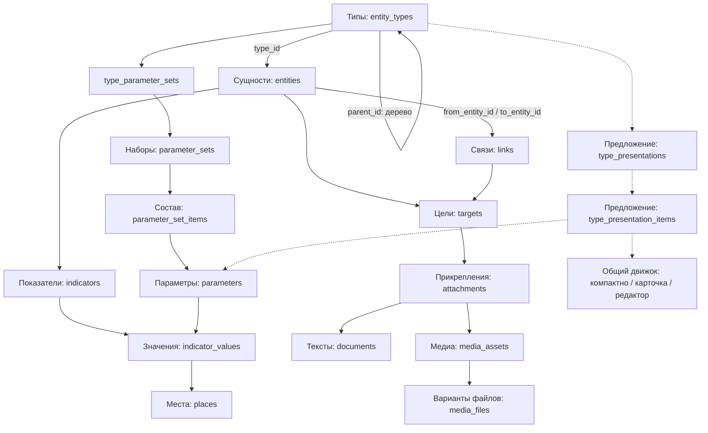
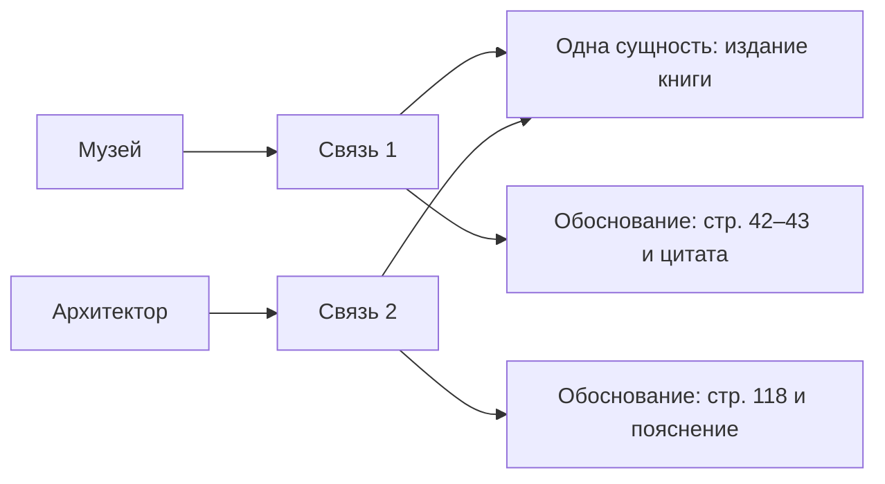

# Схема данных: источники и отображения

Дата: 2026-09-29. Статус: обновлённый проект модели для обсуждения, не SQL-миграция. Существующая часть сверена с миграциями 0002–0023; состояние источников проверено 2026-09-28. Новые таблицы и поля ниже **предлагаются**, на сервере их пока нет.

Основания: [Структура БД](Структура%20БД.md), [решения Р-39, Р-74, Р-75](Решения.md), [ТЗ](Техническое%20задание.md). Документ описывает предметный контур сайта; ведомость и GIS не перестраиваются.

## 1. Общая схема

Стрелки показывают зависимости и пути чтения, а не направление каждого SQL FK. Источники в целевой модели — часть `entities`. Нынешняя `reference_items` показана отдельно в разделе перехода: она пока существует.

Все внутренние отношения задаются FK на ID. UID здесь означает устойчивый идентификатор: у сущностей, связей и документов сейчас `bigint`, у типов, параметров и ряда служебных объектов — `uuid`. Массовой замены ID схема не требует. Slug, название и URL не являются внутренними ключами.

## 2. Что и где хранится

Все перечисленные прикладные таблицы находятся в схеме PostgreSQL `app`.

| Объект | Хранение | Содержание и назначение | Статус |
|---|---|---|---|
| Сущность | `entities` | ID, `type_id`, названия на разных языках, slug, порядок, служебные сведения. Музей, человек, книга, публикация, лекция, страница «О проекте» | Таблица существует; включение источников — предложение |
| Тип | `entity_types` | ID, родитель `parent_id`, код, название, порядок. Дерево разновидностей сущностей | Существует |
| Определение параметра | `parameters`, `parameter_options` | Смысл, тип значения, единица, допустимые варианты, повторяемость | Существует |
| Набор параметров | `parameter_sets`, `parameter_set_items` | Какие параметры образуют набор, в каком порядке, с какими подсказками | Существует |
| Применимость набора | `type_parameter_sets`, `entity_parameter_sets` | Наборы ветви типов с наследованием; дополнительные наборы отдельной сущности | Существует |
| Группа сведений | `indicators` | Принадлежность сущности, название группы, год измерения, актуальность, происхождение данных | Существует; FK источника требует изменения при переносе |
| Значение параметра | `indicator_values` | Ссылка на группу и параметр; число, текст, логическое значение, вариант, дата/интервал или место | Существует |
| Место | `places` | Общий справочник адресов и пространственных сведений; значение параметра ссылается на `place_id` | Существует |
| Связь | `links`, `link_roles` | От какой сущности к какой; роль отношения, порядок, примечание. Например, «использует как источник» | Механизм существует; состав ролей источников предстоит уточнить |
| Цель прикрепления | `targets` | Ровно одна сущность либо одна связь. Общий адресат вложений | Существует |
| Прикрепление | `attachments`, `attachment_roles` | Цель, роль, порядок, примечание и ссылка на содержимое. Описание сущности и обоснование связи используют тот же механизм | Существует |
| Документ | `documents` | `body_json` — блоки BlockNote; `body_text` и поисковый вектор — производные для поиска. Описание, цитата, пояснение | Существует |
| Медиа | `media_assets` | Подпись, автор, источник, условия использования, доступность и другие метаданные | Существует |
| Физический файл | `media_files` и файловое хранилище | В БД — ключ хранения, формат, размер, контрольная сумма, вариант original/screen/thumbnail; сами байты — вне БД | Существует |
| Вхождение сущности в текст | `document_entity_refs` | Производный индекс ссылок из конкретной версии документа: ID сущности, блок, порядок, при необходимости закреплённая версия | Существует |
| Метки | `tags`, `entity_tags` | Общий словарь и прикрепления меток к сущностям | Существует |
| Настройка представления | `type_presentations`, `type_presentation_items` | Режим, состав и порядок элементов показа для типа | Предложение; см. ниже |

Длинное описание книги не хранится в `entities`: это документ, прикреплённый с ролью `description`. Год издания, ISBN, URL — значения параметров соответствующего набора; конкретные определения и наборы ещё нужно согласовать. Автор книги — сущность, связанная с книгой ролью авторства. Авторство книги и авторство записи на сайте различаются.

## 3. Книга, ссылка и цитата

Физический путь обоснования: `links.id → targets.link_id → attachments.target_id → documents.id`, роль прикрепления — `justification`. Короткое примечание связи не заменяет обязательный документ обоснования.

- **Книга / издание** — одна сущность, используемая многими связями. Издания с различающейся пагинацией учитываются отдельно, когда это нужно для точности ссылок.
- **Веб-публикация** — сущность, если учитываем самостоятельный материал. Адрес доступа хранится параметром. Официальный URL музея может оставаться параметром музея без создания новой сущности.
- **Использование источника** — связь с конкретной сущностью. «Стр. 42–43, глава о…» или «Материалы об авторе на сайте поклонников» уже объясняет эту связь; выдумывать дополнительный текст не нужно.
- **Цитата** — блок документа обоснования. Номер страницы, глава, таймкод и точный текст пока хранятся в этом документе; отдельных параметров связи текущая реализация не поддерживает.
- Несколько фрагментов в одном обосновании могут подтверждать одно отношение. Отдельная связь нужна, когда различается само утверждение или нужен независимый учёт. Одна цитата не обязана порождать одну связь.
- Один документ можно прикрепить к нескольким связям. Его изменение затронет все использования после соответствующей публикации; для независимых редакций нужны разные документы.
- Самостоятельная сущность «Цитата» допустима, если цитата сама становится предметом каталога; автоматического создания сущностей из всех цитатных блоков нет.

Название и реквизиты книги не копируются в каждое обоснование. При показе движок объединяет сведения связанной книги и фрагмент обоснования. Наличие библиографической записи не означает наличия файла книги или гарантированного доступа к внешнему сайту.

## 4. Настройки трёх представлений

Предлагаются две таблицы с FK по UID, без произвольного HTML/JavaScript в БД.

**`type_presentations`** — одна запись для пары «тип + режим»:

| Поле | Значение |
|---|---|
| `id` | UID настройки |
| `type_id` | FK на `entity_types.id` |
| `mode` | `compact`, `card`, `editor`; уникальность `(type_id, mode)` |
| `settings` | Проверяемый JSON с настройками композиции: плотность, подписи и т. п.; без значений предметных данных и скрытых ссылок на них |
| поля аудита | Кто и когда создал/изменил настройку |

**`type_presentation_items`** — элементы внутри настройки:

| Поле | Значение |
|---|---|
| `id`, `presentation_id` | UID элемента и FK на настройку |
| `component` | Разрешённый общий компонент: заголовок, параметр, описание, отношения, галерея и т. п. |
| `parameter_id` | FK на `parameters.id` для компонента параметра |
| `link_role_id` / `attachment_role_id` | Необязательный FK для отбора отношений или вложений; допустимые сочетания определяются компонентом |
| `sort_order`, `settings` | Порядок и проверяемые настройки оформления; пустые необязательные значения скрываются при просмотре |

Поля и названия — проект, до SQL нужны ограничения допустимых сочетаний и схема проверки `settings`. Версионирование настроек также нужно определить до реализации: существующие `materials` автоматически их не охватывают.

Простое правило наследования: для выбранного режима используется ближайшая настройка вверх по дереву типов. Если её нет — базовое представление движка. Настройка задаёт целиком один режим; неявного слияния нескольких списков компонентов нет. Наборы параметров продолжают наследоваться по собственному существующему правилу.

| Тип / содержимое | Компактно | Карточка | Редактор |
|---|---|---|---|
| Архитектурный объект | Название, миниатюра, краткие сведения | Сведения, описание, связи, изображения | Стандартные поля, наборы параметров, текст |
| Книга | Название, автор, год | Библиографические сведения, доступ, описание при наличии | Тот же редактор с набором книги |
| Веб-публикация | Название, издание/сайт | Реквизиты, адрес доступа, описание | Тот же редактор с набором публикации |
| Цитата в обосновании | Текстовый блок с указанием источника | Часть связей/источников карточки | Блок стандартного редактора документа |

Последняя строка не является четвёртым режимом сущности и не требует собственного `entity_type`: блок цитаты уже относится к документу. Различия оформления ссылок и цитат задаются соответствующими общими компонентами.

Профили не управляют правами и публикацией. Общее меню, авторизация, проверка SU, маршруты и движок остаются едиными. Скрытый в представлении параметр не считается защищённым от доступа.

## 5. Реестр и публичный каталог

Сущность может иметь краткую библиографическую карточку без развёрнутой статьи. Это полноценная запись реестра. Количество таких записей не должно автоматически определять состав главной страницы и общего каталога.

Предлагается разделить три независимые характеристики: тип предмета, опубликованность и включение в редакционный каталог. Для последней нужен отдельный согласованный механизм: например, правило по типу с исключением для конкретной сущности. Точное место хранения ещё не выбрано; в `type_presentations` этот признак не помещаем. Книга может быть как кратким источником, так и развёрнутой статьёй без изменения своего типа.

## 6. Авторство, версии и доступ

`materials` — служебная оболочка сущности, связи, документа, медиа или прикрепления: статус и ссылка на опубликованную версию. `revisions` содержит неизменяемые снимки, автора изменения и операцию. `material_credits` хранит авторские подписи, `revision_reviews` — рассмотрение версий.

`contributors` связывает участников с учётными записями; `roles`, `permissions`, `role_permissions`, `user_roles` задают доступ. Эти роли не смешиваются с `link_roles` и `attachment_roles`. Источник получает те же правила публикации и доступа, что другие сущности. Права, история и авторство при переносе сохраняются.

## 7. Что требуется изменить при реализации

1. Согласовать наборы параметров источников, роли связей, механизм включения в каталог и точную структуру представлений.
2. Перенести `reference_items` в общую модель с сохранением соответствий ID; преобразовать прикрепления источников в отношения и обоснования, сохранив их смысл и историю.
3. Заменить зависимости `attachments.reference_item_id`, `materials.reference_item_id` и `indicators.source_reference_item_id`. Для показателей предлагается ссылка на связь с источником (`source_link_id → links.id`), чтобы сохранялось конкретное обоснование; нужна проверка, что связь относится к той же сущности. Это новое предложение, не существующее поле.
4. Согласованно обновить ограничения, триггеры публикации, версии, импорт, API и интерфейс. Старые таблицы не удалять до проверки всех зависимостей и переноса.
5. Перед изменением БД сделать согласованную резервную копию, проверить восстановление в изолированном окружении; миграцию проверить там же. Затем проверить права, версии, поиск, все три представления, меню и возврат из редактора.

По сверке 2026-09-28 в `reference_items` было 0 записей. Это не отменяет зависимостей схемы и наличия ссылок/цитат внутри документов.

В рамках подготовки этой схемы изменена только WIKI. Миграции, выкладка и изменения пользовательских данных не выполнялись.
