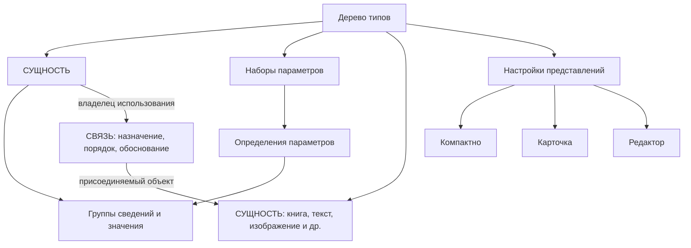
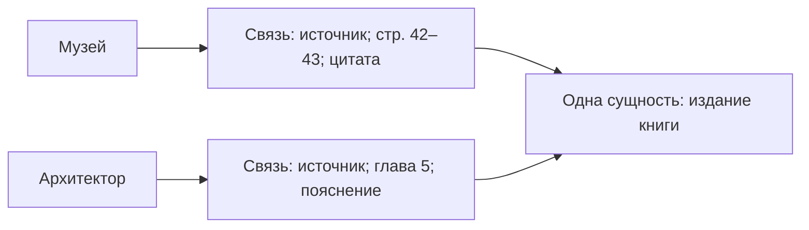

# Целевая схема данных: присоединение через сущность и связь

Обновлено 2026-09-29 после уточнения пользователя: механизм присоединений сохраняется и реализуется через **СУЩНОСТЬ + СВЯЗЬ**. Присоединяемый объект — сущность; его использование другой сущностью — связь. Отдельный универсальный слой `targets` / `attachments` не является целевой реализацией этого механизма. Предыдущая редакция смешивала действующее хранение и целевую схему; история сохранена в Git.

**Принцип подтверждён пользователем:** сущность, связь, параметр; присоединения выражаются через сущность и связь; настройки представлений связаны с типом. **Физическая реализация ниже — предложение**, не применённая миграция. Названия новых полей и способ хранения текста не считаются уже согласованными. Существующая БД продолжает работать по прежней схеме. Присоединения из пользовательского процесса не убираются.

## 1. Предметная схема

Книга и веб-публикация — сущности. Использование книги музеем или автором — связь с этой сущностью. URL — значение параметра. Цитата, страница и глава относятся к конкретному обоснованию связи. Это и есть присоединение: существующая сущность используется через новую связь, без создания её копии или дополнительного объекта отношения другого вида.

Внутренние ссылки задаются по UID, не по названию, slug или URL. Существующие `bigint` ID сущностей и `uuid` ID справочников не требуется менять ради унификации.

## 2. Объекты и место хранения

| Объект | Целевое хранение | Что хранится |
|---|---|---|
| Сущность | `entities` | ID, тип, названия, slug; доступ к собственному тексту описания |
| Тип | `entity_types` | ID, родитель, название, порядок |
| Книга, издание, веб-публикация | Те же `entities` | Одна запись на учитываемый объект; «источник» — роль в отношении к другой сущности |
| Характеристика | `parameters`, `parameter_options` | Определение, тип значения, единица, варианты |
| Набор характеристик | `parameter_sets`, `parameter_set_items` | Состав набора, порядок, подсказки |
| Применимость набора | `type_parameter_sets`, `entity_parameter_sets` | Наборы для ветви типов и дополнения конкретной сущности |
| Конкретные сведения | `indicators`, `indicator_values` | Группа сведений и значения параметров: год, URL, ISBN и другие согласованные параметры |
| Отношение | `links`, `link_roles` | Две сущности по ID, роль, порядок, собственное обоснование |
| Присоединяемый текст / описание | Сущность текста и обычная связь с описываемым объектом | Блоки стандартного редактора хранятся в содержимом сущности текста; назначение «описание» — в связи |
| Обоснование связи | Текст, непосредственно указанный связью | Причина отношения, точная цитата, страницы, глава, таймкод |
| Самостоятельная статья / лекция | `entities` соответствующего типа и собственный текст | Название, параметры, содержание; вхождения других сущностей по UID |
| Место | `places`, на которое ссылается значение параметра | Общий справочник мест сохраняется согласно Р-40 |
| Отображение | Предлагаемые `type_presentations`, `type_presentation_items` | Три режима, порядок и настройки общих компонентов; предметные значения здесь не копируются |

Таблицы состава наборов и значений — нормализованное хранение параметров. Они не вводят самостоятельный универсальный объект «присоединение».

## 3. Присоединяемый объект и содержимое

Присоединение во всех случаях выражается одинаково:

| Исходная сущность | Связь: назначение использования | Присоединяемая сущность |
|---|---|---|
| Музей | Описание | Текст о музее |
| Музей | Иллюстрация / обложка | Изображение |
| Музей | Источник | Издание книги |
| Архитектор | Источник | Веб-публикация |

Названия ролей здесь смысловые примеры, не новые уже созданные элементы справочника. Направление, кратности и правила обязательного обоснования должны быть закреплены перед SQL.

Один объект может использоваться многими связями. Название, реквизиты и собственное содержимое принадлежат объекту; назначение, порядок и пояснение конкретного использования — связи. Для повторного использования изображения или книги новая сущность не создаётся.

Существующие `documents` могут остаться техническим хранилищем блоков редактора с прямой привязкой к сущности текста. Это не отдельный механизм присоединений. Точный FK, границы версионирования и перенос текущих документов нужно спроектировать; пользователь утвердил принцип, а не конкретные новые поля.

Обоснование — собственное содержимое связи. Цитата, страница и глава могут входить в него без создания отдельной сущности-цитаты. Физическое хранение обоснования (блоки в связи либо прямой FK на хранилище текста) ещё не выбрано. Служебное хранение обоснования не требует новой смысловой связи с ещё одним обоснованием: бесконечная цепочка не создаётся.

## 4. Пример: одна книга, разные страницы

В сущности книги — название; в параметрах — реквизиты; автор книги связан обычным отношением авторства. В каждой связи с книгой — своё обоснование. Реквизиты книги в связи не дублируются.

Несколько фрагментов могут входить в одно обоснование. Отдельная связь нужна при самостоятельном отношении/утверждении, а не автоматически для каждого абзаца. Самостоятельная сущность «Цитата» нужна только тогда, когда цитата становится отдельным предметом учёта. Цитатный блок текста сам по себе сущность не создаёт.

## 5. Присоединение медиа тем же механизмом

Присоединяемое изображение/файл представлено сущностью соответствующего типа; отношение к музею, книге или статье хранится в `links`. Роль и порядок относятся к связи, поэтому один файл может занимать разное место в разных карточках.

Технический реестр `media_assets` / `media_files` и физическое файловое хранилище сохраняют оригиналы, варианты, контрольные суммы и метаданные обработки. Реестр получает прямую однозначную привязку к сущности медиа; точный FK и перенос публикации/авторства нужно определить до SQL. Два независимых названия, статуса публикации или источника прав для одного медиа создавать нельзя.

Принцип присоединения через сущность и связь согласован; конкретное преобразование таблиц медиа ещё требуется спроектировать. Технические варианты original/screen/thumbnail остаются вариантами одного медиа, а не тремя присоединяемыми сущностями.

## 6. Представления по типу

`type_presentations`: UID, `type_id`, режим `compact / card / editor`, проверяемые настройки, аудит. Уникальна пара «тип + режим».

`type_presentation_items`: UID, FK на представление, общий компонент, порядок, настройки; при необходимости FK на параметр или роль связи. Поля `attachment_role_id` в целевом предложении нет.

Компоненты читают сущность, её параметры, описание и связи. Для книги компактный вид может показывать автора и год, для здания — миниатюру и место; цитата отображается блоком обоснования с указанием источника. Общие движок, меню, права и стандартный редактор сохраняются.

Предлагаемое простое наследование: для режима берётся ближайшая настройка вверх по дереву, иначе базовая. Частичное слияние нескольких списков компонентов не вводится. Точные поля, ограничения и история настроек ещё требуют проектирования.

Тип предмета, опубликованность и включение в общий каталог — разные характеристики. Краткий источник может быть опубликован и доступен по связям, не занимая место в основном каталоге. Механизм отбора каталога нужно согласовать отдельно; настройки внешнего вида не заменяют его и не управляют правами.

## 7. История, права и переход

Существующие `materials`, `revisions`, `material_credits`, `revision_reviews` сохраняют публикацию, историю и авторство. Их зависимости должны быть адаптированы к целевым объектам. Существующие роли доступа и SU не меняются. Новые настройки отображения нельзя считать автоматически охваченными существующей историей материалов.

Присоединения сейчас хранятся через `targets`, `attachments`, `attachment_roles`; целевая реализация переводит их на `entities`, `links`, `link_roles`. `reference_items` заменяется сущностями источников и обоснованиями связей. Это описание направления перехода, **не команда удалить действующие таблицы**.

До миграции необходимы:

1. Согласование физического хранения текстов, медиа и настроек отображения; правила включения в каталог.
2. Полное соответствие старых ID новым отношениям, включая роли, порядок, примечания, версии, авторство и архивные данные. Историю старых присоединений нельзя выбросить.
3. Замена зависимостей API, триггеров, публикации, импорта, редактора, галереи и указателей источников показателей. Для последних место целевого FK пока не утверждено.
4. Согласованная резервная копия и пробное восстановление, перенос в тестовом окружении, проверка полноты и прав.
5. Переключение чтения и записи на единственный механизм после проверки. Прежние таблицы перестают обслуживать сайт; порядок сохранения их истории определяется миграцией.

Эта правка меняет только документацию. Рабочая БД и сайт не изменены.
