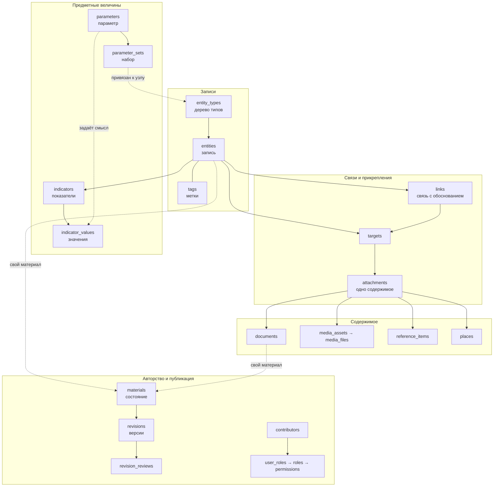
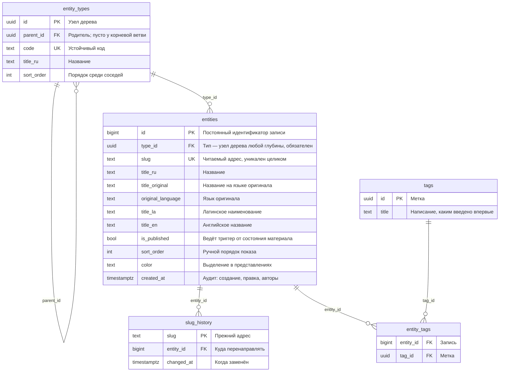
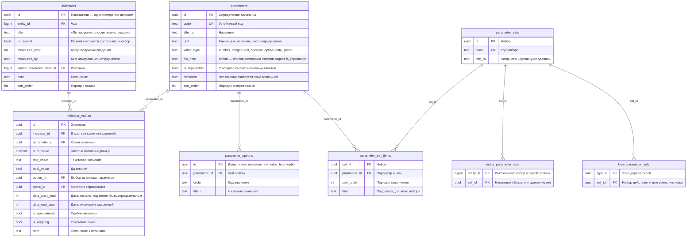
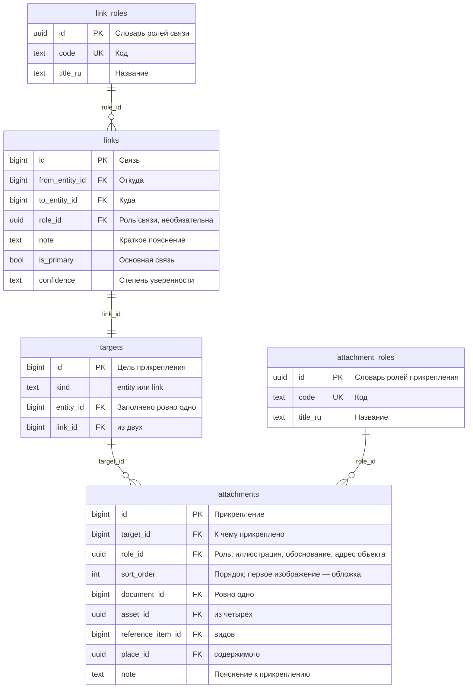
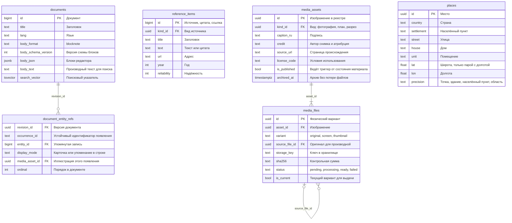
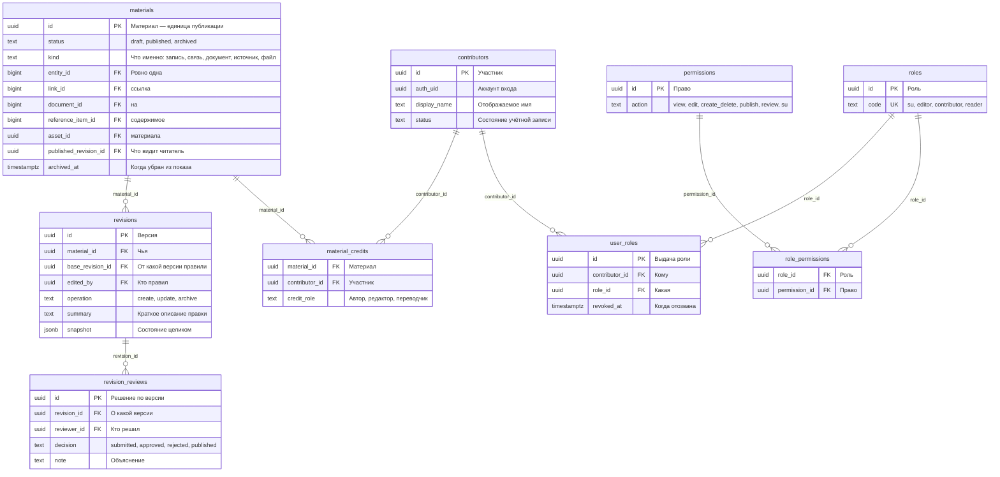

# Схема данных

Целевое устройство схемы `app` после решений [Р-37 и Р-38](Решения.md): единая запись, дерево типов, предметные величины параметрами. Здесь описано то, к чему идём; что уже стоит в базе — в [Инвентаризации сервера](Инвентаризация%20сервера.md), история модели и обсуждения — в [Структуре БД](Структура%20БД.md).

Отличия от действующей базы помечены: **новое**, **изменяется**, **снимается**. Без пометки — работает сейчас и остаётся как есть.

## Обзор

Правило, из которого следует остальное: **запись одна для всех**. Человек, здание и стиль отличаются типом и набором параметров, а не строением записи. Отображение, права, версии и публикация от типа не зависят.

## Записи и дерево типов

| Что | Как |
|---|---|
| **новое** `entity_types` | Дерево. Корневые ветви — прежние виды: «Кто», «Что», «Когда». Ниже растут типы: здание, зрелищное здание, постановка, стиль |
| **изменяется** `entities.type_id` | Вместо `kind_id`. Тип обязателен и один |
| **снимается** `entity_kinds`, `object_types`, `person_types`, `period_types` | Сходятся в дерево |
| **снимается** `object_profile`, `person_profile`, `period_profile` | Типология и полное имя — параметры; координаты — места ([Р-25](Решения.md)); тип — узел дерева |
| **изменяется** `entities.slug` | Уникален целиком, а не в пределах вида: видов больше нет. `slug_history.kind_id` снимается |
| **снимается** `entities.cover_media_id` | Обложка — первое прикреплённое изображение по порядку ([Р-36](Решения.md)); второго места для того же сведения не держим |

Отбор идёт по ветви целиком: рекурсивный обход от выбранного узла вниз. Данных немного, материализованный путь пока не нужен; если список перестанет отвечать за 300 мс ([Р-17](Решения.md)), колонка пути добавляется отдельной миграцией.

## Предметные величины

Правила, которые держит база:

- У значения заполнено ровно то поле, которое соответствует типу параметра. Проверка по `value_type`, а не по договорённости.
- Один параметр встречается в одних показателях один раз: `UNIQUE (indicator_id, parameter_id)`.
- Единица измерения живёт в определении параметра; рядом со значением её нет.
- Набор подсказывает состав, но не запрещает заполнить параметр вне набора и не требует заполнить всё.
- Наследование по дереву: набор узла действует для всего, что ниже. Общее для «Что» не дублируется в «Здании».
- Сортировка и отбор считают по показателям с `is_current`; в карточке видны все.

**Датировки и места — параметры** ([Р-40](Решения.md), выполнено). Вид даты — рождение, строительство, открытие, реконструкция — это параметр с `value_type = date`; роль места — адрес объекта, место рождения, захоронение, офис — параметр с `value_type = place` и значением-ссылкой на справочник мест. Приблизительность и открытый конец живут у значения. `entity_dates`, `date_kinds` и `attachments.place_id` сняты, [Р-08](Архив%20решений.md) отменено.

Справочник мест для параметра «место» — то же, чем список значений служит параметру «выбор»: общий набор возможных ответов.

## Связи и прикрепления

Связь не существует без обоснования: отложенный триггер требует к моменту фиксации транзакции прикрепление с ролью `justification`. Роль принадлежит прикреплению, а не содержимому: одно и то же место служит адресом здания, местом рождения архитектора и офисом бюро.

## Содержимое: тексты, источники, медиа, места

Повтор адреса невозможен: частичный уникальный указатель по нормализованным элементам ([Р-35](Решения.md)). Метки файлов лежат в общем справочнике `tags` через `media_tags`.

## Авторство, версии и публикация

**Показатели входят в материал записи** ([Р-38](Решения.md)): их правка создаёт версию записи и проходит обычную публикацию. Отдельного материала и отдельного авторства у измерений нет.

Одновременную правку разводит `base_revision_id`: версия поверх устаревшей отклоняется с `version_conflict`.

## Служебное

| Таблица | Назначение |
|---|---|
| `schema_migrations` | Журнал применённых миграций: номер, контрольная сумма, кто и когда применил ([Р-12](Решения.md)) |
| `import_jobs`, `import_items`, `import_key_map` | Пакетное наполнение с повторяемостью по внешнему ключу |
| `published_entity_mentions` | Представление: в каких опубликованных материалах упомянута запись. Черновики через него не раскрываются |

## Что меняется по этапам

| Этап | Появляется | Снимается |
|---|---|---|
| **А** — выполнен 2026-09-23 (0015) | `entity_types`, `entities.type_id` | `entity_kinds`, `object_types`, `person_types`, `period_types`, три профиля, `entities.cover_media_id`, `slug_history.kind_id` |
| **Б** — выполнен 2026-09-23 (0016) | `parameters`, `parameter_options`, `parameter_sets`, `parameter_set_items`, `type_parameter_sets`, `entity_parameter_sets`, `indicators`, `indicator_values` | `object_profile` |
| **В** — выполнен 2026-09-24 (0017) | Параметры с `value_type = date` и `value_type = place`, признак `is_repeatable` | `entity_dates`, `date_kinds`, `attachments.place_id` |

Переносить немного: одиннадцать записей с их типами, координаты уже в местах, датировок единицы. Через год та же работа стоила бы сотен записей — поэтому делается сейчас.

## Инварианты

- У записи ровно один тип; тип обязателен. Прежний составной ключ «профиль соответствует виду» больше не нужен.
- У `targets` заполнено ровно одно из `entity_id` и `link_id`; на запись и на связь приходится ровно одна цель.
- У `attachments` заполнено ровно одно содержимое из четырёх.
- Связь не существует без прикреплённого обоснования — отложенный триггер.
- У `materials` ровно одна ссылка на содержимое, и каждое содержимое принадлежит не более чем одному материалу.
- `base_revision_id` и `published_revision_id` принадлежат тому же материалу — составные внешние ключи.
- У значения заполнено поле, соответствующее типу параметра; параметр не повторяется в одних показателях.
- Публикация и доступ проверяются и для прикреплённого: черновик не раскрывается через вложения или API.

## Что требует подтверждения

- Состав первого набора «Зрелищное здание»: список величин и как каждая измеряется.
- Полный список типов значений — достаточно ли `number`, `integer`, `text`, `boolean`, `option`, `date`.
- Судьба колонок `media_assets`, убранных из формы ([Р-28](Решения.md)): описание, альтернативный текст, год съёмки, место хранения, инвентарный номер, подпись источника, `visibility`. Они пусты и в проверках доступа не участвуют, но снимать их без вашего слова не буду.
