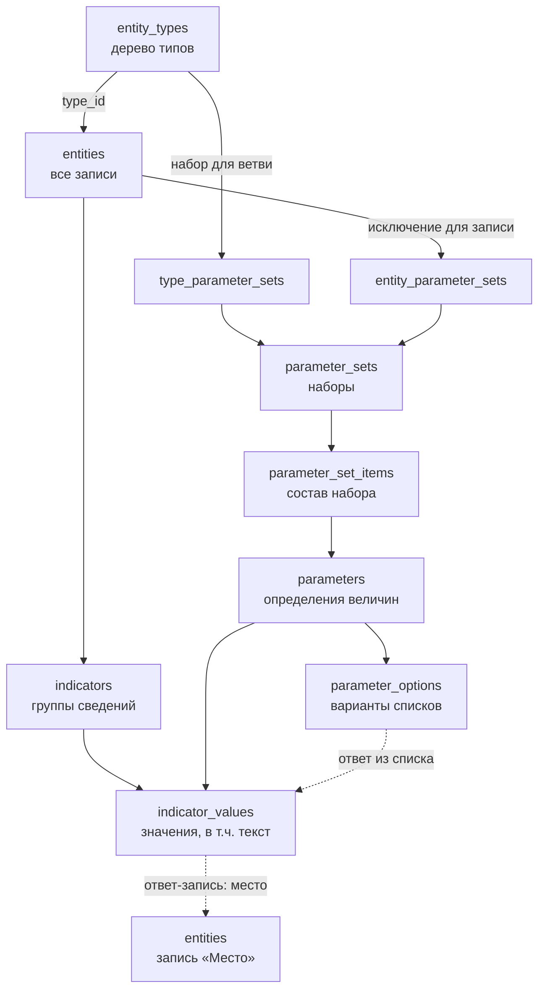
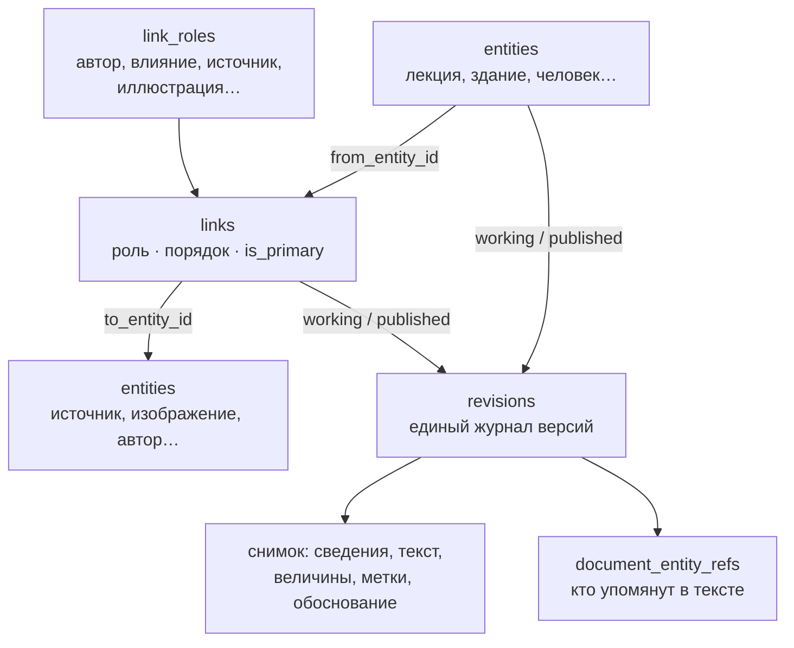
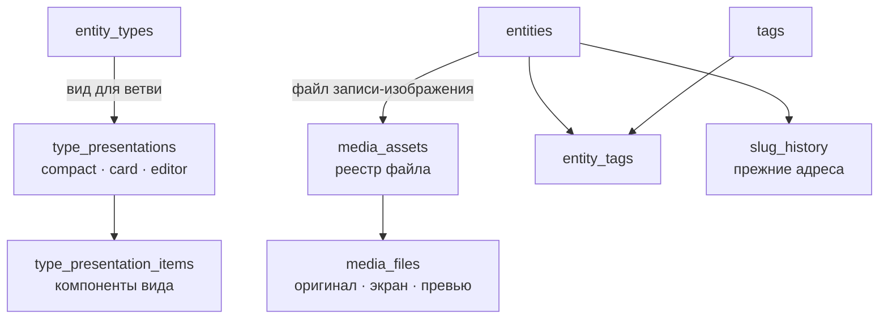

# Схема данных

**Единственный документ о схеме данных.** К этой модели идём и по ней строим код. Прежние описания — «Структура БД», ранняя «Схема данных», «Источники и отображения», снимок состояния на 2026-09-30 — лежат в [архиве](Архив/) как история рассуждений; при расхождении прав этот документ и [журнал решений](Решения.md).

Три основы — **запись, связь, параметр** — плюс версия и отображение. Всё, что раньше было отдельными механизмами (присоединения, источники, справочник мест, сведения о файле, самостоятельные тексты), выражено через них ([Р-39](Решения.md), [Р-76](Решения.md), [Р-78](Решения.md), [Р-80](Решения.md), [Р-84](Решения.md), [Р-85](Решения.md), [Р-86](Решения.md)).

**Состояние на 2026-10-01.** Хранение унифицировано миграцией `db/migrations/0026_one_model.sql` (одна транзакция), применённой к рабочей базе 2026-10-01 в 02:32 UTC. Единый механизм трёх представлений ещё не завершён — см. «Отображение». После неё в схеме `app` 35 таблиц; прежних `attachments`, `targets`, `reference_items`, `places` больше нет.

## Диаграмма

Три части, каждая читается сверху вниз. Общий узел — `entities`.

### 1. Запись и её сведения

```mermaid
flowchart TD
    T["entity_types<br/>дерево типов"] -->|"type_id"| E["entities<br/>все записи"]
    T -->|"набор для ветви"| TPS["type_parameter_sets"]
    TPS --> PS["parameter_sets<br/>наборы"]
    E -->|"исключение для записи"| EPS["entity_parameter_sets"]
    EPS --> PS
    PS --> PSI["parameter_set_items<br/>состав набора"]
    PSI --> P["parameters<br/>определения величин"]
    P --> PO["parameter_options<br/>варианты списков"]
    E --> I["indicators<br/>группы сведений"]
    I --> V["indicator_values<br/>значения, в т.ч. текст"]
    P --> V
    PO -.->|"ответ из списка"| V
    V -.->|"ответ-запись: место"| EM["entities<br/>запись «Место»"]
```

### 2. Связи и версии

```mermaid
flowchart TD
    E1["entities<br/>лекция, здание, человек…"] -->|"from_entity_id"| L["links<br/>роль · порядок · is_primary"]
    L -->|"to_entity_id"| E2["entities<br/>источник, изображение, автор…"]
    LR["link_roles<br/>автор, влияние, источник,<br/>иллюстрация…"] --> L
    E1 -->|"working / published"| R["revisions<br/>единый журнал версий"]
    L -->|"working / published"| R
    R --> S["снимок: сведения, текст,<br/>величины, метки, обоснование"]
    R --> DR["document_entity_refs<br/>кто упомянут в тексте"]
```

### 3. Отображение и техническое хранилище

```mermaid
flowchart TD
    T["entity_types"] -->|"вид для ветви"| TP["type_presentations<br/>compact · card · editor"]
    TP --> TPI["type_presentation_items<br/>компоненты вида"]
    E["entities"] -->|"файл записи-изображения"| MA["media_assets<br/>реестр файла"]
    MA --> MF["media_files<br/>оригинал · экран · превью"]
    E --> ET["entity_tags"]
    TG["tags"] --> ET
    E --> SH["slug_history<br/>прежние адреса"]
```

## Записи — `entities`

Одна таблица для **всего, о чём можно говорить и на что можно сослаться**. Различает тип из дерева `entity_types`; какие сведения у записи — решает набор параметров её ветви.

| Ветвь дерева | Типы | Что это |
|---|---|---|
| Кто | Человек, Компания, Группа | Авторы, бюро, коллективы |
| Что | Архитектурный объект, Градостроительная концепция, Конкурсная работа, Учебная работа, Постановка, Событие… | Предметы изучения |
| Что | Книга, Статья, Веб-страница | Источники: на них ссылаются тексты ([Р-80](Решения.md)) |
| Где | Место | Страна, город, адрес, точка на карте ([Р-85](Решения.md)) |
| Когда | Стили, эпохи, методы, учения | Периоды и течения |
| Материалы | Изображение, Документ | Файлы и самостоятельные тексты ([Р-84](Решения.md)) |
| Служебные | Лекция | Учебные тексты |
| Страницы проекта | Логотип, Философия, Манифест, Обратная связь | Раздел «О проекте» |

У каждой записи: название, слаг, тип, статус, указатели версий и сведения по набору параметров. Собственный текст — тоже сведение (ниже), если набор ветви его содержит: у лекции, здания, человека он есть, у места и изображения нет ([Р-86](Решения.md), уточняет [Р-77](Решения.md)).

Тип, опубликованность и попадание в общий каталог — разные характеристики. Изображения и документы опубликованы, но в общий каталог, разделы и карту сайта не попадают: их видно на странице записи, к которой они относятся.

## Сведения — параметры

| Таблица | Что хранит | Пример |
|---|---|---|
| `parameters` | Определение величины: смысл, единица, вид значения | «Пролёт, м», «Адрес страницы», «Автор снимка», «Текст» |
| `parameter_options` | Варианты для величины-списка | вид изображения: фото, план, разрез; точность места |
| `parameter_sets` + `parameter_set_items` | Наборы величин | «Зрелищное здание», «Место — сведения», «Изображение — сведения», «Текст» |
| `type_parameter_sets` | Какой набор действует для ветви (вниз по дереву) | «Веб-страница» → набор с адресом страницы |
| `entity_parameter_sets` | Исключение для одной записи | музей в бывшем вокзале получает «Вокзал» |
| `indicators` | Группа сведений записи | «по проекту», «после реконструкции», «Текст» |
| `indicator_values` | Сами значения; причина или оговорка — в `note` | пролёт = 43; адрес = запись-место; текст = блоки |

Виды значений: число, целое, текст, да/нет, вариант, дата, **запись** (`entity_value_id`, с назначенной ветвью — так ставится место), **блоки** (`blocks_value` — текст записи, BlockNote).

- **Текст записи** — параметр `text` вида «блоки». Версионируется вместе с записью: другой версии у него нет ([Р-86](Решения.md)).
- **Отношение к месту** — параметр той записи, что на место ссылается: «Адрес объекта», «Место рождения», «Захоронение», «Офис». Ответ — запись «Место»; причина — в `note`. Связь для этого не расширяется ([Р-85](Решения.md)).
- **Сведения о месте** — параметры записи «Место»: страна, населённый пункт, улица, дом, помещение, широта, долгота, точность, источник сведений.
- **Сведения о файле** — параметры записи «Изображение»: вид, автор, правообладатель, источник, подпись источника, место хранения, инв. номер, год, лицензия, описание для незрячих, описание.

## Связи — `links`

Любое отношение двух записей и любое **использование** одной записи другой. Связь не расширяется новыми полями под частный случай: то, что описывает саму запись, — её параметр.

| Поле | Значение |
|---|---|
| `from_entity_id`, `to_entity_id` | Обе стороны — записи |
| `role_id` → `link_roles` | Архитектор, автор, влияние, **источник**, **иллюстрация**… |
| `sort_order` | Порядок: например, изображений в галерее |
| `is_primary` | Главная связь своей роли; обложка записи — первая по порядку иллюстрация (Р-36) |
| обоснование | Принадлежит связи, физически хранится в её версии (`revisions`, снимок связи). Почему связь есть; для источника — «на стр. 34 сказано „…“»; для иллюстрации — подпись к этому месту |

| Было отдельным механизмом | Теперь |
|---|---|
| Автор здания, влияние, участие | связь с ролью |
| Источник цитаты (`reference_items`) | связь «источник» к Книге, Статье, Веб-странице; в тексте — знак `sourceRef` ([Р-80](Решения.md)) |
| Обоснование связи (документ на присоединении) | содержимое версии связи ([Р-78](Решения.md)) |
| Изображение в галерее, обложка (`attachments`) | связь «иллюстрация» к записи «Изображение»: порядок, `is_primary` ([Р-84](Решения.md)) |

## Версии — `revisions`

Единый журнал. Владелец версии — запись **или** связь (`entity_id` / `link_id`, ровно одно). Владелец хранит статус и два указателя: `working_revision_id` (в работе) и `published_revision_id` (видно всем).

- Снимок версии записи — название, слаг, сведения, все значения параметров (включая текст), метки; связи — её поля и обоснование. Снимок собирается из значений; ключ `body_json` в нём — проекция текста для чтения.
- Таблицы значений — рабочая редакция. Опубликованное читается только из снимка (`app.read_entities`, `read_links`, `read_indicators`, `read_values`, `read_entity_tags`), поэтому правка в работе не меняет то, что видит посетитель.
- Публикуется владелец целиком одной редакцией ([Р-79](Решения.md)); отдельной публикации текста нет. Сохранённая версия не переписывается. Связанные самостоятельные записи вместе с владельцем не публикуются.
- Авторство и рассмотрение — `materials`, `material_credits`, `revision_reviews`.

## Отображение — `type_presentations`, `type_presentation_items`

Как запись выглядит, задаёт её тип; берётся ближайшая настройка вверх по дереву, частичного слияния списков нет. `type_presentations` — пара «тип + режим» (`compact`, `card`, `editor`), `type_presentation_items` — компоненты по порядку, при необходимости с параметром.

| Режим | Настроек в базе | Состояние |
|---|---|---|
| **card** — порядок разделов страницы записи: показатели, связи, текст, изображения, источники, упоминания, «как цитировать» | 11 | работает: настройки определяют порядок разделов |
| **compact** — здание миниатюрой, человек портретом, книга, статья, веб-страница знаком источника, место названием и городом, лекция и период названием | 11 | частично: действует только в строке текста (упоминание); каталог и блок-карточка в тексте рисуются своей разметкой |
| **editor** | 0 | не подключено: форму строит код; параметры редактор уже берёт из наборов, не хватает управления самим видом |

Отображение не управляет правами и не решает, что попадает в каталог.

## Техническое хранилище — не модель, а склад

| Таблица | Что |
|---|---|
| `media_assets` | Реестр файла и ссылка на его запись «Изображение»; публичность — через запись |
| `media_files` | Физические варианты: оригинал, экранный, превью; контрольные суммы |
| `document_entity_refs` | Производный указатель: кто упомянут в какой версии текста |
| `documents` | Только история: прежние тексты с записанным хозяином (`owner_entity_id` / `owner_link_id`) и старые адреса |
| `slug_history` | Прежние адреса записи |
| `tags`, `entity_tags` | Метки, в том числе у изображений |

## Служебное — авторство, права, импорт

| Таблицы | Что |
|---|---|
| `materials`, `material_credits`, `revision_reviews` | Авторские подписи и ход рассмотрения версий |
| `contributors`, `roles`, `permissions`, `role_permissions`, `user_roles`, `telegram_accounts` | Участники и права |
| `import_jobs`, `import_items`, `import_key_map` | Пакетный импорт |
| `schema_migrations` | Журнал миграций |

## Чего в модели больше нет

| Таблица | Чем заменена |
|---|---|
| `reference_items`, `reference_kinds` | связь «источник» к записи-источнику |
| `targets`, `attachments`, `attachment_roles` | связь; присоединяемое — запись |
| `media_kinds` | варианты параметра «Вид изображения» |
| `media_tags` | `entity_tags` записи-изображения |
| `places` | записи типа «Место»; прежние снимки находят их через `entities.legacy_place_id` |

Итог: восемь таблиц сняты, две таблицы отображений добавлены — **41 → 35 таблиц** в схеме `app`. Единственный механизм отношений — связь.

## Инварианты

- Внутренние ссылки — только по UID и номерам строк, не по кодам и названиям.
- У значения заполнено ровно одно поле ответа, и оно соответствует виду параметра; ответ-запись принадлежит назначенной ветви.
- У версии ровно один владелец; указатели владельца ведут только на его собственные версии.
- Опубликованная запись или связь всегда имеет опубликованную версию.
- Связь требует обоснования там, где этого требует роль.
- Данные, авторские подписи, история и права при переходах не теряются: прежние версии не переписываются.
